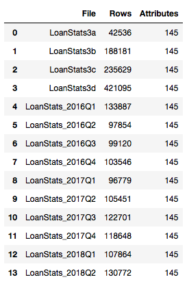
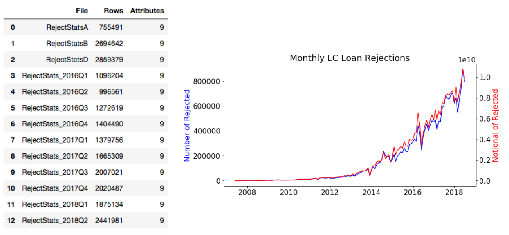
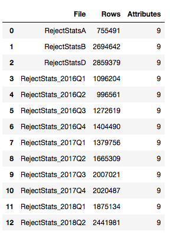

## Contents
{:.no_toc}
*  
{: toc}

We are utilizing the following three aggregated datasets in service of our project goals:

## 1. LoanStats
**Funded LC loans**

Lending Club publishes funded loan data (`LoanStats`) which are updated each quarter. We accessed the data as the Q2 2018 update. These quarterly datasets were merged to create a DataFrame which initially contained 145 features for 2,004,063 approved loans.

The number and notional of LC loan issuances over time is visualized below. The monthly amount of loans has been trending upwards.

The loan issue dates range from June 2007 to June 2018. The loan terms are 36 months or 60 months, which means **term-complete loans** are only those issued prior to June 2013 for 60- month terms and prior to June 2015 for 36-month terms. These 56% of the funded loans form the ‘term complete’ subset from which we can draw significant inferences for a potential investor.

## 2. RejectStats
**Loan applications that failed to meet LC underwriting policy**

Rejected loan datasets (`RejectStats`) were merged to create a DataFrame with 9 features of 22,469,074 loan applications that failed to meet LC underwriting policy

## 3. Census Data
**U.S. demographic information at the zip code level**

To understand whether there is discrimination in LC’s practices and ultimately our proposed investing strategy, we obtained the U.S. Census Bureau’s demographic data and leveraged zip codes to tie the demographic information to the loan data. This data reports the total population and population by different demographic groups (i.e., race, income, education, sex, household structure) and other characteristics like poverty and unemployment rate by zip code. Because LC data is reported at the 3-digit zip code level, we aggregated up to the 3-digit zip code level and calculated percentage of total population and percentage of total household values. We also derived some additional variables such as household size (from population and number of households) and occupied rate (from number of households and housing units). We dropped the variables related to age, as we felt that discrimination related to age is appropriate because it is highly correlated with length of credit history, a valid criterion on which loan applications should be evaluated. Post processing, our census dataset had 891 3-digit zip codes and 68 features. (See Appendix B1 for the full list of variables and their descriptions.)

There are five records with missing data, likely originating from sparsely populated zip code areas. At least one 3-digit zip code area has a recorded population of zero. On average, the population is ~350k, with a household size of ~2.6 and a median income of $55k. For the average zip code area, the population is about evenly split between male and female, with the majority of the population White and having at least a High School education. (See Appendix B2 for table of summary statistics.)
