## Contents
{:.no_toc}
*  
{: toc}


<br>

## 0. Functions


```python
#FUNCTION FOR DUMMY CREATION
def dummy_attr(attr):
    """ Creates dummy variables and drops original attribute"""
    global ls_clean
    if attr not in list(ls_clean): return
    prefix = 'D_' + attr
    dummies = pd.get_dummies(ls_clean[attr], prefix=prefix)
    ls_clean.drop([attr], axis=1, inplace=True)
    ls_clean = pd.concat([ls_clean, dummies], axis=1)
```


```python
#FUNCTION FOR OUTLIER DETECTION
ls_clean['outlier'] = 0 # this column is incremented for identified outlier instances
def outlier_attr(attr, threshold):
    """ Identifies outliers above threshold and updates outlier indictor""" 
    outliers = ls[attr] > threshold
    ls_clean['outlier'] = ls_clean['outlier'] + outliers
    return outliers
```


```python
#FUNCTION FOR MISSING VALUE IMPUTATION
from sklearn.impute import SimpleImputer
def imputation_attr(attr, strategy='mean'):
    """ Impute missing values via mean imputation or most frequent value"""
    imp = SimpleImputer(strategy=strategy)
    ls_clean[attr] = imp.fit_transform(ls_clean[[attr]])
```


```python
#FUNCTION FOR EDA
num_observations = len(ls_clean)
def EDA_attr(attr):
    """ Displays basic EDA for given attribute"""
    attr_type = ls_clean[attr].dtype
    missing_values = ls_clean[attr].isnull().sum()
    display(Markdown('**{}**: {}'.format(attr, data_dict.get(attr, ""))))
    print('\tType: \t\t\t{}'.format(attr_type))
    print('\tMissing Values: \t{} ({:.1%})'.format(missing_values, missing_values/num_observations))
    
    # numerical variables
    if attr_type == 'float64' or attr_type == 'int64':  
        print('\tMean: \t\t\t{:.2f}'.format(ls_clean[attr].mean()))     
        print('\tRange: \t\t\t({:.2f}, {:.2f})'.format(ls_clean[attr].min(), ls_clean[attr].max()))
        plt.hist(ls_clean[attr]); plt.ylabel('Number of Loans'); plt.xlabel(attr); plt.show()
    
    # categorical variables
    if attr_type == 'object':   
        print('\tNumber of Categories: \t{}'.format(len(ls_clean.groupby(attr))))
        print('\tMost Common Category: \t{}'.format(ls_clean.groupby(attr)['loan_amnt'].count().idxmax()))
        dummy_attr(attr)

    display(Markdown('\n'))
```


<br>

## 1. Inconsequential Variables

Our focus will be on loans that have completed their terms. This subset of **'term-complete'** loans provides the most representative outcome information since in-force loans can still default. Therefore, we remove the loan instances that are not term-complete:


```python
#DROP TERM INCOMPLETE LOANS
completed_36 = (ls['issue_d'] < '2015-04-01') & (ls['term']  == ' 36 months')
completed_60 = (ls['issue_d'] < '2013-04-01') & (ls['term']  == ' 60 months')
ls_clean = ls_clean[completed_36 | completed_60]
```


Next we drop non-existant, empty, constant or otherwise unmeaningful variables. LC only recently began accepting joint application loans, so none of these loans are term-complete. Similarly, LC started reporting variables recently that were not reported for the term-complete loans. Therefore we remove these variables from the model.


```python
#DROP CO-BORROWER VARIABLES
joint = ['application_type', 'annual_inc_joint', 'dti_joint', 'revol_bal_joint', 
         'sec_app_chargeoff_within_12_mths', 'sec_app_collections_12_mths_ex_med', 
         'sec_app_earliest_cr_line', 'sec_app_inq_last_6mths', 'sec_app_mort_acc', 
         'sec_app_mths_since_last_major_derog', 'sec_app_num_rev_accts', 'sec_app_open_acc', 
         'sec_app_open_act_il', 'sec_app_revol_util', 'verification_status_joint']
ls_clean.drop(joint, axis=1, inplace=True)

#DROP EMPTY VARIABLES
empty = ['all_util', 'il_util', 'inq_fi', 'inq_last_12m', 'max_bal_bc', 
         'mths_since_rcnt_il', 'open_acc_6m', 'open_act_il', 'open_il_12m', 
         'open_il_24m', 'open_rv_12m', 'open_rv_24m','total_bal_il', 'total_cu_tl']
ls_clean.drop(empty, axis=1, inplace=True)

#DROP INCONSEQUENTIAL VARIABLES
drop = ['addr_state', # not useful as dummy variable
        'dataset', # just indicates the dataset
        'desc', # non-standard text description
        'disbursement_method', # just indicates cash or direct_pay
        'emp_title', # non-standard text description
        'funded_amnt', # redundant with loan_amount
        'funded_amnt_inv', # redundant with loan_amount
        'grade', # redundant when using sub_grade
        'initial_list_status', # possible values are w or f
        'title', # non-standard text description
        'zip_code'] # we could make into dummies, but there are 954 of them
ls_clean.drop(drop, axis=1, inplace=True)
```


<br>

## 2. Depedent Variables

The following variables represent outcome information for the loan after it has been funded. This information is not available to a prospective investor but instead represents aspects of how well or poorly the loan performed after issuance. Based on these variables, we designed 3 outcome features to represent loan outcomes: `OUT_Class`, `OUT_Principle_Repaid_Percentage` and `OUT_Monthly_Rate_of_Return`.


```python
#DEPENDENT VARIABLES
dependent_cols = [
    
    # Payment Variables (11): 
    'issue_d', 'last_pymnt_amnt', 'last_pymnt_d', 'loan_status', 
    'next_pymnt_d', 'out_prncp', 'out_prncp_inv', 'total_pymnt', 
    'total_pymnt_inv', 'total_rec_int', 'total_rec_prncp', 
    
    # Hardship/Collections/Settlements (27)
    'collection_recovery_fee', 'debt_settlement_flag', 'debt_settlement_flag_date', 
    'deferral_term', 'hardship_amount', 'hardship_dpd', 'hardship_end_date', 
    'hardship_flag', 'hardship_last_payment_amount','hardship_length', 'hardship_loan_status', 
    'hardship_payoff_balance_amount', 'hardship_reason', 'hardship_start_date', 
    'hardship_status', 'hardship_type', 'last_credit_pull_d', 
    'orig_projected_additional_accrued_interest', 'payment_plan_start_date', 'pymnt_plan', 
    'recoveries', 'settlement_amount', 'settlement_date', 'settlement_percentage', 
    'settlement_status', 'settlement_term', 'total_rec_late_fee']

outcome_cols = ['OUT_Class', 'OUT_Principle_Repaid_Percentage', 'OUT_Monthly_Rate_Of_Return']
```


### 2A. `OUT_Class`

This outcome variable is an binary classification of whether the loan has been Fully Repaid (1) or Charged Off (0). Note that 85.9% percent of all loans have been repaid.


```python
ls_clean['OUT_Class'] = 0
ls_clean.loc[ls['loan_status'].str.contains('Fully Paid'), 'OUT_Class'] = 1
ls_clean.loc[ls['loan_status'].str.contains('Current'), 'OUT_Class'] = 1
EDA_attr('OUT_Class')
```


**OUT_Class**: 


    	Type: 			int64
    	Missing Values: 	0 (0.0%)
    	Mean: 			0.86
    	Range: 			(0.00, 1.00)


### 2B. `OUT_Principle_Repaid_Percentage`

This outcome variable represents the percentage of loan principal that has been repaid. Note that the average principal repaid percentage is 91.5%.


```python
ls_clean['OUT_Principle_Repaid_Percentage'] = ls['total_rec_prncp'] / ls['loan_amnt']
EDA_attr('OUT_Principle_Repaid_Percentage')
```


**OUT_Principle_Repaid_Percentage**: 


    	Type: 			float64
    	Missing Values: 	0 (0.0%)
    	Mean: 			0.92
    	Range: 			(0.00, 1.00)


### 2C. `OUT_Monthly_Rate_of_Return`

This outcome variable represents the simple monthly rate of return that investors recieved by holding the loan. This is the most comprehensive of our outcome features because it takes into account the total amount repaid (including interest) for the effective term of the loan. Note that the median monthly rate of return is 0.6%.


```python
#NET_REPAYMENT: amount repaid on the loan net of the loan amount
Net_Repayment = ls['total_pymnt'] - ls['loan_amnt']

#REPAYMENT_PERIOD: amount of time it took to repay the loan or charge off
Repayment_Period = (ls['last_pymnt_d'].dt.to_period('M') - 
                    ls['issue_d'].dt.to_period('M')).replace([pd.NaT,0], 1)

#MONTHLY_RATE_OF_RETURN: simple monthly return accrued over the term of the loan
ls_clean['OUT_Monthly_Rate_Of_Return'] = (Net_Repayment / Repayment_Period) / ls_clean['loan_amnt']
EDA_attr('OUT_Monthly_Rate_Of_Return')
```


**OUT_Monthly_Rate_Of_Return**: 


    	Type: 			float64
    	Missing Values: 	0 (0.0%)
    	Mean: 			-0.00
    	Range: 			(-1.00, 0.21)


<br>

## 3. Independent Variables

We performed type conversions, outlier identification, dummy creation, missing value imputation and EDA for each independent variable.

<br>


```python
independent_cols = set(ls_clean.columns) - set(outcome_cols)
for attr in sorted(independent_cols):
    EDA_attr(attr)
```


**acc_now_delinq**: The number of accounts on which the borrower is now delinquent.


    	Type: 			float64
    	Missing Values: 	29 (0.0%)
    	Mean: 			0.00
    	Range: 			(0.00, 14.00)


**acc_open_past_24mths**: Number of trades opened in past 24 months.


    	Type: 			float64
    	Missing Values: 	50030 (2.5%)
    	Mean: 			4.19
    	Range: 			(0.00, 53.00)


**annual_inc**: The self-reported annual income provided by the borrower during registration.


    	Type: 			float64
    	Missing Values: 	4 (0.0%)
    	Mean: 			71625.96
    	Range: 			(1896.00, 8706582.00)


**avg_cur_bal**: Average current balance of all accounts


    	Type: 			float64
    	Missing Values: 	70285 (3.5%)
    	Mean: 			12685.60
    	Range: 			(0.00, 958084.00)


**bc_open_to_buy**: Total open to buy on revolving bankcards.


    	Type: 			float64
    	Missing Values: 	53734 (2.7%)
    	Mean: 			8498.77
    	Range: 			(0.00, 497445.00)


**bc_util**: Ratio of total current balance to high credit/credit limit for all bankcard accounts.


    	Type: 			float64
    	Missing Values: 	53975 (2.7%)
    	Mean: 			64.43
    	Range: 			(0.00, 339.60)


**chargeoff_within_12_mths**: Number of charge-offs within 12 months


    	Type: 			float64
    	Missing Values: 	145 (0.0%)
    	Mean: 			0.01
    	Range: 			(0.00, 7.00)


**collections_12_mths_ex_med**: Number of collections in 12 months excluding medical collections


    	Type: 			float64
    	Missing Values: 	145 (0.0%)
    	Mean: 			0.01
    	Range: 			(0.00, 20.00)


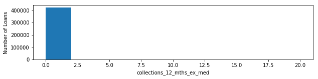


**delinq_2yrs**: The number of 30+ days past-due incidences of delinquency in the borrower's credit file for the past 2 years


    	Type: 			float64
    	Missing Values: 	29 (0.0%)
    	Mean: 			0.29
    	Range: 			(0.00, 29.00)


**delinq_amnt**: The past-due amount owed for the accounts on which the borrower is now delinquent.


    	Type: 			float64
    	Missing Values: 	29 (0.0%)
    	Mean: 			8.69
    	Range: 			(0.00, 86399.00)


**dti**: A ratio calculated using the borrower’s total monthly debt payments on the total debt obligations, excluding mortgage and the requested LC loan, divided by the borrower’s self-reported monthly income.


    	Type: 			float64
    	Missing Values: 	0 (0.0%)
    	Mean: 			16.99
    	Range: 			(0.00, 39.99)


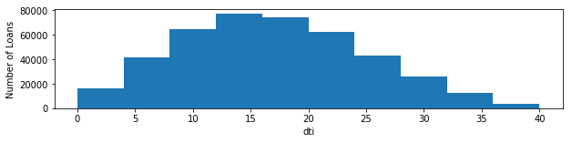


**earliest_cr_line**: The month the borrower's earliest reported credit line was opened


    	Type: 			float64
    	Missing Values: 	29 (0.0%)
    	Mean: 			5749.94
    	Range: 			(184.00, 25933.00)


**emp_length**: Employment length in years. Possible values are between 0 and 10 where 0 means less than one year and 10 means ten or more years. 


    	Type: 			float64
    	Missing Values: 	21519 (1.1%)
    	Mean: 			5.84
    	Range: 			(0.00, 10.00)


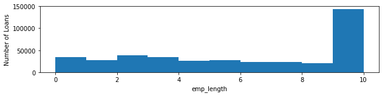


**home_ownership**: The home ownership status provided by the borrower during registration or obtained from the credit report. Our values are: RENT, OWN, MORTGAGE, OTHER


    	Type: 			object
    	Missing Values: 	0 (0.0%)
    	Number of Categories: 	4
    	Most Common Category: 	MORTGAGE


**inq_last_6mths**: The number of inquiries in past 6 months (excluding auto and mortgage inquiries)


    	Type: 			float64
    	Missing Values: 	29 (0.0%)
    	Mean: 			0.78
    	Range: 			(0.00, 33.00)


**installment**: The monthly payment owed by the borrower if the loan originates.


    	Type: 			float64
    	Missing Values: 	0 (0.0%)
    	Mean: 			414.03
    	Range: 			(14.01, 1409.99)


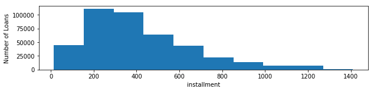


**int_rate**: Interest Rate on the loan


    	Type: 			float64
    	Missing Values: 	0 (0.0%)
    	Mean: 			12.74
    	Range: 			(5.42, 26.06)


**loan_amnt**: The listed amount of the loan applied for by the borrower. If at some point in time, the credit department reduces the loan amount, then it will be reflected in this value.


    	Type: 			float64
    	Missing Values: 	0 (0.0%)
    	Mean: 			12718.50
    	Range: 			(500.00, 35000.00)


**mo_sin_old_il_acct**: Months since oldest bank installment account opened


    	Type: 			float64
    	Missing Values: 	83911 (4.2%)
    	Mean: 			124.94
    	Range: 			(0.00, 649.00)


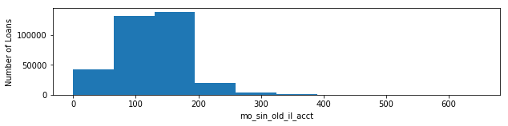


**mo_sin_old_rev_tl_op**: Months since oldest revolving account opened


    	Type: 			float64
    	Missing Values: 	70277 (3.5%)
    	Mean: 			180.39
    	Range: 			(3.00, 851.00)


**mo_sin_rcnt_rev_tl_op**: Months since most recent revolving account opened


    	Type: 			float64
    	Missing Values: 	70277 (3.5%)
    	Mean: 			13.25
    	Range: 			(0.00, 372.00)


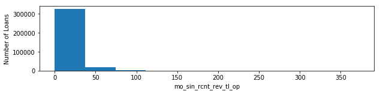


**mo_sin_rcnt_tl**: Months since most recent account opened


    	Type: 			float64
    	Missing Values: 	70276 (3.5%)
    	Mean: 			8.37
    	Range: 			(0.00, 226.00)


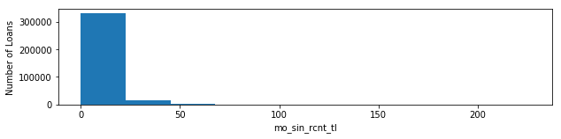


**mort_acc**: Number of mortgage accounts.


    	Type: 			float64
    	Missing Values: 	50030 (2.5%)
    	Mean: 			1.69
    	Range: 			(0.00, 34.00)


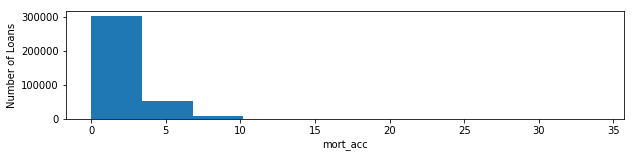


**mths_since_last_delinq**: The number of months since the borrower's last delinquency.


    	Type: 			float64
    	Missing Values: 	224620 (11.2%)
    	Mean: 			34.30
    	Range: 			(0.00, 188.00)


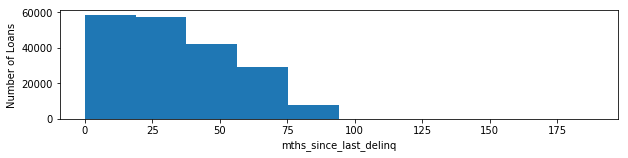


**mths_since_last_major_derog**: Months since most recent 90-day or worse rating


    	Type: 			float64
    	Missing Values: 	329015 (16.4%)
    	Mean: 			42.46
    	Range: 			(0.00, 188.00)


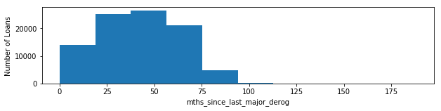


**mths_since_last_record**: The number of months since the last public record.


    	Type: 			float64
    	Missing Values: 	360872 (18.0%)
    	Mean: 			72.88
    	Range: 			(0.00, 129.00)


**mths_since_recent_bc**: Months since most recent bankcard account opened.


    	Type: 			float64
    	Missing Values: 	53373 (2.7%)
    	Mean: 			24.53
    	Range: 			(0.00, 616.00)


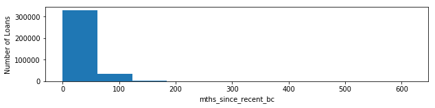


**mths_since_recent_bc_dlq**: Months since most recent bankcard delinquency


    	Type: 			float64
    	Missing Values: 	331393 (16.5%)
    	Mean: 			40.30
    	Range: 			(0.00, 176.00)


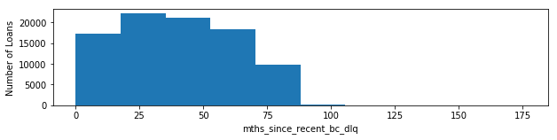


**mths_since_recent_inq**: Months since most recent inquiry.


    	Type: 			float64
    	Missing Values: 	88898 (4.4%)
    	Mean: 			6.95
    	Range: 			(0.00, 25.00)


**mths_since_recent_revol_delinq**: Months since most recent revolving delinquency.


    	Type: 			float64
    	Missing Values: 	294683 (14.7%)
    	Mean: 			36.15
    	Range: 			(0.00, 180.00)


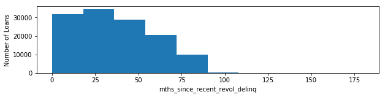


**num_accts_ever_120_pd**: Number of accounts ever 120 or more days past due


    	Type: 			float64
    	Missing Values: 	70276 (3.5%)
    	Mean: 			0.46
    	Range: 			(0.00, 35.00)


**num_actv_bc_tl**: Number of currently active bankcard accounts


    	Type: 			float64
    	Missing Values: 	70276 (3.5%)
    	Mean: 			3.66
    	Range: 			(0.00, 30.00)


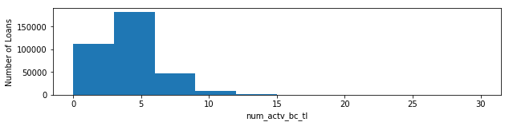


**num_actv_rev_tl**: Number of currently active revolving trades


    	Type: 			float64
    	Missing Values: 	70276 (3.5%)
    	Mean: 			5.67
    	Range: 			(0.00, 41.00)


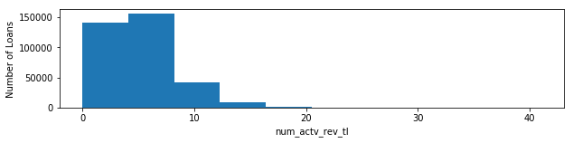


**num_bc_sats**: Number of satisfactory bankcard accounts


    	Type: 			float64
    	Missing Values: 	58590 (2.9%)
    	Mean: 			4.61
    	Range: 			(0.00, 46.00)


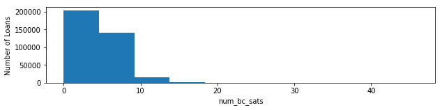


**num_bc_tl**: Number of bankcard accounts


    	Type: 			float64
    	Missing Values: 	70276 (3.5%)
    	Mean: 			8.60
    	Range: 			(0.00, 65.00)


**num_il_tl**: Number of installment accounts


    	Type: 			float64
    	Missing Values: 	70276 (3.5%)
    	Mean: 			7.98
    	Range: 			(0.00, 150.00)


**num_op_rev_tl**: Number of open revolving accounts


    	Type: 			float64
    	Missing Values: 	70276 (3.5%)
    	Mean: 			8.11
    	Range: 			(0.00, 62.00)


**num_rev_accts**: Number of revolving accounts


    	Type: 			float64
    	Missing Values: 	70276 (3.5%)
    	Mean: 			14.93
    	Range: 			(0.00, 105.00)


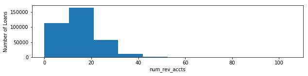


**num_rev_tl_bal_gt_0**: Number of revolving trades with balance >0


    	Type: 			float64
    	Missing Values: 	70276 (3.5%)
    	Mean: 			5.65
    	Range: 			(0.00, 38.00)


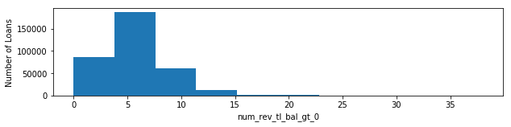


**num_sats**: Number of satisfactory accounts


    	Type: 			float64
    	Missing Values: 	58590 (2.9%)
    	Mean: 			11.22
    	Range: 			(0.00, 84.00)


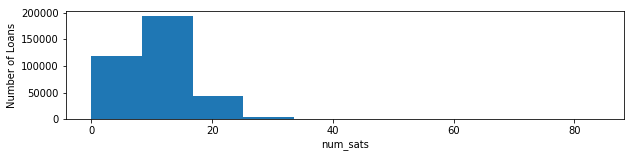


**num_tl_120dpd_2m**: Number of accounts currently 120 days past due (updated in past 2 months)


    	Type: 			float64
    	Missing Values: 	78691 (3.9%)
    	Mean: 			0.00
    	Range: 			(0.00, 3.00)


**num_tl_30dpd**: Number of accounts currently 30 days past due (updated in past 2 months)


    	Type: 			float64
    	Missing Values: 	70276 (3.5%)
    	Mean: 			0.00
    	Range: 			(0.00, 4.00)


**num_tl_90g_dpd_24m**: Number of accounts 90 or more days past due in last 24 months


    	Type: 			float64
    	Missing Values: 	70276 (3.5%)
    	Mean: 			0.09
    	Range: 			(0.00, 24.00)


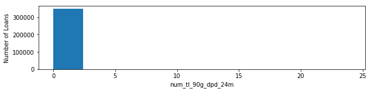


**num_tl_op_past_12m**: Number of accounts opened in past 12 months


    	Type: 			float64
    	Missing Values: 	70276 (3.5%)
    	Mean: 			1.94
    	Range: 			(0.00, 26.00)


**open_acc**: The number of open credit lines in the borrower's credit file.


    	Type: 			float64
    	Missing Values: 	29 (0.0%)
    	Mean: 			11.01
    	Range: 			(0.00, 84.00)


**pct_tl_nvr_dlq**: Percent of trades never delinquent


    	Type: 			float64
    	Missing Values: 	70390 (3.5%)
    	Mean: 			94.44
    	Range: 			(7.70, 100.00)


**percent_bc_gt_75**: Percentage of all bankcard accounts > 75% of limit.


    	Type: 			float64
    	Missing Values: 	53858 (2.7%)
    	Mean: 			50.54
    	Range: 			(0.00, 100.00)


**pub_rec**: Number of derogatory public records


    	Type: 			float64
    	Missing Values: 	29 (0.0%)
    	Mean: 			0.17
    	Range: 			(0.00, 63.00)


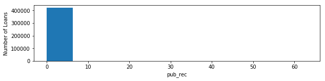


**pub_rec_bankruptcies**: Number of public record bankruptcies


    	Type: 			float64
    	Missing Values: 	1365 (0.1%)
    	Mean: 			0.11
    	Range: 			(0.00, 12.00)


**purpose**: A category provided by the borrower for the loan request. 


    	Type: 			object
    	Missing Values: 	0 (0.0%)
    	Number of Categories: 	14
    	Most Common Category: 	debt_consolidation


**revol_bal**: Total credit revolving balance


    	Type: 			float64
    	Missing Values: 	0 (0.0%)
    	Mean: 			15406.16
    	Range: 			(0.00, 2568995.00)


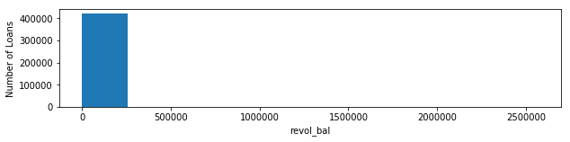


**revol_util**: Revolving line utilization rate, or the amount of credit the borrower is using relative to all available revolving credit.


    	Type: 			float64
    	Missing Values: 	296 (0.0%)
    	Mean: 			55.02
    	Range: 			(0.00, 892.30)


**sub_grade**: LC assigned loan subgrade


    	Type: 			float64
    	Missing Values: 	0 (0.0%)
    	Mean: 			10.59
    	Range: 			(1.00, 35.00)


**tax_liens**: Number of tax liens


    	Type: 			float64
    	Missing Values: 	105 (0.0%)
    	Mean: 			0.04
    	Range: 			(0.00, 63.00)


**term**: The number of payments on the loan. Values are in months and can be either 36 or 60.


    	Type: 			object
    	Missing Values: 	0 (0.0%)
    	Number of Categories: 	2
    	Most Common Category: 	 36 months


**tot_coll_amt**: Total collection amounts ever owed


    	Type: 			float64
    	Missing Values: 	70276 (3.5%)
    	Mean: 			213.03
    	Range: 			(0.00, 9152545.00)


**tot_cur_bal**: Total current balance of all accounts


    	Type: 			float64
    	Missing Values: 	70276 (3.5%)
    	Mean: 			128545.52
    	Range: 			(0.00, 8000078.00)


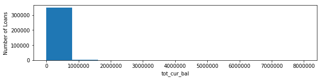


**tot_hi_cred_lim**: Total high credit/credit limit


    	Type: 			float64
    	Missing Values: 	70276 (3.5%)
    	Mean: 			157552.13
    	Range: 			(0.00, 9999999.00)


**total_acc**: The total number of credit lines currently in the borrower's credit file


    	Type: 			float64
    	Missing Values: 	29 (0.0%)
    	Mean: 			24.49
    	Range: 			(1.00, 162.00)


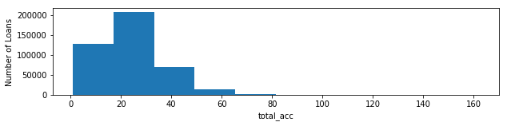


**total_bal_ex_mort**: Total credit balance excluding mortgage


    	Type: 			float64
    	Missing Values: 	50030 (2.5%)
    	Mean: 			44002.55
    	Range: 			(0.00, 2688920.00)


**total_bc_limit**: Total bankcard high credit/credit limit


    	Type: 			float64
    	Missing Values: 	50030 (2.5%)
    	Mean: 			19602.34
    	Range: 			(0.00, 760000.00)


**total_il_high_credit_limit**: Total installment high credit/credit limit


    	Type: 			float64
    	Missing Values: 	70276 (3.5%)
    	Mean: 			36279.50
    	Range: 			(0.00, 1241783.00)


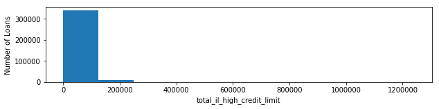


**total_rev_hi_lim**: Total revolving high credit/credit limit


    	Type: 			float64
    	Missing Values: 	70276 (3.5%)
    	Mean: 			29473.47
    	Range: 			(0.00, 9999999.00)


**verification_status**: Indicates if income was verified by LC, not verified, or if the income source was verified


    	Type: 			object
    	Missing Values: 	0 (0.0%)
    	Number of Categories: 	3
    	Most Common Category: 	Not Verified


