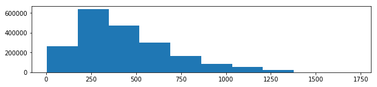
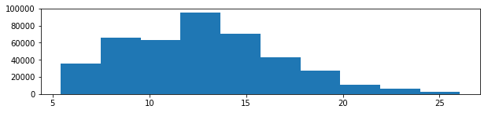
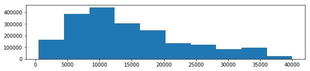
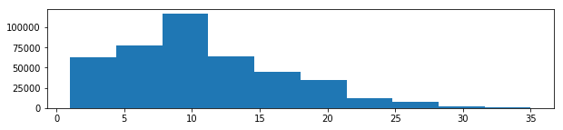
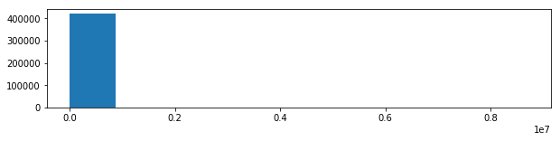
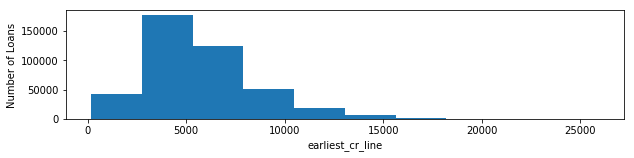
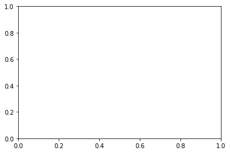

## Contents
{:.no_toc}
*  
{: toc}


Note: **`ls`** is DataFrame used for EDA and never modified. **`ls_clean`** is DataFrame updated progressively to create final processed dataset

## 0. Imports and Functions


```python
#IMPORTS
import warnings; warnings.filterwarnings('ignore')
import numpy as np
import pandas as pd
import matplotlib.pyplot as plt
from sklearn.preprocessing import StandardScaler, MinMaxScaler
from IPython.display import Markdown, display
pd.options.display.max_rows = 150
pd.options.display.max_columns = 200
pd.options.display.float_format = '{:.3f}'.format
plt.rcParams['figure.figsize'] = (10, 2)
```


```python
#LOAD LOANSTATS
directory = '../../../data/'
ls = pd.read_hdf(directory + 'LoanStats_clean.h5', 'full_loanstats') # HDF5
```


```python
#LOAD DATA DICTIONARY
sheet_dict = pd.read_excel(directory + 'LCDataDictionary.xlsx', sheet_name=None)
data_dict = {}
for key in sheet_dict:
    for index, row in sheet_dict[key].iterrows():
        if type(row[0]) != float:
            data_dict[row[0].strip()] = row[1]
```


```python
#CREATE 'ls_clean'
ls.sort_index(axis=1, inplace=True)
ls_clean = ls.copy()
```


```python
#FUNCTION FOR EDA
def EDA_attr(attr):
    """ Prints basic EDA for given attribute (muted by commenting)"""
    num_observations = len(ls_clean)
    attr_type = ls_clean[attr].dtype
    missing_values = ls_clean[attr].isnull().sum()
    display(Markdown('**{}**: {}'.format(attr, data_dict.get(attr, "NULL"))))
    print('\tType: \t\t\t{}'.format(attr_type))
    print('\tMissing Values: \t{} ({:.1%})'.format(
                    missing_values, missing_values/num_observations))    
    
    if attr_type == 'float64':  # numerical variables
        print('\tMean: \t\t\t{:.2f}'.format(ls_clean[attr].mean()))
        print('\tRange: \t\t\t({:.2f}, {:.2f})'.format(ls_clean[attr].min(), ls_clean[attr].max()))
        plt.hist(ls_clean[attr]); plt.show()
    
    if attr_type == 'object':   # categorical variables
        print('\tNumber of Categories: \t{}'.format(len(ls_clean.groupby(attr))))
        print('\tMost Common Category: \t{}'.format(ls_clean.groupby(attr)['loan_amnt'].count().idxmax()))
```


```python
#FUNCTION FOR SCALING
scaler_dict = {} # dictionary to store scalers, to be used for inverse transforms
scaler_list = [] # list to store variables to be scaled
def scale_attr(attr, fit_data=None, scaler=None):
    """ Scales attribute with StandardScaler (default) or MinMaxScaler"""
    scaler_list.append(attr)
```


```python
#FUNCTION FOR DUMMY CREATION
def dummy_attr(attr):
    """ Creates dummy variables and drops original attribute"""
    global ls_clean
    if attr not in list(ls_clean): return
    prefix = 'D_' + attr
    dummies = pd.get_dummies(ls_clean[attr], prefix=prefix)
    ls_clean.drop([attr], axis=1, inplace=True)
    ls_clean = pd.concat([ls_clean, dummies], axis=1)
```


```python
#FUNCTION FOR OUTLIER DETECTION
ls_clean['outlier'] = 0 # this column is incremented for identified outlier instances
def outlier_attr(attr, threshold):
    """ Identifies outliers above threshold and updates outlier indictor""" 
    outliers = ls[attr] > threshold
    ls_clean['outlier'] = ls_clean['outlier'] + outliers
    return outliers
```


## 1. Inconsequential Variable Removal (20 Variables)

First, we drop non-existant, empty, constant or otherwise unmeaningful variables:


```python
#DROP INCONSEQUENTIAL VARIABLES
drop = ['dataset', # just indicates the dataset
        'desc', # non-standard text description
        'disbursement_method', # just indicates cash or direct_pay
        'emp_title', # non-standard text description
        'funded_amnt', # redundant with loan_amount
        'funded_amnt_inv', # redundant with loan_amount
        'grade', # redundant when using sub_grade
        'initial_list_status', # possible values are w or f
        'title', # non-standard text description
        'zip_code'] # we could make it a dummy, but there would be 954 of them
ls_clean.drop(drop, axis=1, inplace=True)
```


Second, we remove the loan instances that are not term-complete:


```python
#DROP TERM INCOMPLETE LOANS
completed_36 = (ls['issue_d'] < '2015-04-01') & (ls['term']  == ' 36 months')
completed_60 = (ls['issue_d'] < '2013-04-01') & (ls['term']  == ' 60 months')
ls_clean = ls_clean[completed_36 | completed_60]
```


## 2. Independent Variable Preprocessing (93 Variables)

We perform type conversions, outlier identification, scaling and dummy creation for each of the independent variables:

### 2A. Loan Characteristics


**installment**: The monthly payment owed by the borrower if the loan originates.


    	Type: 			float64
    	Missing Values: 	0 (0.0%)
    	Mean: 			414.03
    	Range: 			(14.01, 1409.99)





**int_rate**: Interest Rate on the loan


    	Type: 			float64
    	Missing Values: 	0 (0.0%)
    	Mean: 			12.74
    	Range: 			(5.42, 26.06)





**loan_amnt**: The listed amount of the loan applied for by the borrower. If at some point in time, the credit department reduces the loan amount, then it will be reflected in this value.


    	Type: 			float64
    	Missing Values: 	0 (0.0%)
    	Mean: 			12718.50
    	Range: 			(500.00, 35000.00)





```python
#PURPOSE
X = 'purpose'
EDA_attr(X)
dummy_attr(X)
```


**purpose**: A category provided by the borrower for the loan request. 


    	Type: 			object
    	Missing Values: 	0 (0.0%)
    	Number of Categories: 	14
    	Most Common Category: 	debt_consolidation


**sub_grade**: LC assigned loan subgrade


    	Type: 			float64
    	Missing Values: 	0 (0.0%)
    	Mean: 			10.59
    	Range: 			(1.00, 35.00)





**term**: The number of payments on the loan. Values are in months and can be either 36 or 60.


    	Type: 			object
    	Missing Values: 	0 (0.0%)
    	Number of Categories: 	2
    	Most Common Category: 	 36 months


**verification_status**: Indicates if income was verified by LC, not verified, or if the income source was verified


    	Type: 			object
    	Missing Values: 	0 (0.0%)
    	Number of Categories: 	3
    	Most Common Category: 	Not Verified


### 2B. Borrower Demographics


**addr_state**: The state provided by the borrower in the loan application


    	Type: 			object
    	Missing Values: 	0 (0.0%)
    	Number of Categories: 	50
    	Most Common Category: 	CA


**annual_inc**: The self-reported annual income provided by the borrower during registration.


    	Type: 			float64
    	Missing Values: 	4 (0.0%)
    	Mean: 			71625.96
    	Range: 			(1896.00, 8706582.00)





**emp_length**: Employment length in years. Possible values are between 0 and 10 where 0 means less than one year and 10 means ten or more years. 


    	Type: 			float64
    	Missing Values: 	21519 (5.1%)
    	Mean: 			5.84
    	Range: 			(0.00, 10.00)


**home_ownership**: The home ownership status provided by the borrower during registration or obtained from the credit report. Our values are: RENT, OWN, MORTGAGE, OTHER


    	Type: 			object
    	Missing Values: 	0 (0.0%)
    	Number of Categories: 	4
    	Most Common Category: 	MORTGAGE


### 2C. Credit History Information
`acc_now_delinq`, `acc_open_past_24mths`, `all_util`,
- `avg_cur_bal`: scaling
- `bc_open_to_buy`: scaling
- `bc_util`: scaling
- `chargeoff_within_12_mths`: scaling
- `collections_12_mths_ex_med`: outliers, scaling
- `delinq_2yrs`: scaling
- `delinq_amnt`: standard scaling
- `dti`: mapping, scaling
- `earliest_cr_line`: mapping, scaling
- `il_util`: scaling
- `inq_fi`: scaling
- `inq_last_12m`: scaling
- `inq_last_6mths`: scaling
- `max_bal_bc`: scaling
- `mo_sin_old_il_acct`: scaling
- `mo_sin_old_rev_tl_op`: scaling
- `mo_sin_rcnt_rev_tl_op`: scaling
- `mo_sin_rcnt_tl`: scaling
- `mort_acc`: scaling
- `mths_since_last_delinq`: scaling
- `mths_since_last_major_derog`: scaling
- `mths_since_last_record`: scaling
- `mths_since_rcnt_il`: scaling
- `mths_since_recent_bc`: scaling
- `mths_since_recent_bc_dlq`: scaling
- `mths_since_recent_inq`: scaling
- `mths_since_recent_revol_delinq`: scaling
- `num_accts_ever_120_pd`: scaling
- `num_actv_bc_tl`: scaling
- `num_actv_rev_tl`: scaling
- `num_bc_sats`: scaling
- `num_bc_tl`: scaling
- `num_il_tl`: scaling
- `num_op_rev_tl`: scaling
- `num_rev_accts`: scaling
- `num_rev_tl_bal_gt_0`: scaling
- `num_sats`: scaling
- `num_tl_120dpd_2m`: scaling
- `num_tl_30dpd`: scaling
- `num_tl_90g_dpd_24m`: scaling
- `num_tl_op_past_12m`: scaling
- `open_acc`: scaling
- `open_acc_6m`: scaling
- `open_act_il`: scaling
- `open_il_12m`: scaling
- `open_il_24m`: scaling
- `open_rv_12m`: scaling
- `open_rv_24m`: scaling
- `pct_tl_nvr_dlq`: scaling
- `percent_bc_gt_75`: scaling
- `pub_rec`: scaling
- `pub_rec_bankruptcies`: scaling
- `revol_bal`: scaling
- `revol_util`: mapping, scaling
- `tax_liens`: scaling
- `tot_coll_amt`: scaling
- `tot_cur_bal`: scaling
- `tot_hi_cred_lim`: scaling
- `total_acc`: scaling
- `total_bal_ex_mort`: scaling
- `total_bal_il`: scaling
- `total_bc_limit`: scaling
- `total_cu_tl`: scaling
- `total_il_high_credit_limit`: scaling
- `total_rev_hi_lim`: scaling


```python
X = 'acc_now_delinq'
EDA_attr(X)
outliers = outlier_attr(X, 7)

```


**acc_now_delinq**: The number of accounts on which the borrower is now delinquent.


    	Type: 			float64
    	Missing Values: 	29 (0.0%)
    	Mean: 			0.00
    	Range: 			(0.00, 14.00)





```python
X = 'acc_open_past_24mths'
EDA_attr(X)
scale_attr(X)
```


**acc_open_past_24mths**: Number of trades opened in past 24 months.


    	Type: 			float64
    	Missing Values: 	50030 (11.9%)
    	Mean: 			4.19
    	Range: 			(0.00, 53.00)


```python
X = 'all_util'
EDA_attr(X)
scale_attr(X)
```


**all_util**: Balance to credit limit on all trades


    	Type: 			float64
    	Missing Values: 	420181 (100.0%)
    	Mean: 			nan
    	Range: 			(nan, nan)


    ---------------------------------------------------------------------------

    ValueError                                Traceback (most recent call last)

    <ipython-input-24-b7981050f85b> in <module>()
          1 # ALL_UTIL
          2 X = 'all_util'
    ----> 3 EDA_attr(X)
          4 scale_attr(X)


    <ipython-input-5-01117813923a> in EDA_attr(attr)
         13         print('\tMean: \t\t\t{:.2f}'.format(ls_clean[attr].mean()))
         14         print('\tRange: \t\t\t({:.2f}, {:.2f})'.format(ls_clean[attr].min(), ls_clean[attr].max()))
    ---> 15         plt.hist(ls_clean[attr]); plt.show()
         16 
         17     if attr_type == 'object':   # categorical variables


    ~/anaconda3/lib/python3.6/site-packages/matplotlib/pyplot.py in hist(x, bins, range, density, weights, cumulative, bottom, histtype, align, orientation, rwidth, log, color, label, stacked, normed, data, **kwargs)
       2617         align=align, orientation=orientation, rwidth=rwidth, log=log,
       2618         color=color, label=label, stacked=stacked, normed=normed,
    -> 2619         data=data, **kwargs)
       2620 
       2621 # Autogenerated by boilerplate.py.  Do not edit as changes will be lost.


    ~/anaconda3/lib/python3.6/site-packages/matplotlib/__init__.py in inner(ax, data, *args, **kwargs)
       1783                         "the Matplotlib list!)" % (label_namer, func.__name__),
       1784                         RuntimeWarning, stacklevel=2)
    -> 1785             return func(ax, *args, **kwargs)
       1786 
       1787         inner.__doc__ = _add_data_doc(inner.__doc__,


    ~/anaconda3/lib/python3.6/site-packages/matplotlib/axes/_axes.py in hist(self, x, bins, range, density, weights, cumulative, bottom, histtype, align, orientation, rwidth, log, color, label, stacked, normed, **kwargs)
       6567             # this will automatically overwrite bins,
       6568             # so that each histogram uses the same bins
    -> 6569             m, bins = np.histogram(x[i], bins, weights=w[i], **hist_kwargs)
       6570             m = m.astype(float)  # causes problems later if it's an int
       6571             if mlast is None:


    ~/anaconda3/lib/python3.6/site-packages/numpy/lib/function_base.py in histogram(a, bins, range, normed, weights, density)
        665     if first_edge > last_edge:
        666         raise ValueError(
    --> 667             'max must be larger than min in range parameter.')
        668     if not np.all(np.isfinite([first_edge, last_edge])):
        669         raise ValueError(


    ValueError: max must be larger than min in range parameter.





```python
X = 'avg_cur_bal'
EDA_attr(X)
scale_attr(X)
```


```python
X = 'bc_open_to_buy'
EDA_attr(X)
scale_attr(X)
```


```python
X = 'bc_util'
EDA_attr(X)
scale_attr(X)
```


```python
X = 'chargeoff_within_12_mths'
EDA_attr(X)
scale_attr(X)
```


```python
X = 'collections_12_mths_ex_med'
EDA_attr(X)
outliers = outlier_attr(X, 12)
scale_attr(X,fit_data=ls_clean[~outliers][[X]])
```


```python
X = 'delinq_2yrs'
EDA_attr(X)
scale_attr(X)
```


```python
X = 'delinq_amnt'
EDA_attr(X)
scale_attr(X)
```


```python
X = 'dti'
EDA_attr(X)
ls_clean[ls[X]==-1] = np.NaN
scale_attr(X)
```


```python
X = 'earliest_cr_line'
EDA_attr(X)

ls_clean[X] =  np.array((ls['issue_d'] - ls[X]).dt.days).reshape(-1,1)

scale_attr(X)
```


```python
X = 'il_util'
EDA_attr(X)
scale_attr(X)
```


```python
X = 'inq_fi'
EDA_attr(X)
scale_attr(X)
```


```python
X = 'inq_last_12m'
EDA_attr(X)
scale_attr(X)
```


```python
X = 'inq_last_6mths'
EDA_attr(X)
scale_attr(X)
```


```python
X = 'max_bal_bc'
EDA_attr(X)
scale_attr(X)
```


```python
X =  'mo_sin_old_il_acct'
EDA_attr(X)
scale_attr(X)
```


```python
X =  'mo_sin_old_rev_tl_op'
EDA_attr(X)
scale_attr(X)
```


```python
X = 'mo_sin_rcnt_rev_tl_op'
EDA_attr(X)
scale_attr(X)
```


```python
X = 'mo_sin_rcnt_tl'
EDA_attr(X)
scale_attr(X)
```


```python
X = 'mort_acc'
EDA_attr(X)
scale_attr(X)
```


```python
X = 'mths_since_last_delinq'
EDA_attr(X)
scale_attr(X)
```


```python
X = 'mths_since_last_major_derog'
EDA_attr(X)
scale_attr(X)
```


```python
X = 'mths_since_last_record'
EDA_attr(X)
scale_attr(X)
```


```python
X = 'mths_since_rcnt_il'
EDA_attr(X)
scale_attr(X)
```


```python
X = 'mths_since_recent_bc'
EDA_attr(X)
scale_attr(X)
```


```python
X = 'mths_since_recent_bc_dlq'
EDA_attr(X)
scale_attr(X)
```


```python
X =  'mths_since_recent_inq'
EDA_attr(X)
scale_attr(X)
```


```python
X= 'mths_since_recent_revol_delinq'
EDA_attr(X)
scale_attr(X)
```


```python
X = 'num_accts_ever_120_pd'
EDA_attr(X)
scale_attr(X)
```


```python
X = 'num_actv_bc_tl'
EDA_attr(X)
scale_attr(X)
```


```python
X = 'num_actv_rev_tl'
EDA_attr(X)
scale_attr(X)
```


```python
X = 'num_bc_sats'
EDA_attr(X)
scale_attr(X)
```


```python
X =  'num_bc_tl'
EDA_attr(X)
scale_attr(X)
```


```python
X = 'num_il_tl'
EDA_attr(X)
scale_attr(X)
```


```python
X = 'num_op_rev_tl'
EDA_attr(X)
scale_attr(X)
```


```python
X = 'num_rev_accts'
EDA_attr(X)
scale_attr(X)
```


```python
X = 'num_rev_tl_bal_gt_0'
EDA_attr(X)
scale_attr(X)
```


```python
X = 'num_sats'
EDA_attr(X)
scale_attr(X)
```


```python
X = 'num_tl_120dpd_2m'
EDA_attr(X)
scale_attr(X)
```


```python
X = 'num_tl_30dpd'
EDA_attr(X)
scale_attr(X)
```


```python
X = 'num_tl_90g_dpd_24m'
EDA_attr(X)
scale_attr(X)
```


```python
X = 'num_tl_op_past_12m'
EDA_attr(X)
scale_attr(X)
```


```python
X = 'open_acc'
EDA_attr(X)
scale_attr(X)
```


```python
X = 'open_acc_6m'
EDA_attr(X)
scale_attr(X)
```


```python
X = 'open_act_il'
EDA_attr(X)
scale_attr(X)
```


```python
X = 'open_il_12m'
EDA_attr(X)
scale_attr(X)
```


```python
X = 'open_il_24m'
EDA_attr(X)
scale_attr(X)
```


```python
X = 'open_rv_12m'
EDA_attr(X)
scale_attr(X)
```


```python
X = 'open_rv_24m'
EDA_attr(X)
scale_attr(X)
```


```python
X = 'pct_tl_nvr_dlq'
EDA_attr(X)
scale_attr(X)
```


```python
X = 'percent_bc_gt_75'
EDA_attr(X)
scale_attr(X)
```


```python
X ='pub_rec'
EDA_attr(X)
scale_attr(X)
```


```python
X = 'pub_rec_bankruptcies'
EDA_attr(X)
scale_attr(X)
```


```python
X = 'revol_bal'
EDA_attr(X)
scale_attr(X)
```


```python
X = 'revol_util'
EDA_attr(X)
ls_clean[X] = ls[X].str[:-1].astype(np.float)
scale_attr(X)
```


```python
X = 'tax_liens'
EDA_attr(X)
scale_attr(X)
```


```python
X = 'tot_coll_amt'
EDA_attr(X)
scale_attr(X)
```


```python
X = 'tot_cur_bal'
EDA_attr(X)
scale_attr(X)
```


```python
X = 'tot_hi_cred_lim'
EDA_attr(X)
scale_attr(X)
```


```python
X = 'total_acc'
EDA_attr(X)
scale_attr(X)
```


```python
X = 'total_bal_ex_mort'
EDA_attr(X)
scale_attr(X)
```


```python
X = 'total_bal_il'
EDA_attr(X)
scale_attr(X)
```


```python
X = 'total_bc_limit'
EDA_attr(X)
scale_attr(X)
```


```python
X = 'total_cu_tl'
EDA_attr(X)
scale_attr(X)
```


```python
X = 'total_il_high_credit_limit'
EDA_attr(X)
scale_attr(X)
```


```python
X = 'total_rev_hi_lim'
EDA_attr(X)
scale_attr(X)
```


### 2D. Co-Borrower Information
`application_type`, `annual_inc_joint`, `dti_joint`, `revol_bal_joint`, `sec_app_chargeoff_within_12_mths`, `sec_app_collections_12_mths_ex_med`, `sec_app_earliest_cr_line`, `sec_app_inq_last_6mths`, `sec_app_mort_acc`, `sec_app_mths_since_last_major_derog`, `sec_app_num_rev_accts`, `sec_app_open_acc`, `sec_app_open_act_il`, `sec_app_revol_util`, `verification_status_joint`


```python
X = 'application_type'
EDA_attr(X)
dummy_attr(X)
```


```python
X = 'annual_inc_joint'
EDA_attr(X)
outliers = outlier_attr(X, 10000000)
scale_attr(X, ls[~outliers][[X]])
```


```python
X = 'dti_joint'
EDA_attr(X)
scale_attr(X)
```


```python
X = 'revol_bal_joint'
EDA_attr(X)
scale_attr(X)
```


```python
X ='sec_app_chargeoff_within_12_mths'
EDA_attr(X)
scale_attr(X)
```


```python
X = 'sec_app_collections_12_mths_ex_med'
EDA_attr(X)
outliers = outlier_attr(X, 12)
scale_attr(X, ls[~outliers][[X]])
```


```python
X = 'sec_app_earliest_cr_line'
EDA_attr(X)
ls_clean[X] =  np.array((ls['issue_d'] - ls[X]).dt.days).reshape(-1,1)
scale_attr(X)
```


```python
X = 'sec_app_inq_last_6mths'
EDA_attr(X)
scale_attr(X)
```


```python
X = 'sec_app_mort_acc'
EDA_attr(X)
outliers = outlier_attr(X, 15)
scale_attr(X, ls[~outliers][[X]])
```


```python
X = 'sec_app_mths_since_last_major_derog'
EDA_attr(X)
scale_attr(X)
```


```python
X = 'sec_app_num_rev_accts'
EDA_attr(X)
scale_attr(X)
```


```python
X = 'sec_app_open_acc'
EDA_attr(X)
scale_attr(X)
```


```python
X = 'sec_app_open_act_il'
EDA_attr(X)
scale_attr(X)
```


```python
X = 'sec_app_revol_util'
EDA_attr(X)
scale_attr(X)
```


```python
X = 'verification_status_joint'
EDA_attr(X)
dummy_attr(X)
```


## 3. Dependent Variable Feature Design (36 variables)

**feature design of outcome variable**


```python
dependent_cols = [
    
    # Payment Variables (11): 
    'issue_d', 'last_pymnt_amnt', 'last_pymnt_d', 'loan_status', 
    'next_pymnt_d', 'out_prncp', 'out_prncp_inv', 'total_pymnt', 
    'total_pymnt_inv', 'total_rec_int', 'total_rec_prncp', 
    
    # Hardship/Collections/Settlements
    'collection_recovery_fee', 'debt_settlement_flag', 'debt_settlement_flag_date', 'deferral_term', 
    'hardship_amount', 'hardship_dpd', 'hardship_end_date', 'hardship_flag', 
    'hardship_last_payment_amount','hardship_length', 'hardship_loan_status', 'hardship_payoff_balance_amount', 
    'hardship_reason', 'hardship_start_date', 'hardship_status', 'hardship_type',
    'last_credit_pull_d', 'orig_projected_additional_accrued_interest', 'payment_plan_start_date', 'pymnt_plan', 
    'recoveries', 'settlement_amount', 'settlement_date', 'settlement_percentage', 
    'settlement_status', 'settlement_term', 'total_rec_late_fee', ]

ls_clean.drop(dependent_cols, axis=1, inplace=True)
```


There are three features that we will design to represent the outcome of loan:
- A. **Outcome Classification** (Repaid/Current vs. Not Repaid/Current)
- B. **Principal Repaid Percentage**
- C. **Annual Percentage Rate of Return** (APR)

Our focus will be on loans that have completed their terms. This subset of loans provides the most complete outcome information. In-force loans cannot provide conclusive inferences on loan outcomes because the full term has not completed. Therefore information

### 3A. `OUT_Class`


```python
print(ls.groupby('loan_status')['loan_amnt'].count())
len(ls['loan_status'])
```


```python
ls_clean['OUT_Class'] = 0
ls_clean.loc[ls['loan_status'].str.contains('Fully Paid'), 'OUT_Class'] = 1
ls_clean.loc[ls['loan_status'].str.contains('Current'), 'OUT_Class'] = 1
```


```python
print(ls_clean.groupby('OUT_Class')['loan_amnt'].count())
len(ls['loan_status'])
```


### 3B. `OUT_Prncp_Repaid_Percentage`


```python
ls_clean['OUT_Prncp_Repaid_Percentage'] = ls['total_rec_prncp'] / ls['loan_amnt']
```


```python
ls_clean['OUT_Prncp_Repaid_Percentage'].describe()
```


### 3C. `OUT_APR`


```python

    
```


<hr style="height:5pt">

## 4. Final Processing


```python
ls_clean2 = ls_clean[ls_clean['outlier']==0]
ls_clean2 = ls_clean2.drop('outlier', axis=1)
```


```python
ls_clean2.to_hdf(directory + 'LS_CLEAN.h5', 'LS_CLEAN')
ls_clean3.to_hdf(directory + 'LS_CLEAN_COMPLETED.h5', 'LS_CLEAN_COMPLETED')
```

