## Contents
{:.no_toc}
*  
{: toc}

0. **Imports and Functions**
1. **Inconsequential Variable Removal**: removal of non-existant, empty, constant or otherwise unmeaningful variables
2. **Independent Variable Preprocessing**: type conversions, outlier identification, dummy creation
    - 2A. *Loan Characteristics* (6)
    - 2B. *Borrower Demographics* (4)
    - 2C. *Borrower Credit History* (68)
    - 2D. *Co-Borrower Information* (15)
  
  
3. **Dependent Variable Feature Design**: feature design of outcome variable
4. **Final Processing**: final cleaning and export

Note: **`ls`** is DataFrame used for EDA and never modified. **`ls_clean`** is DataFrame updated progressively to create final processed dataset

## 0. Imports and Functions

## 1. Inconsequential Variable Removal

Removal of non-existant, empty, constant or otherwise unmeaningful variables

**Do Not Exist** (6): 
- `fico_range_high`, `fico_range_low`, `last_fico_range_high`, `last_fico_range_low`, `sec_app_fico_range_high`, `sec_app_fico_range_low`

**Empty/Constant** (already dropped) (4): 
- `id`, `member_id`, `url`, `policy_code`

**Not Meaningful**:
- `dataset`: just indicates the dataset
- `desc`: non-standard text description
- `disbursement_method`: just indicates cash or direct_pay
- `emp_title`: non-standard text description
- `funded_amnt`: redundant with loan_amount (?)
- `funded_amnt_inv` redundany with loan_amount (?)
- `grade`: redundant when using sub_grade
- `initial_list_status`: possible values are w or f (?)
- `title`: non-standard text description
- `zip_code`: we could make it a dummy, but there would be 954 of them

## 2. Preprocessing of Independent Variables (93 Variables)

**2A. Loan Characteristics (6)**:
- `installment`: scaling
- `int_rate`: mapping, scaling
- `loan_amnt`: scaling
- `purpose`: dummy(14)
- `sub_grade`: mapping, scaling
- `term`: dummy(2)
- `verification_status`: dummy(3)

**2B. Borrower Demographics (4)**:
- `addr_state`: dummy(51)
- `annual_inc`: outliers, scaling
- `emp_length`: mapping, scaling
- `home_ownership`: mapping, dummy(4)

**2C. Borrower Credit History (68)**
- `acc_now_delinq`: outliers,  scaling
- `acc_open_past_24mths`: scaling
- `all_util`: scaling
- `avg_cur_bal`: scaling
- `bc_open_to_buy`: scaling
- `bc_util`: scaling
- `chargeoff_within_12_mths`: scaling
- `collections_12_mths_ex_med`: outliers, scaling
- `delinq_2yrs`: scaling
- `delinq_amnt`: standard scaling
- `dti`: mapping, scaling
- `earliest_cr_line`: mapping, scaling
- `il_util`: scaling
- `inq_fi`: scaling
- `inq_last_12m`: scaling
- `inq_last_6mths`: scaling
- `max_bal_bc`: scaling
- `mo_sin_old_il_acct`: scaling
- `mo_sin_old_rev_tl_op`: scaling
- `mo_sin_rcnt_rev_tl_op`: scaling
- `mo_sin_rcnt_tl`: scaling
- `mort_acc`: scaling
- `mths_since_last_delinq`: scaling
- `mths_since_last_major_derog`: scaling
- `mths_since_last_record`: scaling
- `mths_since_rcnt_il`: scaling
- `mths_since_recent_bc`: scaling
- `mths_since_recent_bc_dlq`: scaling
- `mths_since_recent_inq`: scaling
- `mths_since_recent_revol_delinq`: scaling
- `num_accts_ever_120_pd`: scaling
- `num_actv_bc_tl`: scaling
- `num_actv_rev_tl`: scaling
- `num_bc_sats`: scaling
- `num_bc_tl`: scaling
- `num_il_tl`: scaling
- `num_op_rev_tl`: scaling
- `num_rev_accts`: scaling
- `num_rev_tl_bal_gt_0`: scaling
- `num_sats`: scaling
- `num_tl_120dpd_2m`: scaling
- `num_tl_30dpd`: scaling
- `num_tl_90g_dpd_24m`: scaling
- `num_tl_op_past_12m`: scaling
- `open_acc`: scaling
- `open_acc_6m`: scaling
- `open_act_il`: scaling
- `open_il_12m`: scaling
- `open_il_24m`: scaling
- `open_rv_12m`: scaling
- `open_rv_24m`: scaling
- `pct_tl_nvr_dlq`: scaling
- `percent_bc_gt_75`: scaling
- `pub_rec`: scaling
- `pub_rec_bankruptcies`: scaling
- `revol_bal`: scaling
- `revol_util`: mapping, scaling
- `tax_liens`: scaling
- `tot_coll_amt`: scaling
- `tot_cur_bal`: scaling
- `tot_hi_cred_lim`: scaling
- `total_acc`: scaling
- `total_bal_ex_mort`: scaling
- `total_bal_il`: scaling
- `total_bc_limit`: scaling
- `total_cu_tl`: scaling
- `total_il_high_credit_limit`: scaling
- `total_rev_hi_lim`: scaling

**2D. Co-Borrower Information (15)**
- `application_type`: dummy(2)
- `annual_inc_joint`: outliers, scaling
- `dti_joint`: scaling
- `revol_bal_joint`: scaling
- `sec_app_chargeoff_within_12_mths`: scaling
- `sec_app_collections_12_mths_ex_med`: outliers, scaling
- `sec_app_earliest_cr_line`: mapping, scaling
- `sec_app_inq_last_6mths`: scaling
- `sec_app_mort_acc`: outliers, scaling
- `sec_app_mths_since_last_major_derog`: scaling
- `sec_app_num_rev_accts`: scaling
- `sec_app_open_acc`: scaling
- `sec_app_open_act_il`: scaling
- `sec_app_revol_util`: scaling
- `verification_status_joint`: dummy(3)

### 2A. Loan Characteristics

**installment**: The monthly payment owed by the borrower if the loan originates.

    	Type: 			float64
    	Missing Values: 	0 (0.0%)
    	Mean: 			443.08
    	Range: 			(4.93, 1719.83)

**int_rate**: Interest Rate on the loan

    	Type: 			object
    	Missing Values: 	0 (0.0%)
    	Number of Categories: 	650
              count           sum
    int_rate                     
     11.99%   53872 769423225.000
      5.32%   47171 690038950.000
     10.99%   44164 613296525.000

**loan_amnt**: The listed amount of the loan applied for by the borrower. If at some point in time, the credit department reduces the loan amount, then it will be reflected in this value.

    	Type: 			float64
    	Missing Values: 	0 (0.0%)
    	Mean: 			14920.73
    	Range: 			(500.00, 40000.00)

**purpose**: A category provided by the borrower for the loan request. 

    	Type: 			object
    	Missing Values: 	0 (0.0%)
    	Number of Categories: 	14
                          count             sum
    purpose                                    
    debt_consolidation  1137459 17981579625.000
    credit_card          446668  6814273200.000
    home_improvement     135001  1973988925.000

**sub_grade**: LC assigned loan subgrade

    	Type: 			object
    	Missing Values: 	0 (0.0%)
    	Number of Categories: 	35
                count            sum
    sub_grade                       
    C1         131882 1884162800.000
    B5         126570 1723099175.000
    B4         122532 1692566700.000

**term**: The number of payments on the loan. Values are in months and can be either 36 or 60.

    	Type: 			object
    	Missing Values: 	0 (0.0%)
    	Number of Categories: 	2
                  count             sum
    term                               
     36 months  1432001 18128083000.000
     60 months   572061 11773980675.000

**verification_status**: Indicates if income was verified by LC, not verified, or if the income source was verified

    	Type: 			object
    	Missing Values: 	0 (0.0%)
    	Number of Categories: 	3
                          count             sum
    verification_status                        
    Source Verified      784628 11914964500.000
    Not Verified         636247  7955207100.000
    Verified             583187 10031892075.000

### 2B. Borrower Demographics

**addr_state**: The state provided by the borrower in the loan application

    	Type: 			object
    	Missing Values: 	0 (0.0%)
    	Number of Categories: 	51
                 count            sum
    addr_state                       
    CA          279270 4227821200.000
    NY          165920 2444828575.000
    TX          165147 2578213425.000

**annual_inc**: The self-reported annual income provided by the borrower during registration.

    	Type: 			float64
    	Missing Values: 	4 (0.0%)
    	Mean: 			77546.58
    	Range: 			(0.00, 110000000.00)

**emp_length**: Employment length in years. Possible values are between 0 and 10 where 0 means less than one year and 10 means ten or more years. 

    	Type: 			object
    	Missing Values: 	124816 (6.2%)
    	Number of Categories: 	11
                 count             sum
    emp_length                        
    10+ years   667144 10766403175.000
    2 years     181413  2580529150.000
    < 1 year    162599  2362518625.000

**home_ownership**: The home ownership status provided by the borrower during registration or obtained from the credit report. Our values are: RENT, OWN, MORTGAGE, OTHER

    	Type: 			object
    	Missing Values: 	0 (0.0%)
    	Number of Categories: 	6
                     count             sum
    home_ownership                        
    MORTGAGE        985824 16326308950.000
    RENT            793630 10368245325.000
    OWN             223846  3197386500.000

### 2C. Credit History Information

**acc_now_delinq**: The number of accounts on which the borrower is now delinquent.

    	Type: 			float64
    	Missing Values: 	29 (0.0%)
    	Mean: 			0.00
    	Range: 			(0.00, 14.00)

**acc_open_past_24mths**: Number of trades opened in past 24 months.

    	Type: 			float64
    	Missing Values: 	50030 (2.5%)
    	Mean: 			4.54
    	Range: 			(0.00, 64.00)

**all_util**: Balance to credit limit on all trades

    	Type: 			float64
    	Missing Values: 	866282 (43.2%)
    	Mean: 			57.64
    	Range: 			(0.00, 239.00)

**avg_cur_bal**: Average current balance of all accounts

    	Type: 			float64
    	Missing Values: 	70321 (3.5%)
    	Mean: 			13519.36
    	Range: 			(0.00, 958084.00)

**bc_open_to_buy**: Total open to buy on revolving bankcards.

    	Type: 			float64
    	Missing Values: 	71597 (3.6%)
    	Mean: 			10896.07
    	Range: 			(0.00, 711140.00)

**bc_util**: Ratio of total current balance to high credit/credit limit for all bankcard accounts.

    	Type: 			float64
    	Missing Values: 	72621 (3.6%)
    	Mean: 			58.89
    	Range: 			(0.00, 339.60)

**chargeoff_within_12_mths**: Number of charge-offs within 12 months

    	Type: 			float64
    	Missing Values: 	145 (0.0%)
    	Mean: 			0.01
    	Range: 			(0.00, 10.00)

**collections_12_mths_ex_med**: Number of collections in 12 months excluding medical collections

    	Type: 			float64
    	Missing Values: 	145 (0.0%)
    	Mean: 			0.02
    	Range: 			(0.00, 20.00)

**delinq_2yrs**: The number of 30+ days past-due incidences of delinquency in the borrower's credit file for the past 2 years

    	Type: 			float64
    	Missing Values: 	29 (0.0%)
    	Mean: 			0.32
    	Range: 			(0.00, 42.00)

**delinq_amnt**: The past-due amount owed for the accounts on which the borrower is now delinquent.

    	Type: 			float64
    	Missing Values: 	29 (0.0%)
    	Mean: 			13.81
    	Range: 			(0.00, 249925.00)

**dti**: A ratio calculated using the borrower’s total monthly debt payments on the total debt obligations, excluding mortgage and the requested LC loan, divided by the borrower’s self-reported monthly income.

    	Type: 			float64
    	Missing Values: 	1167 (0.1%)
    	Mean: 			18.69
    	Range: 			(-1.00, 999.00)

**earliest_cr_line**: The month the borrower's earliest reported credit line was opened

    	Type: 			datetime64[ns]
    	Missing Values: 	31 (0.0%)

**il_util**: Ratio of total current balance to high credit/credit limit on all install acct

    	Type: 			float64
    	Missing Values: 	1028063 (51.3%)
    	Mean: 			69.39
    	Range: 			(0.00, 1000.00)

**inq_fi**: Number of personal finance inquiries

    	Type: 			float64
    	Missing Values: 	866131 (43.2%)
    	Mean: 			0.99
    	Range: 			(0.00, 48.00)

**inq_last_12m**: Number of credit inquiries in past 12 months

    	Type: 			float64
    	Missing Values: 	866132 (43.2%)
    	Mean: 			2.07
    	Range: 			(0.00, 67.00)

**inq_last_6mths**: The number of inquiries in past 6 months (excluding auto and mortgage inquiries)

    	Type: 			float64
    	Missing Values: 	32 (0.0%)
    	Mean: 			0.60
    	Range: 			(0.00, 33.00)

**max_bal_bc**: Maximum current balance owed on all revolving accounts

    	Type: 			float64
    	Missing Values: 	866131 (43.2%)
    	Mean: 			5757.91
    	Range: 			(0.00, 1170668.00)

**mo_sin_old_il_acct**: Months since oldest bank installment account opened

    	Type: 			float64
    	Missing Values: 	129984 (6.5%)
    	Mean: 			126.08
    	Range: 			(0.00, 999.00)

**mo_sin_old_rev_tl_op**: Months since oldest revolving account opened

    	Type: 			float64
    	Missing Values: 	70279 (3.5%)
    	Mean: 			182.54
    	Range: 			(1.00, 999.00)

**mo_sin_rcnt_rev_tl_op**: Months since most recent revolving account opened

    	Type: 			float64
    	Missing Values: 	70279 (3.5%)
    	Mean: 			13.86
    	Range: 			(0.00, 547.00)

**mo_sin_rcnt_tl**: Months since most recent account opened

    	Type: 			float64
    	Missing Values: 	70278 (3.5%)
    	Mean: 			8.25
    	Range: 			(0.00, 368.00)

**mort_acc**: Number of mortgage accounts.

    	Type: 			float64
    	Missing Values: 	50032 (2.5%)
    	Mean: 			1.59
    	Range: 			(0.00, 94.00)

**mths_since_last_delinq**: The number of months since the borrower's last delinquency.

    	Type: 			float64
    	Missing Values: 	1014919 (50.6%)
    	Mean: 			34.26
    	Range: 			(0.00, 226.00)

**mths_since_last_major_derog**: Months since most recent 90-day or worse rating

    	Type: 			float64
    	Missing Values: 	1482298 (74.0%)
    	Mean: 			43.90
    	Range: 			(0.00, 226.00)

**mths_since_last_record**: The number of months since the last public record.

    	Type: 			float64
    	Missing Values: 	1676064 (83.6%)
    	Mean: 			71.04
    	Range: 			(0.00, 129.00)

**mths_since_rcnt_il**: Months since most recent installment accounts opened

    	Type: 			float64
    	Missing Values: 	900837 (45.0%)
    	Mean: 			21.36
    	Range: 			(0.00, 511.00)

**mths_since_recent_bc**: Months since most recent bankcard account opened.

    	Type: 			float64
    	Missing Values: 	70273 (3.5%)
    	Mean: 			24.73
    	Range: 			(0.00, 661.00)

**mths_since_recent_bc_dlq**: Months since most recent bankcard delinquency

    	Type: 			float64
    	Missing Values: 	1534956 (76.6%)
    	Mean: 			39.17
    	Range: 			(0.00, 202.00)

**mths_since_recent_inq**: Months since most recent inquiry.

    	Type: 			float64
    	Missing Values: 	263374 (13.1%)
    	Mean: 			6.95
    	Range: 			(0.00, 25.00)

**mths_since_recent_revol_delinq**: Months since most recent revolving delinquency.

    	Type: 			float64
    	Missing Values: 	1337568 (66.7%)
    	Mean: 			35.55
    	Range: 			(0.00, 202.00)

**num_accts_ever_120_pd**: Number of accounts ever 120 or more days past due

    	Type: 			float64
    	Missing Values: 	70278 (3.5%)
    	Mean: 			0.50
    	Range: 			(0.00, 51.00)

**num_actv_bc_tl**: Number of currently active bankcard accounts

    	Type: 			float64
    	Missing Values: 	70278 (3.5%)
    	Mean: 			3.68
    	Range: 			(0.00, 50.00)

**num_actv_rev_tl**: Number of currently active revolving trades

    	Type: 			float64
    	Missing Values: 	70278 (3.5%)
    	Mean: 			5.66
    	Range: 			(0.00, 72.00)

**num_bc_sats**: Number of satisfactory bankcard accounts

    	Type: 			float64
    	Missing Values: 	58592 (2.9%)
    	Mean: 			4.76
    	Range: 			(0.00, 71.00)

**num_bc_tl**: Number of bankcard accounts

    	Type: 			float64
    	Missing Values: 	70278 (3.5%)
    	Mean: 			7.81
    	Range: 			(0.00, 86.00)

**num_il_tl**: Number of installment accounts

    	Type: 			float64
    	Missing Values: 	70278 (3.5%)
    	Mean: 			8.44
    	Range: 			(0.00, 159.00)

**num_op_rev_tl**: Number of open revolving accounts

    	Type: 			float64
    	Missing Values: 	70278 (3.5%)
    	Mean: 			8.25
    	Range: 			(0.00, 91.00)

**num_rev_accts**: Number of revolving accounts

    	Type: 			float64
    	Missing Values: 	70279 (3.5%)
    	Mean: 			14.15
    	Range: 			(0.00, 151.00)

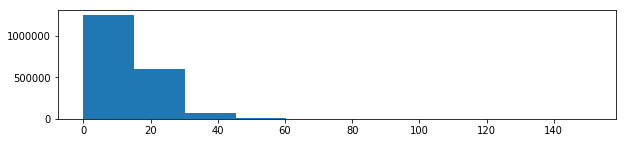

**num_rev_tl_bal_gt_0**: Number of revolving trades with balance >0

    	Type: 			float64
    	Missing Values: 	70278 (3.5%)
    	Mean: 			5.60
    	Range: 			(0.00, 65.00)

**num_sats**: Number of satisfactory accounts

    	Type: 			float64
    	Missing Values: 	58592 (2.9%)
    	Mean: 			11.64
    	Range: 			(0.00, 101.00)

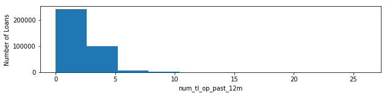

**num_tl_120dpd_2m**: Number of accounts currently 120 days past due (updated in past 2 months)

    	Type: 			float64
    	Missing Values: 	147546 (7.4%)
    	Mean: 			0.00
    	Range: 			(0.00, 7.00)

**num_tl_30dpd**: Number of accounts currently 30 days past due (updated in past 2 months)

    	Type: 			float64
    	Missing Values: 	70278 (3.5%)
    	Mean: 			0.00
    	Range: 			(0.00, 4.00)

**num_tl_90g_dpd_24m**: Number of accounts 90 or more days past due in last 24 months

    	Type: 			float64
    	Missing Values: 	70278 (3.5%)
    	Mean: 			0.09
    	Range: 			(0.00, 42.00)

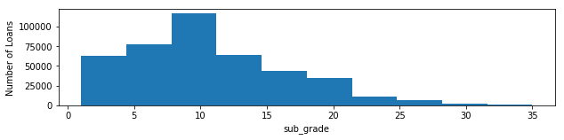

**num_tl_op_past_12m**: Number of accounts opened in past 12 months

    	Type: 			float64
    	Missing Values: 	70278 (3.5%)
    	Mean: 			2.09
    	Range: 			(0.00, 32.00)

**open_acc**: The number of open credit lines in the borrower's credit file.

    	Type: 			float64
    	Missing Values: 	31 (0.0%)
    	Mean: 			11.62
    	Range: 			(0.00, 101.00)

**open_acc_6m**: Number of open trades in last 6 months

    	Type: 			float64
    	Missing Values: 	866132 (43.2%)
    	Mean: 			0.94
    	Range: 			(0.00, 18.00)

**open_act_il**: Number of currently active installment trades

    	Type: 			float64
    	Missing Values: 	866131 (43.2%)
    	Mean: 			2.79
    	Range: 			(0.00, 57.00)

**open_il_12m**: Number of installment accounts opened in past 12 months

    	Type: 			float64
    	Missing Values: 	866131 (43.2%)
    	Mean: 			0.68
    	Range: 			(0.00, 25.00)

**open_il_24m**: Number of installment accounts opened in past 24 months

    	Type: 			float64
    	Missing Values: 	866131 (43.2%)
    	Mean: 			1.57
    	Range: 			(0.00, 51.00)

**open_rv_12m**: Number of revolving trades opened in past 12 months

    	Type: 			float64
    	Missing Values: 	866131 (43.2%)
    	Mean: 			1.31
    	Range: 			(0.00, 28.00)

**open_rv_24m**: Number of revolving trades opened in past 24 months

    	Type: 			float64
    	Missing Values: 	866131 (43.2%)
    	Mean: 			2.79
    	Range: 			(0.00, 60.00)

**pct_tl_nvr_dlq**: Percent of trades never delinquent

    	Type: 			float64
    	Missing Values: 	70432 (3.5%)
    	Mean: 			94.05
    	Range: 			(0.00, 100.00)

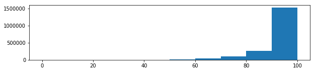

**percent_bc_gt_75**: Percentage of all bankcard accounts > 75% of limit.

    	Type: 			float64
    	Missing Values: 	72040 (3.6%)
    	Mean: 			43.65
    	Range: 			(0.00, 100.00)

**pub_rec**: Number of derogatory public records

    	Type: 			float64
    	Missing Values: 	31 (0.0%)
    	Mean: 			0.21
    	Range: 			(0.00, 86.00)

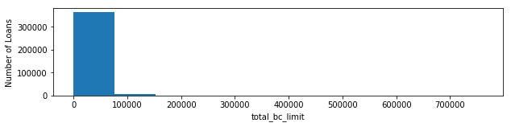

**pub_rec_bankruptcies**: Number of public record bankruptcies

    	Type: 			float64
    	Missing Values: 	1367 (0.1%)
    	Mean: 			0.13
    	Range: 			(0.00, 12.00)

**revol_bal**: Total credit revolving balance

    	Type: 			float64
    	Missing Values: 	2 (0.0%)
    	Mean: 			16650.29
    	Range: 			(0.00, 2904836.00)

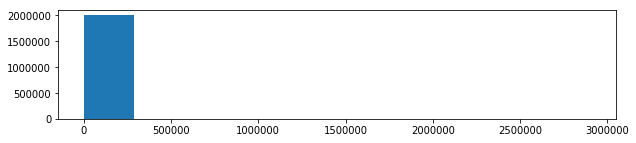

**revol_util**: Revolving line utilization rate, or the amount of credit the borrower is using relative to all available revolving credit.

    	Type: 			object
    	Missing Values: 	1519 (0.1%)
    	Number of Categories: 	1421
                count           sum
    revol_util                     
    0%          10877 152684825.000
    57%          3945  61456000.000
    59%          3890  61073725.000

**tax_liens**: Number of tax liens

    	Type: 			float64
    	Missing Values: 	107 (0.0%)
    	Mean: 			0.05
    	Range: 			(0.00, 85.00)

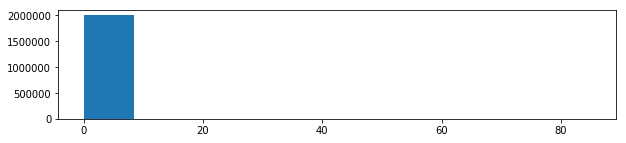

**tot_coll_amt**: Total collection amounts ever owed

    	Type: 			float64
    	Missing Values: 	70278 (3.5%)
    	Mean: 			238.34
    	Range: 			(0.00, 9152545.00)

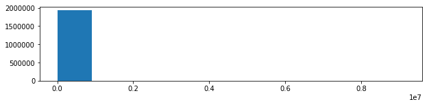

**tot_cur_bal**: Total current balance of all accounts

    	Type: 			float64
    	Missing Values: 	70278 (3.5%)
    	Mean: 			142034.87
    	Range: 			(0.00, 8524709.00)

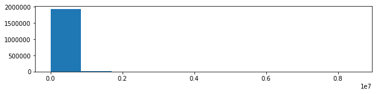

**tot_hi_cred_lim**: Total high credit/credit limit

    	Type: 			float64
    	Missing Values: 	70278 (3.5%)
    	Mean: 			177035.96
    	Range: 			(0.00, 9999999.00)

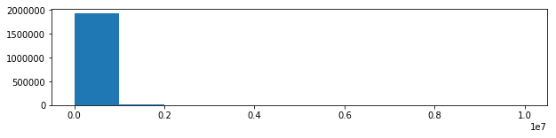

**total_acc**: The total number of credit lines currently in the borrower's credit file

    	Type: 			float64
    	Missing Values: 	31 (0.0%)
    	Mean: 			24.35
    	Range: 			(1.00, 176.00)

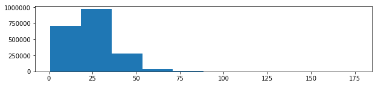

**total_bal_ex_mort**: Total credit balance excluding mortgage

    	Type: 			float64
    	Missing Values: 	50032 (2.5%)
    	Mean: 			50769.47
    	Range: 			(0.00, 3408095.00)

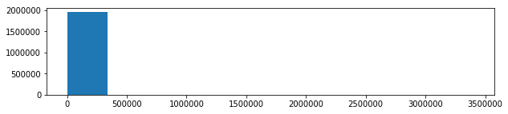

**total_bal_il**: Total current balance of all installment accounts

    	Type: 			float64
    	Missing Values: 	866131 (43.2%)
    	Mean: 			35424.44
    	Range: 			(0.00, 1711009.00)

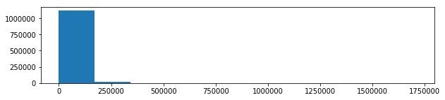

**total_bc_limit**: Total bankcard high credit/credit limit

    	Type: 			float64
    	Missing Values: 	50032 (2.5%)
    	Mean: 			22667.45
    	Range: 			(0.00, 1569000.00)

**total_cu_tl**: Number of finance trades

    	Type: 			float64
    	Missing Values: 	866132 (43.2%)
    	Mean: 			1.47
    	Range: 			(0.00, 111.00)

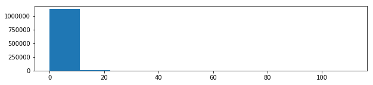

**total_il_high_credit_limit**: Total installment high credit/credit limit

    	Type: 			float64
    	Missing Values: 	70278 (3.5%)
    	Mean: 			43384.36
    	Range: 			(0.00, 2101913.00)

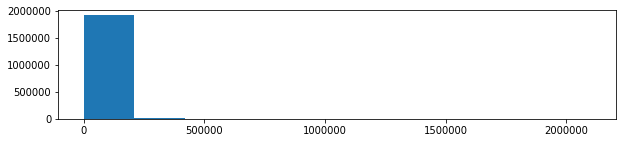

**total_rev_hi_lim**: Total revolving high credit/credit limit

    	Type: 			float64
    	Missing Values: 	70278 (3.5%)
    	Mean: 			33980.46
    	Range: 			(0.00, 9999999.00)

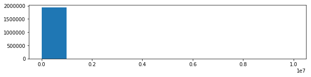

### 2D. Co-Borrower Information

**application_type**: Indicates whether the loan is an individual application or a joint application with two co-borrowers

    	Type: 			object
    	Missing Values: 	2 (0.0%)
    	Number of Categories: 	2
                        count             sum
    application_type                         
    Individual        1917918 28212224125.000
    Joint App           86142  1689807550.000

**annual_inc_joint**: The combined self-reported annual income provided by the co-borrowers during registration

    	Type: 			float64
    	Missing Values: 	1917920 (95.7%)
    	Mean: 			120803.17
    	Range: 			(5693.51, 7874821.00)

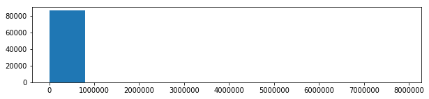

**dti_joint**: A ratio calculated using the co-borrowers' total monthly payments on the total debt obligations, excluding mortgages and the requested LC loan, divided by the co-borrowers' combined self-reported monthly income

    	Type: 			float64
    	Missing Values: 	1917924 (95.7%)
    	Mean: 			19.27
    	Range: 			(0.00, 69.49)

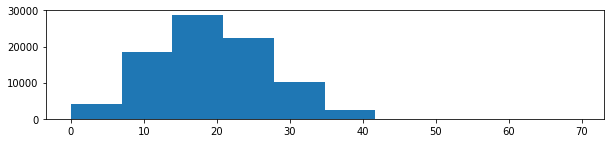

**revol_bal_joint**:  Sum of revolving credit balance of the co-borrowers, net of duplicate balances

    	Type: 			float64
    	Missing Values: 	1930609 (96.3%)
    	Mean: 			32703.64
    	Range: 			(0.00, 371153.00)

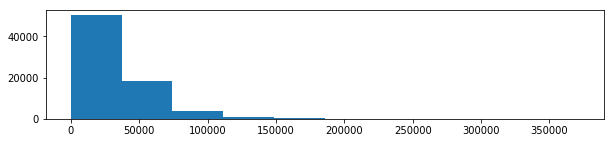

**sec_app_chargeoff_within_12_mths**:  Number of charge-offs within last 12 months at time of application for the secondary applicant

    	Type: 			float64
    	Missing Values: 	1930608 (96.3%)
    	Mean: 			0.05
    	Range: 			(0.00, 21.00)

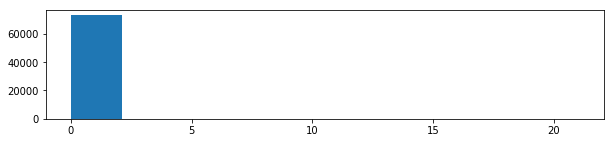

**sec_app_collections_12_mths_ex_med**:  Number of collections within last 12 months excluding medical collections at time of application for the secondary applicant

    	Type: 			float64
    	Missing Values: 	1930608 (96.3%)
    	Mean: 			0.08
    	Range: 			(0.00, 23.00)

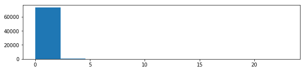

**sec_app_earliest_cr_line**:  Earliest credit line at time of application for the secondary applicant

    	Type: 			datetime64[ns]
    	Missing Values: 	1930608 (96.3%)

**sec_app_inq_last_6mths**:  Credit inquiries in the last 6 months at time of application for the secondary applicant

    	Type: 			float64
    	Missing Values: 	1930608 (96.3%)
    	Mean: 			0.66
    	Range: 			(0.00, 6.00)

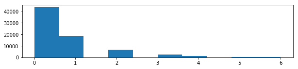

**sec_app_mort_acc**:  Number of mortgage accounts at time of application for the secondary applicant

    	Type: 			float64
    	Missing Values: 	1930608 (96.3%)
    	Mean: 			1.52
    	Range: 			(0.00, 27.00)

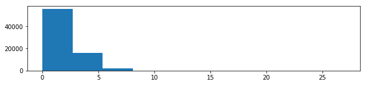

**sec_app_mths_since_last_major_derog**:  Months since most recent 90-day or worse rating at time of application for the secondary applicant

    	Type: 			float64
    	Missing Values: 	1978886 (98.7%)
    	Mean: 			36.18
    	Range: 			(0.00, 185.00)

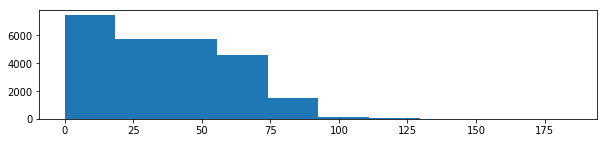

**sec_app_num_rev_accts**:  Number of revolving accounts at time of application for the secondary applicant

    	Type: 			float64
    	Missing Values: 	1930608 (96.3%)
    	Mean: 			12.59
    	Range: 			(0.00, 96.00)

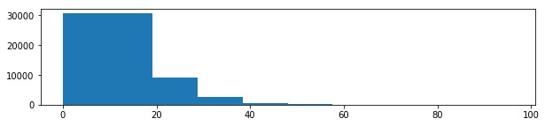

**sec_app_open_acc**:  Number of open trades at time of application for the secondary applicant

    	Type: 			float64
    	Missing Values: 	1930608 (96.3%)
    	Mean: 			11.50
    	Range: 			(0.00, 82.00)

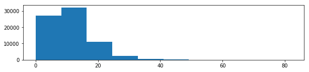

**sec_app_open_act_il**:  Number of currently active installment trades at time of application for the secondary applicant

    	Type: 			float64
    	Missing Values: 	1930608 (96.3%)
    	Mean: 			3.03
    	Range: 			(0.00, 39.00)

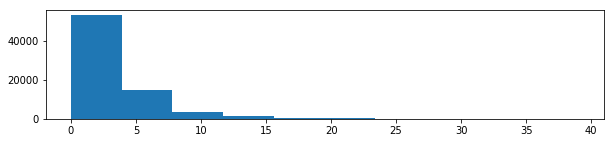

**sec_app_revol_util**:  Ratio of total current balance to high credit/credit limit for all revolving accounts

    	Type: 			float64
    	Missing Values: 	1931877 (96.4%)
    	Mean: 			59.13
    	Range: 			(0.00, 434.30)

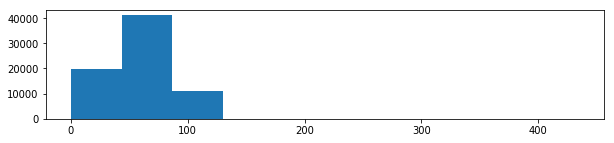

**verification_status_joint**: NULL

    	Type: 			object
    	Missing Values: 	1918910 (95.8%)
    	Number of Categories: 	3
                               count           sum
    verification_status_joint                     
    Not Verified               44215 804160525.000
    Source Verified            24063 491283900.000
    Verified                   16874 371509725.000

## 3. Dependent Variable Feature Design (36 variables)

There are three features that we will design to represent the outcome of loan:
- A. **Outcome Classification** (Repaid/Current vs. Not Repaid/Current)
- B. **Principal Repaid Percentage**
- C. **Annual Percentage Rate of Return** (APR)

Our focus will be on loans that have completed their terms. This subset of loans provides the most complete outcome information. In-force loans cannot provide conclusive inferences on loan outcomes because the full term has not completed. Therefore information

### A. `OUT_Class`

    loan_status
    Charged Off                                            226958
    Current                                                834071
    Default                                                    36
    Does not meet the credit policy. Status:Charged Off       761
    Does not meet the credit policy. Status:Fully Paid       1988
    Fully Paid                                             898954
    In Grace Period                                         13740
    Late (16-30 days)                                        5128
    Late (31-120 days)                                      22426
    Name: loan_amnt, dtype: int64

    2004062

    OUT_Class
    0     269049
    1    1735011
    Name: loan_amnt, dtype: int64

    2004062

### B. `OUT_Prncp_Repaid_Percentage`

    count   2004062.000
    mean          0.645
    std           0.370
    min           0.000
    25%           0.265
    50%           0.764
    75%           1.000
    max           1.000
    Name: OUT_Prncp_Repaid_Percentage, dtype: float64

### C. `OUT_APR`

## 4. Final Processing

