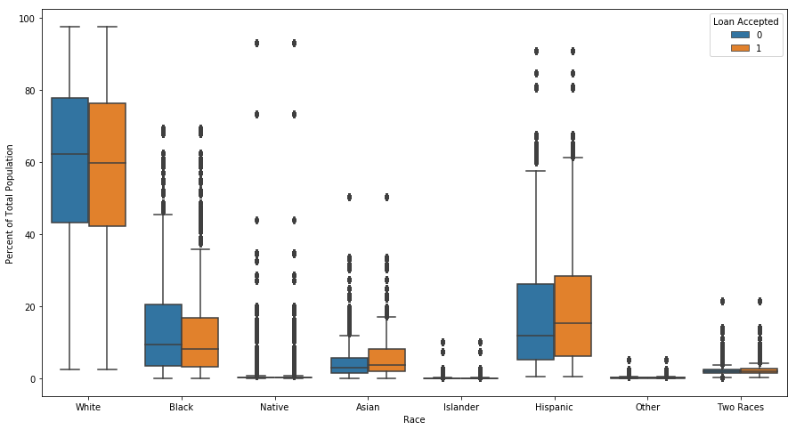

## Contents
{:.no_toc}
*  
{: toc}

## 1. Lending and Discrimination

The [Equal Credit Opportunity Act (ECOA)](https://www.consumer.ftc.gov/articles/0347-your-equal-credit-opportunity-rights) is a federal law that prohibits lending entities (both institutions and people) from discriminating "on the basis of race, color, religion, national origin, sex, marital status, age," or because the prospective borrower receives public assistance. Lenders are, however, permitted to consider an applicant's "income, expenses, debts, and credit history" in evaluating the applicant's probability of repaying the debt to decide whether to accept or reject loan applications and to determine loan terms. Nevertheless, differential treatment by race, color, religion, national origin, sex, etc can still arise even when an institution or person is not explicitly discriminating based on those characteristics. Thus, we want to assess whether we see evidence of discrimination in LendingClub's acceptances and rejections of loan applications or in the terms it sets for accepted loans. In addition, we want to evaluate whether our proposed investing strategy results in differential treatment.

## 2. Literature Review

To inform our approach, we surveyed existing research of how predictive algorithms can result in discrimination and methods for addressing it.

#### 2A. Sweeney, L. "Discrimination in Online Ad Delivery". Communications of the ACM, May 2013, Vol. 56 No. 5, Pages 44-54.

Sweeney's research presents evidence of discrimination in ad delivery on Google.com and Reuters.com on the basis of racially associated names. Using a chi-squared analysis, Sweeney found that running a search on a black-associated name was 25% more likely to get arrested-related ads compared to running a search on a white-associated name. All names used in the study were the full names of real people, roughly evenly split between professionals and "netizens" (i.e. people active on the internet - social media and blogs), and about one-third black and two-thirds white.

While disentangling the root cause of the discrimination fell outside the scope of the study, Sweeney's research clearly showcases the need to actively evaluate possibly unintended societal implications of the algorithms we put in place.

#### 2B. Datta, A., Tschantz, M.C., and Datta, A. "Automated Experiments on Ad Privacy Settings: A Tale of Opacity, Choice, and Discrimination". Proceedings on Privacy Enhancing Technologies 2015; 2015 (1):92–112.

Datta et al. found evidence of gender discimination in employment-related searches by experimentally manipulating whether a simulated user specified male or female in Google's ad settings. Their results revealed that simulated male users were shown ads regarding coaching for high-paying careers more often than they were shown to simulated female users. They collected the ads results of 1000 simulated users - half male and half female - and trained a classifier predicting gender using the ad URLs and titles as the feature set. Their classifier used a 90-10 train-test split, and achieved 93% accuracy on the test set. The high predictive power of the classifier suggests gender discrimination in Google's employment-related ad results, and such discrimination can exacerbate the current gender pay gap.

With limited visibility into the details of Google's ad vending algorithm, the authors of this paper were also unable to isolate the mechanisms through which the discrimination is arising. But again, like Sweeney's research, it demonstrates algorithms, while not inherently subjective, can be discriminatory as well.

#### 2C. Angwin, J., Larson, J., Mattu, S., and Kirchner, L. "Machine Bias". ProPublica. May 23, 2016.

In an article published on ProPublica, the authors found that COMPAS (Correctional Offender Management Profiling for Alternative Sanctions), one of the nation's most popular tools in criminal risk assessment, discriminates unfavorably toward black defendants but favorably toward white defendants. Although the prediction accuracy was about the same as the overall accuracy (61%) in both groups, COMPAS makes a systematically different kind of error depending on the defendant's race group. Specifically, black defendants were twice as likely as black defendants to fall victim to a false positive result, i.e. they did not reoffend within the next two years but were wrongly labelled as highly likely to reoffend (i.e. high risk). On the other hand, white defendants were twice as likely as black defendants to receive a false negative assessment, i.e. they did reoffend within the next two years but were incorrectly labelled as not very likely to reoffend (i.e. low risk). Using a logistic regression model, Angwin et al. found that bias against black defendants in COMPAS's predictions (higher risk scores) remains even after controlling for age, criminal history, future (actual) recidivism, charge degree, and gender.

## 3. Census Data Description and Cleaning

Especially when machine-generated predictions carry significant life consequences, developers and scientists have a responsibility to ensure their algorithms do not create or exacerbate societal problems through disparate outcomes and impacts on different groups.

While LendingClub does not have the demographic data associated with each loan or loan application (either they don't collect it or they just don't make it publicly available), LendingClub does share the 3-digit zip codes of the borrowers and applicants. To understand whether there is discrimination in LendingClub’s practices and ultimately our proposed investing strategy, we obtained the U.S. Census Bureau’s demographic data and leveraged these zip codes to tie high-level demographic information to the loan data. This data reports the total population and population by different demographic groups (i.e., race, income, education, sex, household structure) and other characteristics like poverty and unemployment rates by zip code. Because LendingClub data is reported at the 3-digit zip code level, we aggregated up to the 3-digit zip code level and calculated percentage of total population and percentage of total household values. We also derived some additional variables such as household size (from population and number of households) and occupied rate (from number of households and housing units). We dropped the variables related to age, as we felt that discrimination related to age is appropriate because it is highly correlated with length of credit history, a valid criterion on which loan applications should be evaluated but is not available in the LendingClub data. Post processing, our census dataset had 891 3-digit zip codes and 68 features.

There are five records with missing data, likely originating from sparsely populated zip code areas. At least one 3-digit zip code area has a recorded population of zero. On average, the population is ~350k, with a household size of ~2.6 and a median income of $55k. For the average zip code area, the population is about evenly split between male and female, with the majority of the population White and having at least a High School education. (See **Table 1** below.)

#### Table 1. Selected Summary Statistics for Census Data

<table border="1" class="dataframe">
  <thead>
    <tr style="text-align: right;">
      <th></th>
      <th>Population</th>
      <th>Household_size</th>
      <th>Avg_median_household_inc</th>
      <th>Male_pct</th>
      <th>White_pct</th>
      <th>No_Diploma_pct</th>
    </tr>
  </thead>
  <tbody>
    <tr>
      <th>count</th>
      <td>891.000000</td>
      <td>886.000000</td>
      <td>886.000000</td>
      <td>886.000000</td>
      <td>886.000000</td>
      <td>885.000000</td>
    </tr>
    <tr>
      <th>mean</th>
      <td>357514.425365</td>
      <td>2.657810</td>
      <td>54876.389742</td>
      <td>49.533976</td>
      <td>71.255064</td>
      <td>12.865526</td>
    </tr>
    <tr>
      <th>std</th>
      <td>391271.361292</td>
      <td>0.306602</td>
      <td>16378.655265</td>
      <td>1.806755</td>
      <td>20.720257</td>
      <td>5.511241</td>
    </tr>
    <tr>
      <th>min</th>
      <td>0.000000</td>
      <td>1.960550</td>
      <td>10039.113879</td>
      <td>42.618155</td>
      <td>2.420546</td>
      <td>0.873224</td>
    </tr>
    <tr>
      <th>25%</th>
      <td>116037.500000</td>
      <td>2.493136</td>
      <td>44655.485670</td>
      <td>48.773422</td>
      <td>58.467006</td>
      <td>8.968413</td>
    </tr>
    <tr>
      <th>50%</th>
      <td>217838.000000</td>
      <td>2.611310</td>
      <td>51368.147218</td>
      <td>49.374504</td>
      <td>75.983965</td>
      <td>11.838107</td>
    </tr>
    <tr>
      <th>75%</th>
      <td>451807.000000</td>
      <td>2.761605</td>
      <td>61534.292170</td>
      <td>50.041174</td>
      <td>89.283953</td>
      <td>15.580997</td>
    </tr>
    <tr>
      <th>max</th>
      <td>3105203.000000</td>
      <td>8.104651</td>
      <td>184414.729328</td>
      <td>88.256228</td>
      <td>97.704745</td>
      <td>38.063859</td>
    </tr>
  </tbody>
</table>

## 4. Exploratory Data Analysis

Leveraging zip codes, we explored whether there were demographic differences between loans that LendingClub accepted or rejected for its marketplace.

    /anaconda3/lib/python3.7/site-packages/ipykernel_launcher.py:6: SettingWithCopyWarning: 
    A value is trying to be set on a copy of a slice from a DataFrame.
    Try using .loc[row_indexer,col_indexer] = value instead
    
    See the caveats in the documentation: http://pandas.pydata.org/pandas-docs/stable/indexing.html#indexing-view-versus-copy
      
    /anaconda3/lib/python3.7/site-packages/ipykernel_launcher.py:7: SettingWithCopyWarning: 
    A value is trying to be set on a copy of a slice from a DataFrame.
    Try using .loc[row_indexer,col_indexer] = value instead
    
    See the caveats in the documentation: http://pandas.pydata.org/pandas-docs/stable/indexing.html#indexing-view-versus-copy
      import sys

<table border="1" class="dataframe">
  <thead>
    <tr style="text-align: right;">
      <th></th>
      <th>loan_amnt</th>
      <th>funded_amnt</th>
      <th>funded_amnt_inv</th>
      <th>term</th>
      <th>int_rate</th>
      <th>installment</th>
      <th>grade</th>
      <th>sub_grade</th>
      <th>emp_length</th>
      <th>home_ownership</th>
      <th>annual_inc</th>
      <th>verification_status</th>
      <th>zip_code</th>
      <th>dti</th>
      <th>accepted</th>
    </tr>
  </thead>
  <tbody>
    <tr>
      <th>0</th>
      <td>5000.0</td>
      <td>5000.0</td>
      <td>4975.0</td>
      <td>36 months</td>
      <td>10.65</td>
      <td>162.87</td>
      <td>B</td>
      <td>B2</td>
      <td>10+ years</td>
      <td>RENT</td>
      <td>24000.0</td>
      <td>Verified</td>
      <td>860xx</td>
      <td>27.65</td>
      <td>1</td>
    </tr>
    <tr>
      <th>1</th>
      <td>2500.0</td>
      <td>2500.0</td>
      <td>2500.0</td>
      <td>60 months</td>
      <td>15.27</td>
      <td>59.83</td>
      <td>C</td>
      <td>C4</td>
      <td>&lt; 1 year</td>
      <td>RENT</td>
      <td>30000.0</td>
      <td>Source Verified</td>
      <td>309xx</td>
      <td>1.00</td>
      <td>1</td>
    </tr>
    <tr>
      <th>2</th>
      <td>2400.0</td>
      <td>2400.0</td>
      <td>2400.0</td>
      <td>36 months</td>
      <td>15.96</td>
      <td>84.33</td>
      <td>C</td>
      <td>C5</td>
      <td>10+ years</td>
      <td>RENT</td>
      <td>12252.0</td>
      <td>Not Verified</td>
      <td>606xx</td>
      <td>8.72</td>
      <td>1</td>
    </tr>
    <tr>
      <th>3</th>
      <td>10000.0</td>
      <td>10000.0</td>
      <td>10000.0</td>
      <td>36 months</td>
      <td>13.49</td>
      <td>339.31</td>
      <td>C</td>
      <td>C1</td>
      <td>10+ years</td>
      <td>RENT</td>
      <td>49200.0</td>
      <td>Source Verified</td>
      <td>917xx</td>
      <td>20.00</td>
      <td>1</td>
    </tr>
    <tr>
      <th>4</th>
      <td>3000.0</td>
      <td>3000.0</td>
      <td>3000.0</td>
      <td>60 months</td>
      <td>12.69</td>
      <td>67.79</td>
      <td>B</td>
      <td>B5</td>
      <td>1 year</td>
      <td>RENT</td>
      <td>80000.0</td>
      <td>Source Verified</td>
      <td>972xx</td>
      <td>17.94</td>
      <td>1</td>
    </tr>
  </tbody>
</table>

<table border="1" class="dataframe">
  <thead>
    <tr style="text-align: right;">
      <th></th>
      <th>loan_amnt</th>
      <th>risk_score</th>
      <th>dti</th>
      <th>zip_code</th>
      <th>emp_length</th>
      <th>accepted</th>
    </tr>
  </thead>
  <tbody>
    <tr>
      <th>0</th>
      <td>1000.000000</td>
      <td>693.000000</td>
      <td>10.000000</td>
      <td>481xx</td>
      <td>4 years</td>
      <td>0</td>
    </tr>
    <tr>
      <th>1</th>
      <td>1000.000000</td>
      <td>703.000000</td>
      <td>10.000000</td>
      <td>010xx</td>
      <td>&lt; 1 year</td>
      <td>0</td>
    </tr>
    <tr>
      <th>2</th>
      <td>11000.000000</td>
      <td>715.000000</td>
      <td>10.000000</td>
      <td>212xx</td>
      <td>1 year</td>
      <td>0</td>
    </tr>
    <tr>
      <th>3</th>
      <td>6000.000000</td>
      <td>698.000000</td>
      <td>38.640000</td>
      <td>017xx</td>
      <td>&lt; 1 year</td>
      <td>0</td>
    </tr>
    <tr>
      <th>4</th>
      <td>1500.000000</td>
      <td>509.000000</td>
      <td>9.430000</td>
      <td>209xx</td>
      <td>&lt; 1 year</td>
      <td>0</td>
    </tr>
  </tbody>
</table>

Of the loans that were accepted, is there any discrimination in terms of the loan amount, funded amount, grade, interest rate, or term?

## 5. Modelling

<table border="1" class="dataframe">
  <thead>
    <tr style="text-align: right;">
      <th></th>
      <th>loan_amnt</th>
      <th>dti</th>
      <th>Zip</th>
      <th>emp_length</th>
      <th>accepted</th>
      <th>Population</th>
      <th>White</th>
      <th>Black</th>
      <th>Native</th>
      <th>Asian</th>
      <th>...</th>
      <th>Married_couple_child_under_18_pct</th>
      <th>Married_couple_no_child_under_18_pct</th>
      <th>Single_parent_families_pct</th>
      <th>Single_parent_child_under_18_pct</th>
      <th>Single_parent_no_child_under_18_pct</th>
      <th>Non_families_pct</th>
      <th>Householder_living_alone_pct</th>
      <th>Householder_living_with_unrelated_pct</th>
      <th>Occupied_pct</th>
      <th>Household_size</th>
    </tr>
  </thead>
  <tbody>
    <tr>
      <th>0</th>
      <td>5000.000000</td>
      <td>27.650000</td>
      <td>860xx</td>
      <td>10+ years</td>
      <td>1</td>
      <td>184274.000000</td>
      <td>85837.000000</td>
      <td>2391.000000</td>
      <td>64344.000000</td>
      <td>2553.000000</td>
      <td>...</td>
      <td>16.424996</td>
      <td>26.521836</td>
      <td>22.213048</td>
      <td>11.061802</td>
      <td>11.151246</td>
      <td>34.840119</td>
      <td>23.614910</td>
      <td>11.225209</td>
      <td>0.747368</td>
      <td>3.169651</td>
    </tr>
    <tr>
      <th>1</th>
      <td>2500.000000</td>
      <td>1.000000</td>
      <td>309xx</td>
      <td>&lt; 1 year</td>
      <td>1</td>
      <td>204347.000000</td>
      <td>91932.000000</td>
      <td>92769.000000</td>
      <td>283.000000</td>
      <td>5308.000000</td>
      <td>...</td>
      <td>12.838156</td>
      <td>24.570782</td>
      <td>24.387649</td>
      <td>12.528446</td>
      <td>11.859203</td>
      <td>38.203412</td>
      <td>32.716157</td>
      <td>5.487255</td>
      <td>0.829328</td>
      <td>2.751666</td>
    </tr>
    <tr>
      <th>2</th>
      <td>2400.000000</td>
      <td>8.720000</td>
      <td>606xx</td>
      <td>10+ years</td>
      <td>1</td>
      <td>2697610.000000</td>
      <td>875093.000000</td>
      <td>822035.000000</td>
      <td>3193.000000</td>
      <td>163025.000000</td>
      <td>...</td>
      <td>13.999956</td>
      <td>18.663649</td>
      <td>21.527478</td>
      <td>10.097242</td>
      <td>11.430236</td>
      <td>45.808917</td>
      <td>36.493490</td>
      <td>9.315426</td>
      <td>0.873162</td>
      <td>2.602140</td>
    </tr>
    <tr>
      <th>3</th>
      <td>10000.000000</td>
      <td>20.000000</td>
      <td>917xx</td>
      <td>10+ years</td>
      <td>1</td>
      <td>1977114.000000</td>
      <td>393027.000000</td>
      <td>72504.000000</td>
      <td>4702.000000</td>
      <td>452147.000000</td>
      <td>...</td>
      <td>24.276769</td>
      <td>30.612848</td>
      <td>23.172234</td>
      <td>9.575353</td>
      <td>13.596881</td>
      <td>21.938149</td>
      <td>17.238609</td>
      <td>4.699540</td>
      <td>0.948437</td>
      <td>3.499106</td>
    </tr>
    <tr>
      <th>4</th>
      <td>3000.000000</td>
      <td>17.940000</td>
      <td>972xx</td>
      <td>1 year</td>
      <td>1</td>
      <td>893646.000000</td>
      <td>644973.000000</td>
      <td>42217.000000</td>
      <td>4048.000000</td>
      <td>69569.000000</td>
      <td>...</td>
      <td>17.444413</td>
      <td>24.163792</td>
      <td>13.963949</td>
      <td>7.647337</td>
      <td>6.316612</td>
      <td>44.427846</td>
      <td>32.168502</td>
      <td>12.259344</td>
      <td>0.944561</td>
      <td>2.458543</td>
    </tr>
  </tbody>
</table>

5 rows × 72 columns

