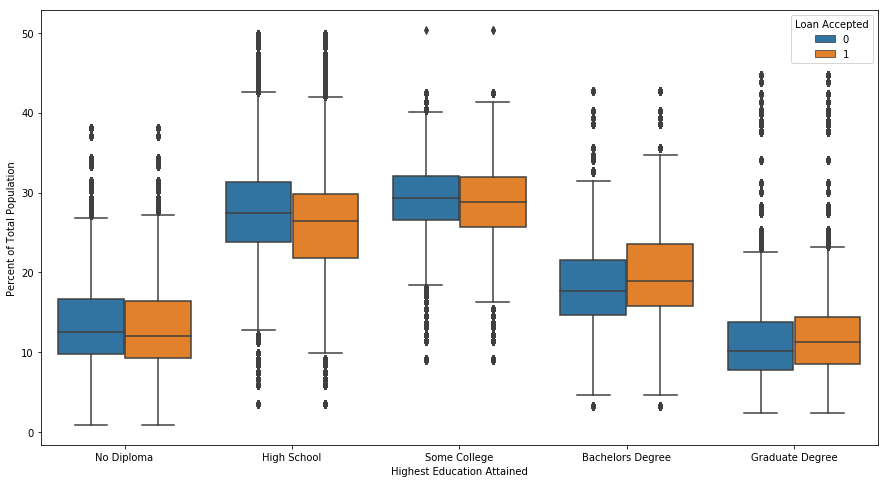

## Contents
{:.no_toc}
*  
{: toc}


## 1. Lending and Discrimination

The [Equal Credit Opportunity Act (ECOA)](https://www.consumer.ftc.gov/articles/0347-your-equal-credit-opportunity-rights) is a federal law that prohibits lending entities (both institutions and people) from discriminating "on the basis of race, color, religion, national origin, sex, marital status, age," or because the prospective borrower receives public assistance. Lenders are, however, permitted to consider an applicant's "income, expenses, debts, and credit history" in evaluating the applicant's probability of repaying the debt to decide whether to accept or reject loan applications and to determine loan terms. Nevertheless, differential treatment by race, color, religion, national origin, sex, etc can still arise even when an institution or person is not explicitly discriminating based on those characteristics. Thus, we want to assess whether we see evidence of discrimination in LendingClub's acceptances and rejections of loan applications or in the terms it sets for accepted loans. In addition, we want to evaluate whether our proposed investing strategy results in differential treatment.

## 2. Literature Review

To inform our approach, we surveyed existing research of how predictive algorithms can result in discrimination and methods for addressing it.

**2A. Sweeney, L. "Discrimination in Online Ad Delivery". Communications of the ACM, May 2013, Vol. 56 No. 5, Pages 44-54.**

Sweeney's research presents evidence of discrimination in ad delivery on Google.com and Reuters.com on the basis of racially associated names. Using a chi-squared analysis, Sweeney found that running a search on a black-associated name was 25% more likely to get arrested-related ads compared to running a search on a white-associated name. All names used in the study were the full names of real people, roughly evenly split between professionals and "netizens" (i.e. people active on the internet - social media and blogs), and about one-third black and two-thirds white.

While disentangling the root cause of the discrimination fell outside the scope of the study, Sweeney's research clearly showcases the need to actively evaluate possibly unintended societal implications of the algorithms we put in place.

**2B. Datta, A., Tschantz, M.C., and Datta, A. "Automated Experiments on Ad Privacy Settings: A Tale of Opacity, Choice, and Discrimination". Proceedings on Privacy Enhancing Technologies 2015; 2015 (1):92–112.**

Datta et al. found evidence of gender discimination in employment-related searches by experimentally manipulating whether a simulated user specified male or female in Google's ad settings. Their results revealed that simulated male users were shown ads regarding coaching for high-paying careers more often than they were shown to simulated female users. They collected the ads results of 1000 simulated users - half male and half female - and trained a classifier predicting gender using the ad URLs and titles as the feature set. Their classifier used a 90-10 train-test split, and achieved 93% accuracy on the test set. The high predictive power of the classifier suggests gender discrimination in Google's employment-related ad results, and such discrimination can exacerbate the current gender pay gap.

With limited visibility into the details of Google's ad vending algorithm, the authors of this paper were also unable to isolate the mechanisms through which the discrimination is arising. But again, like Sweeney's research, it demonstrates algorithms, while not inherently subjective, can be discriminatory as well.

**2C. Angwin, J., Larson, J., Mattu, S., and Kirchner, L. "Machine Bias". ProPublica. May 23, 2016.**

In an article published on ProPublica, the authors found that COMPAS (Correctional Offender Management Profiling for Alternative Sanctions), one of the nation's most popular tools in criminal risk assessment, discriminates unfavorably toward black defendants but favorably toward white defendants. Although the prediction accuracy was about the same as the overall accuracy (61%) in both groups, COMPAS makes a systematically different kind of error depending on the defendant's race group. Specifically, black defendants were twice as likely as black defendants to fall victim to a false positive result, i.e. they did not reoffend within the next two years but were wrongly labelled as highly likely to reoffend (i.e. high risk). On the other hand, white defendants were twice as likely as black defendants to receive a false negative assessment, i.e. they did reoffend within the next two years but were incorrectly labelled as not very likely to reoffend (i.e. low risk). Using a logistic regression model, Angwin et al. found that bias against black defendants in COMPAS's predictions (higher risk scores) remains even after controlling for age, criminal history, future (actual) recidivism, charge degree, and gender.

## 3. Census Data Summary

Especially when machine-generated predictions carry significant life consequences, developers and scientists have a responsibility to ensure their algorithms do not create or exacerbate societal problems through disparate outcomes and impacts on different groups.

While LendingClub does not have the demographic data associated with each loan or loan application (either they don't collect it or they just don't make it publicly available), LendingClub does share the 3-digit zip codes of the borrowers and applicants. We leveraged these zip codes to tie high-level demographic information to the loan data.

After data processing (as described previously in the [Data Description](https://cs109group67.github.io/lendingclub/DataDescription.html) section), there are five records with missing data, likely originating from sparsely populated zip code areas. At least one 3-digit zip code area has a recorded population of zero. On average, the population is ~350k, with a household size of ~2.6 and a median income of $55k. For the average zip code area, the population is about evenly split between male and female, with the majority of the population White and having at least a High School education. (See **Table 1** below.)


**Table 1. Selected Summary Statistics for Census Data**


<div>
<style scoped>
    .dataframe tbody tr th:only-of-type {
        vertical-align: middle;
    }

    .dataframe tbody tr th {
        vertical-align: top;
    }

    .dataframe thead th {
        text-align: right;
    }
</style>
<table border="1" class="dataframe">
  <thead>
    <tr style="text-align: right;">
      <th></th>
      <th>Population</th>
      <th>Household_size</th>
      <th>Avg_median_household_inc</th>
      <th>Male_pct</th>
      <th>White_pct</th>
      <th>No_Diploma_pct</th>
    </tr>
  </thead>
  <tbody>
    <tr>
      <th>count</th>
      <td>891.000000</td>
      <td>886.000000</td>
      <td>886.000000</td>
      <td>886.000000</td>
      <td>886.000000</td>
      <td>885.000000</td>
    </tr>
    <tr>
      <th>mean</th>
      <td>357514.425365</td>
      <td>2.657810</td>
      <td>54876.389742</td>
      <td>49.533976</td>
      <td>71.255064</td>
      <td>12.865526</td>
    </tr>
    <tr>
      <th>std</th>
      <td>391271.361292</td>
      <td>0.306602</td>
      <td>16378.655265</td>
      <td>1.806755</td>
      <td>20.720257</td>
      <td>5.511241</td>
    </tr>
    <tr>
      <th>min</th>
      <td>0.000000</td>
      <td>1.960550</td>
      <td>10039.113879</td>
      <td>42.618155</td>
      <td>2.420546</td>
      <td>0.873224</td>
    </tr>
    <tr>
      <th>25%</th>
      <td>116037.500000</td>
      <td>2.493136</td>
      <td>44655.485670</td>
      <td>48.773422</td>
      <td>58.467006</td>
      <td>8.968413</td>
    </tr>
    <tr>
      <th>50%</th>
      <td>217838.000000</td>
      <td>2.611310</td>
      <td>51368.147218</td>
      <td>49.374504</td>
      <td>75.983965</td>
      <td>11.838107</td>
    </tr>
    <tr>
      <th>75%</th>
      <td>451807.000000</td>
      <td>2.761605</td>
      <td>61534.292170</td>
      <td>50.041174</td>
      <td>89.283953</td>
      <td>15.580997</td>
    </tr>
    <tr>
      <th>max</th>
      <td>3105203.000000</td>
      <td>8.104651</td>
      <td>184414.729328</td>
      <td>88.256228</td>
      <td>97.704745</td>
      <td>38.063859</td>
    </tr>
  </tbody>
</table>
</div>


## 4. Exploratory Data Analysis

Leveraging zip codes, we explored whether there were demographic differences between loans that LendingClub accepted or rejected for its marketplace. We looked at the distributions of acceptances and rejections by demographic groups, on the basis of which federal law prohibits discrimination, in terms of both population count and as a percentage of the total population.

Visually, our exploratory data analysis did not suggest discrimination in either loan status or the grade assigned to issued loans. Between different sexes, races, household structures, and educational attainments, there was not a significant difference between either the accept-reject decision of loan applications or the resulting loan grade of the issued loans, as suggested by the large overlap in the histograms and boxplots in **Figures 1-5**.


**Figure 1. Distributions of Loan Acceptances and Rejections by Populousness and Income**


Looking at the distributions of acceptances versus rejections by Population size, count of Households, and count of Housing Units, we observe a slight favoring of more populous areas for loan acceptances. Unsurprisingly, we also see that compared to the rejected loans, the accepted loans came from applicants in areas with higher median income.

**Figure 2A. Histograms: Distributions of Loan Acceptances and Rejections by Sex (Count and Percent of Total Population)**


**Figure 2B. Boxplots: Distributions of Loan Acceptances and Rejections by Sex (Count and Percent of Total Population)**


**Figure 3A. Histograms: Distributions of Loan Acceptances and Rejections by Race (Count and Percent of Total Population)**


**Figure 3B. Boxplots: Distributions of Loan Acceptances and Rejections by Race (Count and Percent of Total Population)**


**Figure 4A. Histograms: Distributions of Loan Acceptances and Rejections by Household Structure and Marital Status (Count and Percent of Total Population)**


**Figure 4B. Boxplots: Distributions of Loan Acceptances and Rejections by Household Structure and Marital Status (Count and Percent of Total Population)**


**Figure 5. Boxplots: Distributions of Loan Acceptances and Rejections by Educational Attainment (Count and Percent of Total Population)**





Further, of the loans that were accepted, we checked to see if there were noticeable differences in assigned loan grade by demographic groups. Loan grade will influence the interest rate the borrower is charged and whether or not investors want to fund the loan. Again, the data visualizations did not suggest discrimination. (See **Figures 6-9** below.)


**Figure 6A. Distributions of Loan Grade by Sex (Percent of Total Population)**


**Figure 6B. Distributions of Loan Grade by Sex (Population Count)**


**Figure 7A. Distributions of Loan Grade by Race (Percent of Total Population)**


**Figure 7B. Distributions of Loan Grade by Race (Population Count)**


**Figure 8A. Distributions of Loan Grade by Household Structure and Marital Status (Percent of Total Households)**


**Figure 8B. Distributions of Loan Grade by Household Structure and Marital Status (Household Count)**


**Figure 9. Distributions of Loan Grade by Educational Attainment (Percent of Total Population)**


Going forward in the modelling, we chose to focus on the demographic measures as a percentage of the total population, because demographic information by zip code gets muddled by how populous the zip code is when using population counts. As we can see in the histograms in **Figures 1-4**, using counts makes the acceptance distributions slightly to the right of the rejection distributions for all demographic groups because accepted loans tended to come from more populous zip codes as shown in **Figure 1**, in the distributions by Population size.

## 5. Modelling


```python
#train and test random forest classifier
n_use = 50
depth_use = 25
rf = RandomForestClassifier(n_estimators=n_use, max_depth=depth_use)
rf.fit(X_train_rf, y_train_rf)
rf_score_test = accuracy_score(y_test_rf, rf.predict(X_test_rf))
print("The test accuracy of the RandomForestClassifier with max_depth {} and {} trees is {:.2f}."
      .format(depth_use, n_use, rf_score_test))
```


    The test accuracy of the RandomForestClassifier with max_depth 25 and 50 trees is 0.91.


```python
#remove 1 of each of the demographic groups to avoid perfect colinearity
#e.g. Male_pct + Female_pct = 1
#leave 'int_rate' out as the response
ols_predictors_int_rate = ['loan_amnt',
 'term',
 'sub_grade',
 'emp_length',
 'home_ownership',
 'annual_inc',
 'verification_status',
 'dti',
 'Population',
 'Households',
 'No_Diploma_pct',
 'High_School_pct',
 'Some_College_pct',
 'Bachelors_Degree_pct',
 'Graduate_Degree_pct',
 'Family_Poverty_pct',
 'Unemployment_Rate_pct',
 'Housing_Units',
 'White_pct',
 'Black_pct',
 'Native_pct',
 'Asian_pct',
 'Islander_pct',
 'Two_pct',
 'Hispanic_pct',
 'Male_pct',
 'From_25000_to_49999_pct',
 'From_50000_to_74999_pct',
 'From_75000_to_99999_pct',
 'From_100000_to_149999_pct',
 'From_150000_to_199999_pct',
 'From_200000_or_more_pct',
 'Married_couple_families_pct',
 'Married_couple_child_under_18_pct',
 'Single_parent_families_pct',
 'Single_parent_child_under_18_pct']
```


```python
accepted_joined_df.dtypes
```


    loan_amnt                                float64
    term                                      object
    int_rate                                 float64
    installment                              float64
    grade                                     object
    emp_length                               float64
    home_ownership                            object
    annual_inc                               float64
    verification_status                       object
    Zip                                       object
    dti                                      float64
    accepted                                   int64
    Population                               float64
    White                                    float64
    Black                                    float64
    Native                                   float64
    Asian                                    float64
    Islander                                 float64
    Other                                    float64
    Two                                      float64
    Hispanic                                 float64
    Households                               float64
    Less_than_24999                          float64
    From_25000_to_49999                      float64
    From_50000_to_74999                      float64
    From_75000_to_99999                      float64
    From_100000_to_149999                    float64
    From_150000_to_199999                    float64
    From_200000_or_more                      float64
    No_Diploma_pct                           float64
                                              ...   
    Male                                     float64
    White_pct                                float64
    Black_pct                                float64
    Native_pct                               float64
    Asian_pct                                float64
    Islander_pct                             float64
    Other_pct                                float64
    Two_pct                                  float64
    Hispanic_pct                             float64
    Female_pct                               float64
    Male_pct                                 float64
    Less_than_24999_pct                      float64
    From_25000_to_49999_pct                  float64
    From_50000_to_74999_pct                  float64
    From_75000_to_99999_pct                  float64
    From_100000_to_149999_pct                float64
    From_150000_to_199999_pct                float64
    From_200000_or_more_pct                  float64
    Families_pct                             float64
    Married_couple_families_pct              float64
    Married_couple_child_under_18_pct        float64
    Married_couple_no_child_under_18_pct     float64
    Single_parent_families_pct               float64
    Single_parent_child_under_18_pct         float64
    Single_parent_no_child_under_18_pct      float64
    Non_families_pct                         float64
    Householder_living_alone_pct             float64
    Householder_living_with_unrelated_pct    float64
    Occupied_pct                             float64
    Household_size                           float64
    Length: 79, dtype: object


