Group #67 - Lending Club
# LoanStats Preprocessing

0. **Imports and Functions**
1. **Inconsequential Variable Removal**: removal of non-existant, empty, constant or otherwise unmeaningful variables
2. **Independent Variable Preprocessing**: outlier identification, type conversions, scaling, dummy creation
    - 2A. *Loan Characteristics* (6)
    - 2B. *Borrower Demographics* (4)
    - 2C. *Borrower Credit History* (68)
    - 2D. *Co-Borrower Information* (15)
  
  
3. **Dependent Variable Feature Design**: feature design of outcome variable
4. **Final Processing**: final cleaning and export

Note: **`ls`** is DataFrame used for EDA and never modified. **`ls_clean`** is DataFrame updated progressively to create final processed dataset

<hr style="height:5pt">

## 0. Imports and Functions


```python
# IMPORTS
import warnings; warnings.filterwarnings('ignore')
import numpy as np
import pandas as pd
import matplotlib.pyplot as plt
from sklearn.preprocessing import StandardScaler, MinMaxScaler
from IPython.display import Markdown, display
pd.options.display.max_rows = 150
pd.options.display.max_columns = 200
pd.options.display.float_format = '{:.3f}'.format
plt.rcParams['figure.figsize'] = (10, 2)
```


```python
# LOAD LOANSTATS
directory = 'data/'
ls = pd.read_hdf(directory + 'LoanStats_clean.h5', 'full_loanstats') # HDF5
```


```python
# CREATE 'ls_clean'
ls.sort_index(axis=1, inplace=True)
ls_clean = ls.copy()
```


```python
# LOAD DATA DICTIONARY
sheet_dict = pd.read_excel(directory + 'LCDataDictionary.xlsx', sheet_name=None)
data_dict = {}
for key in sheet_dict:
    for index, row in sheet_dict[key].iterrows():
        if type(row[0]) != float:
            data_dict[row[0].strip()] = row[1]
```


```python
# FUNCTION FOR EDA
def EDA_attr(attr):
    """ Prints basic EDA for given attribute (muted by commenting)"""
    num_observations = len(ls)
    attr_type = ls[attr].dtype
    missing_values = ls[attr].isnull().sum()
    display(Markdown('**{}**: {}'.format(attr, data_dict.get(attr, "NULL"))))
    print('\tType: \t\t\t{}'.format(attr_type))
    print('\tMissing Values: \t{} ({:.1%})'.format(
                    missing_values, missing_values/num_observations))    
    
    if attr_type == 'float64':  # numerical variables
        print('\tMean: \t\t\t{:.2f}'.format(ls[attr].mean()))
        print('\tRange: \t\t\t({:.2f}, {:.2f})'.format(ls[attr].min(), ls[attr].max()))
        plt.hist(ls[attr]); plt.show()
    
    if attr_type == 'object':   # categorical variables
        print('\tNumber of Categories: \t{}'.format(len(ls.groupby(attr))))
        display(ls.groupby(attr)['loan_amnt'].agg(['count', 'sum']).sort_values(
                        by='sum', ascending=False).nlargest(3,columns='count'))
```


```python
# FUNCTION FOR SCALING
scaler_dict = {} # dictionary to store scalers, to be used for inverse transforms
def scale_attr(attr, fit_data=None, scaler=None):
    """ Scales attribute with StandardScaler (default) or MinMaxScaler"""
    if fit_data is None:
        fit_data = ls_clean[[attr]]
    if scaler is None:
        scaler = StandardScaler()
    scaler = scaler.fit(fit_data)
    ls_clean[attr] = scaler.transform(ls_clean[[attr]])
    scaler_dict[attr] = scaler
```


```python
# FUNCTION FOR DUMMY CREATION
def dummy_attr(attr):
    """ Creates dummy variables and drops original attribute"""
    global ls_clean
    if attr not in list(ls_clean): return
    prefix = 'D_' + attr
    dummies = pd.get_dummies(ls_clean[attr], prefix=prefix)
    ls_clean.drop([attr], axis=1, inplace=True)
    ls_clean = pd.concat([ls_clean, dummies], axis=1)
```


```python
# FUNCTION FOR OUTLIER DETECTION
ls_clean['outlier'] = 0 # this column is incremented for identified outlier instances
def outlier_attr(attr, threshold):
    """ Identifies outliers above threshold and updates outlier indictor""" 
    outliers = ls[attr] > threshold
    ls_clean['outlier'] = ls_clean['outlier'] + outliers
    return outliers
```


<hr style="height:5pt">

## 1. Inconsequential Variable Removal

**Do Not Exist** (6): 
- `fico_range_high`, `fico_range_low`, `last_fico_range_high`, `last_fico_range_low`, `sec_app_fico_range_high`, `sec_app_fico_range_low`

**Empty/Constant** (already dropped) (4): 
- `id`, `member_id`, `url`, `policy_code`

**Not Meaningful**:
- `dataset`: just indicates the dataset
- `desc`: non-standard text description
- `disbursement_method`: just indicates cash or direct_pay
- `emp_title`: non-standard text description
- `funded_amnt`: redundant with loan_amount (?)
- `funded_amnt_inv` redundany with loan_amount (?)
- `grade`: redundant when using sub_grade
- `initial_list_status`: possible values are w or f (?)
- `title`: non-standard text description
- `zip_code`: we could make it a dummy, but there would be 954 of them


```python
# Drop Variables
drop_columns = ['dataset', 
                'desc', 
                'disbursement_method', 
                'emp_title',
                'funded_amnt', 
                'funded_amnt_inv', 
                'grade',
                'initial_list_status', 
                'title',
                'zip_code']
ls_clean.drop(drop_columns, axis=1, inplace=True)
```


<hr style="height:5pt">

## 2. Preprocessing of Independent Variables (93 Variables)

**2A. Loan Characteristics (6)**:
- `installment`: scaling
- `int_rate`: mapping, scaling
- `loan_amnt`: scaling
- `purpose`: dummy(14)
- `sub_grade`: mapping, scaling
- `term`: dummy(2)
- `verification_status`: dummy(3)

**2B. Borrower Demographics (4)**:
- `addr_state`: dummy(51)
- `annual_inc`: outliers, scaling
- `emp_length`: mapping, scaling
- `home_ownership`: mapping, dummy(4)

**2C. Borrower Credit History (68)**
- `acc_now_delinq`: outliers,  scaling
- `acc_open_past_24mths`: scaling
- `all_util`: scaling
- `avg_cur_bal`: scaling
- `bc_open_to_buy`: scaling
- `bc_util`: scaling
- `chargeoff_within_12_mths`: scaling
- `collections_12_mths_ex_med`: outliers, scaling
- `delinq_2yrs`: scaling
- `delinq_amnt`: standard scaling
- `dti`: mapping, scaling
- `earliest_cr_line`: mapping, scaling
- `il_util`: scaling
- `inq_fi`: scaling
- `inq_last_12m`: scaling
- `inq_last_6mths`: scaling
- `max_bal_bc`: scaling
- `mo_sin_old_il_acct`: scaling
- `mo_sin_old_rev_tl_op`: scaling
- `mo_sin_rcnt_rev_tl_op`: scaling
- `mo_sin_rcnt_tl`: scaling
- `mort_acc`: scaling
- `mths_since_last_delinq`: scaling
- `mths_since_last_major_derog`: scaling
- `mths_since_last_record`: scaling
- `mths_since_rcnt_il`: scaling
- `mths_since_recent_bc`: scaling
- `mths_since_recent_bc_dlq`: scaling
- `mths_since_recent_inq`: scaling
- `mths_since_recent_revol_delinq`: scaling
- `num_accts_ever_120_pd`: scaling
- `num_actv_bc_tl`: scaling
- `num_actv_rev_tl`: scaling
- `num_bc_sats`: scaling
- `num_bc_tl`: scaling
- `num_il_tl`: scaling
- `num_op_rev_tl`: scaling
- `num_rev_accts`: scaling
- `num_rev_tl_bal_gt_0`: scaling
- `num_sats`: scaling
- `num_tl_120dpd_2m`: scaling
- `num_tl_30dpd`: scaling
- `num_tl_90g_dpd_24m`: scaling
- `num_tl_op_past_12m`: scaling
- `open_acc`: scaling
- `open_acc_6m`: scaling
- `open_act_il`: scaling
- `open_il_12m`: scaling
- `open_il_24m`: scaling
- `open_rv_12m`: scaling
- `open_rv_24m`: scaling
- `pct_tl_nvr_dlq`: scaling
- `percent_bc_gt_75`: scaling
- `pub_rec`: scaling
- `pub_rec_bankruptcies`: scaling
- `revol_bal`: scaling
- `revol_util`: mapping, scaling
- `tax_liens`: scaling
- `tot_coll_amt`: scaling
- `tot_cur_bal`: scaling
- `tot_hi_cred_lim`: scaling
- `total_acc`: scaling
- `total_bal_ex_mort`: scaling
- `total_bal_il`: scaling
- `total_bc_limit`: scaling
- `total_cu_tl`: scaling
- `total_il_high_credit_limit`: scaling
- `total_rev_hi_lim`: scaling

**2D. Co-Borrower Information (15)**
- `application_type`: dummy(2)
- `annual_inc_joint`: outliers, scaling
- `dti_joint`: scaling
- `revol_bal_joint`: scaling
- `sec_app_chargeoff_within_12_mths`: scaling
- `sec_app_collections_12_mths_ex_med`: outliers, scaling
- `sec_app_earliest_cr_line`: mapping, scaling
- `sec_app_inq_last_6mths`: scaling
- `sec_app_mort_acc`: outliers, scaling
- `sec_app_mths_since_last_major_derog`: scaling
- `sec_app_num_rev_accts`: scaling
- `sec_app_open_acc`: scaling
- `sec_app_open_act_il`: scaling
- `sec_app_revol_util`: scaling
- `verification_status_joint`: dummy(3)

<hr style="height:1pt">

### 2A. Loan Characteristics


```python
# INSTALLMENT
X = 'installment'
EDA_attr(X)
scale_attr(X)
```


**installment**: The monthly payment owed by the borrower if the loan originates.


    	Type: 			float64
    	Missing Values: 	0 (0.0%)
    	Mean: 			443.08
    	Range: 			(4.93, 1719.83)


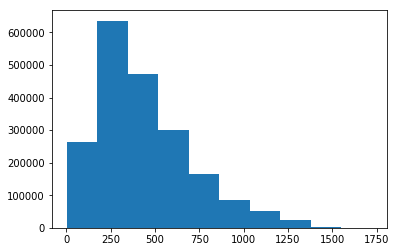


```python
# INT_RATE
X = 'int_rate'
EDA_attr(X)
ls_clean[X] = ls[X].str[:-1].astype(np.float)
scale_attr(X)
```


**int_rate**: Interest Rate on the loan


    	Type: 			object
    	Missing Values: 	0 (0.0%)
    	Number of Categories: 	650


<div>
<style scoped>
    .dataframe tbody tr th:only-of-type {
        vertical-align: middle;
    }

    .dataframe tbody tr th {
        vertical-align: top;
    }

    .dataframe thead th {
        text-align: right;
    }
</style>
<table border="1" class="dataframe">
  <thead>
    <tr style="text-align: right;">
      <th></th>
      <th>count</th>
      <th>sum</th>
    </tr>
    <tr>
      <th>int_rate</th>
      <th></th>
      <th></th>
    </tr>
  </thead>
  <tbody>
    <tr>
      <th>11.99%</th>
      <td>53872</td>
      <td>769423225.000</td>
    </tr>
    <tr>
      <th>5.32%</th>
      <td>47171</td>
      <td>690038950.000</td>
    </tr>
    <tr>
      <th>10.99%</th>
      <td>44164</td>
      <td>613296525.000</td>
    </tr>
  </tbody>
</table>
</div>


```python
# LOAN_AMNT
X = 'loan_amnt'
EDA_attr(X)
scale_attr(X)
```


**loan_amnt**: The listed amount of the loan applied for by the borrower. If at some point in time, the credit department reduces the loan amount, then it will be reflected in this value.


    	Type: 			float64
    	Missing Values: 	0 (0.0%)
    	Mean: 			14920.73
    	Range: 			(500.00, 40000.00)


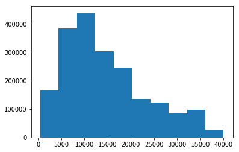


```python
# PURPOSE
X = 'purpose'
EDA_attr(X)
dummy_attr(X)
```


**purpose**: A category provided by the borrower for the loan request. 


    	Type: 			object
    	Missing Values: 	0 (0.0%)
    	Number of Categories: 	14


<div>
<style scoped>
    .dataframe tbody tr th:only-of-type {
        vertical-align: middle;
    }

    .dataframe tbody tr th {
        vertical-align: top;
    }

    .dataframe thead th {
        text-align: right;
    }
</style>
<table border="1" class="dataframe">
  <thead>
    <tr style="text-align: right;">
      <th></th>
      <th>count</th>
      <th>sum</th>
    </tr>
    <tr>
      <th>purpose</th>
      <th></th>
      <th></th>
    </tr>
  </thead>
  <tbody>
    <tr>
      <th>debt_consolidation</th>
      <td>1137459</td>
      <td>17981579625.000</td>
    </tr>
    <tr>
      <th>credit_card</th>
      <td>446668</td>
      <td>6814273200.000</td>
    </tr>
    <tr>
      <th>home_improvement</th>
      <td>135001</td>
      <td>1973988925.000</td>
    </tr>
  </tbody>
</table>
</div>


```python
# SUB_GRADE
X = 'sub_grade'
EDA_attr(X)
mapping = {'A':0, 'B':1, 'C':2, 'D':3, 'E':4, 'F':5, 'G':6}
ls_clean[X] = (ls[X].apply(lambda x: x[0]).map(mapping).astype(int)*5 +
               ls[X].apply(lambda x: x[1]).astype(int)).astype(int)
scale_attr(X)
```


**sub_grade**: LC assigned loan subgrade


    	Type: 			object
    	Missing Values: 	0 (0.0%)
    	Number of Categories: 	35


<div>
<style scoped>
    .dataframe tbody tr th:only-of-type {
        vertical-align: middle;
    }

    .dataframe tbody tr th {
        vertical-align: top;
    }

    .dataframe thead th {
        text-align: right;
    }
</style>
<table border="1" class="dataframe">
  <thead>
    <tr style="text-align: right;">
      <th></th>
      <th>count</th>
      <th>sum</th>
    </tr>
    <tr>
      <th>sub_grade</th>
      <th></th>
      <th></th>
    </tr>
  </thead>
  <tbody>
    <tr>
      <th>C1</th>
      <td>131882</td>
      <td>1884162800.000</td>
    </tr>
    <tr>
      <th>B5</th>
      <td>126570</td>
      <td>1723099175.000</td>
    </tr>
    <tr>
      <th>B4</th>
      <td>122532</td>
      <td>1692566700.000</td>
    </tr>
  </tbody>
</table>
</div>


```python
# TERM
X = 'term'
EDA_attr(X)
dummy_attr(X)
```


**term**: The number of payments on the loan. Values are in months and can be either 36 or 60.


    	Type: 			object
    	Missing Values: 	0 (0.0%)
    	Number of Categories: 	2


<div>
<style scoped>
    .dataframe tbody tr th:only-of-type {
        vertical-align: middle;
    }

    .dataframe tbody tr th {
        vertical-align: top;
    }

    .dataframe thead th {
        text-align: right;
    }
</style>
<table border="1" class="dataframe">
  <thead>
    <tr style="text-align: right;">
      <th></th>
      <th>count</th>
      <th>sum</th>
    </tr>
    <tr>
      <th>term</th>
      <th></th>
      <th></th>
    </tr>
  </thead>
  <tbody>
    <tr>
      <th>36 months</th>
      <td>1432001</td>
      <td>18128083000.000</td>
    </tr>
    <tr>
      <th>60 months</th>
      <td>572061</td>
      <td>11773980675.000</td>
    </tr>
  </tbody>
</table>
</div>


```python
# VERIFICATION_STATUS
X = 'verification_status'
EDA_attr(X)
dummy_attr(X)
```


**verification_status**: Indicates if income was verified by LC, not verified, or if the income source was verified


    	Type: 			object
    	Missing Values: 	0 (0.0%)
    	Number of Categories: 	3


<div>
<style scoped>
    .dataframe tbody tr th:only-of-type {
        vertical-align: middle;
    }

    .dataframe tbody tr th {
        vertical-align: top;
    }

    .dataframe thead th {
        text-align: right;
    }
</style>
<table border="1" class="dataframe">
  <thead>
    <tr style="text-align: right;">
      <th></th>
      <th>count</th>
      <th>sum</th>
    </tr>
    <tr>
      <th>verification_status</th>
      <th></th>
      <th></th>
    </tr>
  </thead>
  <tbody>
    <tr>
      <th>Source Verified</th>
      <td>784628</td>
      <td>11914964500.000</td>
    </tr>
    <tr>
      <th>Not Verified</th>
      <td>636247</td>
      <td>7955207100.000</td>
    </tr>
    <tr>
      <th>Verified</th>
      <td>583187</td>
      <td>10031892075.000</td>
    </tr>
  </tbody>
</table>
</div>


<hr style="height:1pt">

### 2B. Borrower Demographics


```python
# ADDR_STATE
X = 'addr_state'
EDA_attr(X)
dummy_attr(X)
```


**addr_state**: The state provided by the borrower in the loan application


    	Type: 			object
    	Missing Values: 	0 (0.0%)
    	Number of Categories: 	51


<div>
<style scoped>
    .dataframe tbody tr th:only-of-type {
        vertical-align: middle;
    }

    .dataframe tbody tr th {
        vertical-align: top;
    }

    .dataframe thead th {
        text-align: right;
    }
</style>
<table border="1" class="dataframe">
  <thead>
    <tr style="text-align: right;">
      <th></th>
      <th>count</th>
      <th>sum</th>
    </tr>
    <tr>
      <th>addr_state</th>
      <th></th>
      <th></th>
    </tr>
  </thead>
  <tbody>
    <tr>
      <th>CA</th>
      <td>279270</td>
      <td>4227821200.000</td>
    </tr>
    <tr>
      <th>NY</th>
      <td>165920</td>
      <td>2444828575.000</td>
    </tr>
    <tr>
      <th>TX</th>
      <td>165147</td>
      <td>2578213425.000</td>
    </tr>
  </tbody>
</table>
</div>


```python
# ANNUAL_INC
X = 'annual_inc'
EDA_attr(X)
outliers = outlier_attr(X, 10000000)
scale_attr(X,fit_data=ls_clean[~outliers][[X]])
```


**annual_inc**: The self-reported annual income provided by the borrower during registration.


    	Type: 			float64
    	Missing Values: 	4 (0.0%)
    	Mean: 			77546.58
    	Range: 			(0.00, 110000000.00)


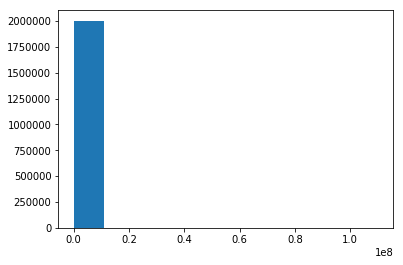


```python
# EMP_LENGTH
X = 'emp_length'
EDA_attr(X)
mapping = {'1 year': 1, '10+ years': 10, '2 years': 2, '3 years': 3, 
           '4 years': 4, '5 years': 5, '6 years': 6, '7 years': 7, 
           '8 years': 8, '9 years': 9, '< 1 year': 0}
ls_clean[X] = ls[X].map(mapping)
scale_attr(X)
```


**emp_length**: Employment length in years. Possible values are between 0 and 10 where 0 means less than one year and 10 means ten or more years. 


    	Type: 			object
    	Missing Values: 	124816 (6.2%)
    	Number of Categories: 	11


<div>
<style scoped>
    .dataframe tbody tr th:only-of-type {
        vertical-align: middle;
    }

    .dataframe tbody tr th {
        vertical-align: top;
    }

    .dataframe thead th {
        text-align: right;
    }
</style>
<table border="1" class="dataframe">
  <thead>
    <tr style="text-align: right;">
      <th></th>
      <th>count</th>
      <th>sum</th>
    </tr>
    <tr>
      <th>emp_length</th>
      <th></th>
      <th></th>
    </tr>
  </thead>
  <tbody>
    <tr>
      <th>10+ years</th>
      <td>667144</td>
      <td>10766403175.000</td>
    </tr>
    <tr>
      <th>2 years</th>
      <td>181413</td>
      <td>2580529150.000</td>
    </tr>
    <tr>
      <th>&lt; 1 year</th>
      <td>162599</td>
      <td>2362518625.000</td>
    </tr>
  </tbody>
</table>
</div>


```python
# HOME_OWNERSHIP
X = 'home_ownership'
EDA_attr(X)
ls_clean[X] = ls_clean[X].replace({'ANY':'OTHER', 'NONE':'OTHER'})
dummy_attr(X)
```


**home_ownership**: The home ownership status provided by the borrower during registration or obtained from the credit report. Our values are: RENT, OWN, MORTGAGE, OTHER


    	Type: 			object
    	Missing Values: 	0 (0.0%)
    	Number of Categories: 	6


<div>
<style scoped>
    .dataframe tbody tr th:only-of-type {
        vertical-align: middle;
    }

    .dataframe tbody tr th {
        vertical-align: top;
    }

    .dataframe thead th {
        text-align: right;
    }
</style>
<table border="1" class="dataframe">
  <thead>
    <tr style="text-align: right;">
      <th></th>
      <th>count</th>
      <th>sum</th>
    </tr>
    <tr>
      <th>home_ownership</th>
      <th></th>
      <th></th>
    </tr>
  </thead>
  <tbody>
    <tr>
      <th>MORTGAGE</th>
      <td>985824</td>
      <td>16326308950.000</td>
    </tr>
    <tr>
      <th>RENT</th>
      <td>793630</td>
      <td>10368245325.000</td>
    </tr>
    <tr>
      <th>OWN</th>
      <td>223846</td>
      <td>3197386500.000</td>
    </tr>
  </tbody>
</table>
</div>


<hr style="height:1pt">

### 2C. Credit History Information


```python
# ACC_NOW_DELINQ
X = 'acc_now_delinq'
EDA_attr(X)
outliers = outlier_attr(X, 7)

```


**acc_now_delinq**: The number of accounts on which the borrower is now delinquent.


    	Type: 			float64
    	Missing Values: 	29 (0.0%)
    	Mean: 			0.00
    	Range: 			(0.00, 14.00)


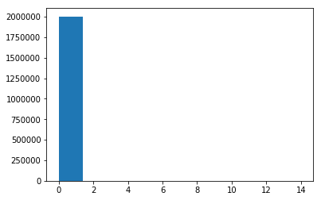


```python
# ACC_OPEN_PAST_24MTHS
X = 'acc_open_past_24mths'
EDA_attr(X)
scale_attr(X)
```


**acc_open_past_24mths**: Number of trades opened in past 24 months.


    	Type: 			float64
    	Missing Values: 	50030 (2.5%)
    	Mean: 			4.54
    	Range: 			(0.00, 64.00)


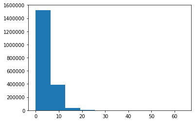


```python
# ALL_UTIL
X = 'all_util'
EDA_attr(X)
scale_attr(X)
```


**all_util**: Balance to credit limit on all trades


    	Type: 			float64
    	Missing Values: 	866282 (43.2%)
    	Mean: 			57.64
    	Range: 			(0.00, 239.00)


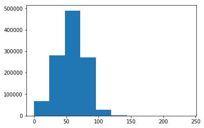


```python
# AVG_CUR_BAL
X = 'avg_cur_bal'
EDA_attr(X)
scale_attr(X)
```


**avg_cur_bal**: Average current balance of all accounts


    	Type: 			float64
    	Missing Values: 	70321 (3.5%)
    	Mean: 			13519.36
    	Range: 			(0.00, 958084.00)


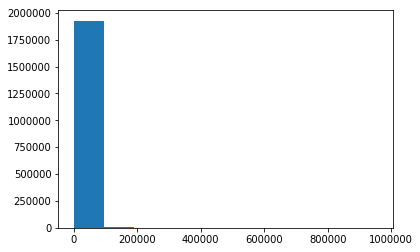


```python
# BC_OPEN_TO_BUY
X = 'bc_open_to_buy'
EDA_attr(X)
scale_attr(X)
```


**bc_open_to_buy**: Total open to buy on revolving bankcards.


    	Type: 			float64
    	Missing Values: 	71597 (3.6%)
    	Mean: 			10896.07
    	Range: 			(0.00, 711140.00)


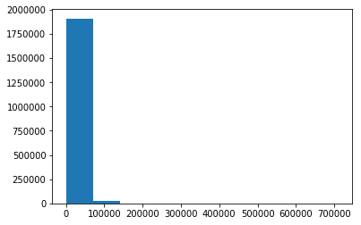


```python
# BC_UTIL: scaling
X = 'bc_util'
EDA_attr(X)
scale_attr(X)
```


**bc_util**: Ratio of total current balance to high credit/credit limit for all bankcard accounts.


    	Type: 			float64
    	Missing Values: 	72621 (3.6%)
    	Mean: 			58.89
    	Range: 			(0.00, 339.60)


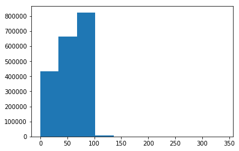


```python
# CHARGEOFF_WITHIN_12_MTHS
X = 'chargeoff_within_12_mths'
EDA_attr(X)
scale_attr(X)
```


**chargeoff_within_12_mths**: Number of charge-offs within 12 months


    	Type: 			float64
    	Missing Values: 	145 (0.0%)
    	Mean: 			0.01
    	Range: 			(0.00, 10.00)


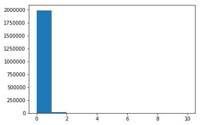


```python
# COLLECTIONS_12_MTHS_EX_MED
X = 'collections_12_mths_ex_med'
EDA_attr(X)
outliers = outlier_attr(X, 12)
scale_attr(X,fit_data=ls_clean[~outliers][[X]])
```


**collections_12_mths_ex_med**: Number of collections in 12 months excluding medical collections


    	Type: 			float64
    	Missing Values: 	145 (0.0%)
    	Mean: 			0.02
    	Range: 			(0.00, 20.00)


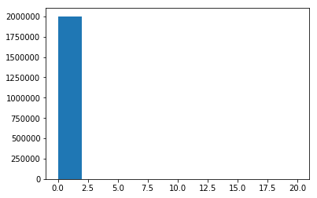


```python
# DELINQ_2YRS
X = 'delinq_2yrs'
EDA_attr(X)
scale_attr(X)
```


**delinq_2yrs**: The number of 30+ days past-due incidences of delinquency in the borrower's credit file for the past 2 years


    	Type: 			float64
    	Missing Values: 	29 (0.0%)
    	Mean: 			0.32
    	Range: 			(0.00, 42.00)


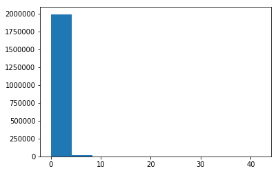


```python
# DELINQ_AMNT
X = 'delinq_amnt'
EDA_attr(X)
scale_attr(X)
```


**delinq_amnt**: The past-due amount owed for the accounts on which the borrower is now delinquent.


    	Type: 			float64
    	Missing Values: 	29 (0.0%)
    	Mean: 			13.81
    	Range: 			(0.00, 249925.00)


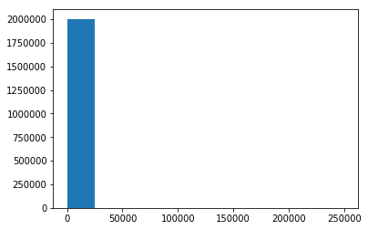


```python
# DTI
X = 'dti'
EDA_attr(X)
ls_clean[ls[X]==-1] = np.NaN
scale_attr(X)
```


**dti**: A ratio calculated using the borrower’s total monthly debt payments on the total debt obligations, excluding mortgage and the requested LC loan, divided by the borrower’s self-reported monthly income.


    	Type: 			float64
    	Missing Values: 	1167 (0.1%)
    	Mean: 			18.69
    	Range: 			(-1.00, 999.00)


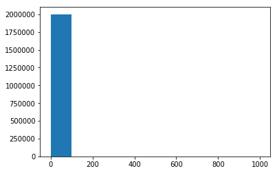


```python
# EARLIEST_CR_LINE
X = 'earliest_cr_line'
EDA_attr(X)

ls_clean[X] =  np.array((ls['issue_d'] - ls[X]).dt.days).reshape(-1,1)

scale_attr(X)
```


**earliest_cr_line**: The month the borrower's earliest reported credit line was opened


    	Type: 			datetime64[ns]
    	Missing Values: 	29 (0.0%)


```python
# IL_UTIL
X = 'il_util'
EDA_attr(X)
scale_attr(X)
```


**il_util**: Ratio of total current balance to high credit/credit limit on all install acct


    	Type: 			float64
    	Missing Values: 	1028062 (51.3%)
    	Mean: 			69.39
    	Range: 			(0.00, 1000.00)


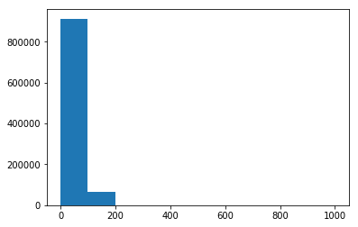


```python
# INQ_FI
X = 'inq_fi'
EDA_attr(X)
scale_attr(X)
```


**inq_fi**: Number of personal finance inquiries


    	Type: 			float64
    	Missing Values: 	866129 (43.2%)
    	Mean: 			0.99
    	Range: 			(0.00, 48.00)


```python
# INQ_LAST_12M
X = 'inq_last_12m'
EDA_attr(X)
scale_attr(X)
```


**inq_last_12m**: Number of credit inquiries in past 12 months


    	Type: 			float64
    	Missing Values: 	866130 (43.2%)
    	Mean: 			2.07
    	Range: 			(0.00, 67.00)


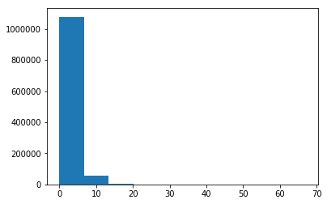


```python
# INQ_LAST_6MTHS
X = 'inq_last_6mths'
EDA_attr(X)
scale_attr(X)
```


**inq_last_6mths**: The number of inquiries in past 6 months (excluding auto and mortgage inquiries)


    	Type: 			float64
    	Missing Values: 	30 (0.0%)
    	Mean: 			0.60
    	Range: 			(0.00, 33.00)


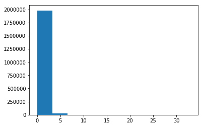


```python
# MAX_BAL_BC
X = 'max_bal_bc'
EDA_attr(X)
scale_attr(X)
```


**max_bal_bc**: Maximum current balance owed on all revolving accounts


    	Type: 			float64
    	Missing Values: 	866129 (43.2%)
    	Mean: 			5757.92
    	Range: 			(0.00, 1170668.00)


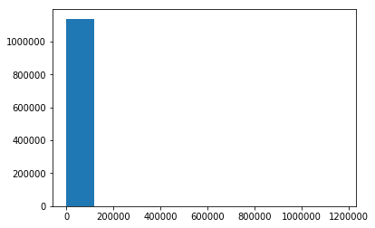


```python
# MO_SIN_OLD_IL_ACCT
X =  'mo_sin_old_il_acct'
EDA_attr(X)
scale_attr(X)
```


**mo_sin_old_il_acct**: Months since oldest bank installment account opened


    	Type: 			float64
    	Missing Values: 	129982 (6.5%)
    	Mean: 			126.08
    	Range: 			(0.00, 999.00)


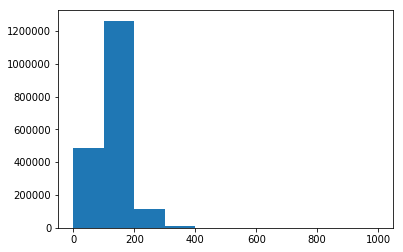


```python
# MO_SIN_OLD_REV_TL_OP
X =  'mo_sin_old_rev_tl_op'
EDA_attr(X)
scale_attr(X)
```


**mo_sin_old_rev_tl_op**: Months since oldest revolving account opened


    	Type: 			float64
    	Missing Values: 	70277 (3.5%)
    	Mean: 			182.54
    	Range: 			(1.00, 999.00)


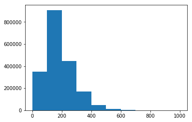


```python
# MO_SIN_RCNT_REV_TL_OP
X = 'mo_sin_rcnt_rev_tl_op'
EDA_attr(X)
scale_attr(X)
```


**mo_sin_rcnt_rev_tl_op**: Months since most recent revolving account opened


    	Type: 			float64
    	Missing Values: 	70277 (3.5%)
    	Mean: 			13.86
    	Range: 			(0.00, 547.00)


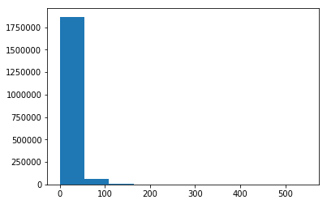


```python
# MO_SIN_RCNT_TL
X = 'mo_sin_rcnt_tl'
EDA_attr(X)
scale_attr(X)
```


**mo_sin_rcnt_tl**: Months since most recent account opened


    	Type: 			float64
    	Missing Values: 	70276 (3.5%)
    	Mean: 			8.25
    	Range: 			(0.00, 368.00)


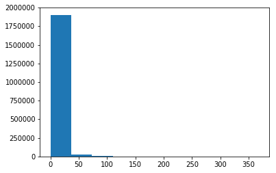


```python
# MORT_ACC
X = 'mort_acc'
EDA_attr(X)
scale_attr(X)
```


**mort_acc**: Number of mortgage accounts.


    	Type: 			float64
    	Missing Values: 	50030 (2.5%)
    	Mean: 			1.59
    	Range: 			(0.00, 94.00)


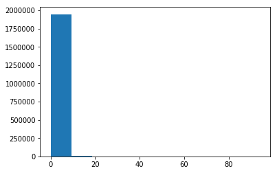


```python
# MTHS_SINCE_LAST_DELINQ
X = 'mths_since_last_delinq'
EDA_attr(X)
scale_attr(X)
```


**mths_since_last_delinq**: The number of months since the borrower's last delinquency.


    	Type: 			float64
    	Missing Values: 	1014917 (50.6%)
    	Mean: 			34.26
    	Range: 			(0.00, 226.00)


```python
# MTHS_SINCE_LAST_MAJOR_DEROG
X = 'mths_since_last_major_derog'
EDA_attr(X)
scale_attr(X)
```


**mths_since_last_major_derog**: Months since most recent 90-day or worse rating


    	Type: 			float64
    	Missing Values: 	1482297 (74.0%)
    	Mean: 			43.90
    	Range: 			(0.00, 226.00)


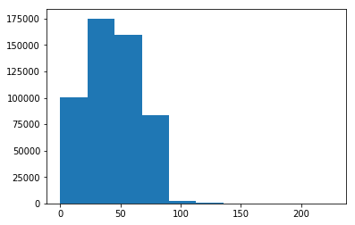


```python
# MTHS_SINCE_LAST_RECORD
X = 'mths_since_last_record'
EDA_attr(X)
scale_attr(X)
```


**mths_since_last_record**: The number of months since the last public record.


    	Type: 			float64
    	Missing Values: 	1676063 (83.6%)
    	Mean: 			71.04
    	Range: 			(0.00, 129.00)


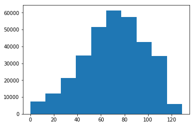


```python
# MTHS_SINCE_RCNT_IL
X = 'mths_since_rcnt_il'
EDA_attr(X)
scale_attr(X)
```


**mths_since_rcnt_il**: Months since most recent installment accounts opened


    	Type: 			float64
    	Missing Values: 	900835 (45.0%)
    	Mean: 			21.36
    	Range: 			(0.00, 511.00)


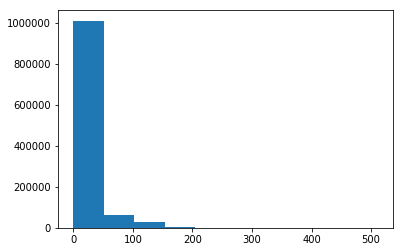


```python
# MTHS_SINCE_RECENT_BC
X = 'mths_since_recent_bc'
EDA_attr(X)
scale_attr(X)
```


**mths_since_recent_bc**: Months since most recent bankcard account opened.


    	Type: 			float64
    	Missing Values: 	70271 (3.5%)
    	Mean: 			24.73
    	Range: 			(0.00, 661.00)


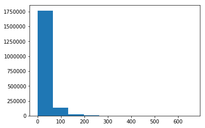


```python
# MTHS_SINCE_RECENT_BC_DLQ
X = 'mths_since_recent_bc_dlq'
EDA_attr(X)
scale_attr(X)
```


**mths_since_recent_bc_dlq**: Months since most recent bankcard delinquency


    	Type: 			float64
    	Missing Values: 	1534955 (76.6%)
    	Mean: 			39.17
    	Range: 			(0.00, 202.00)


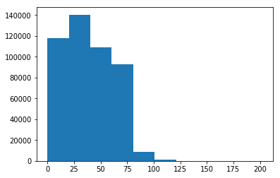


```python
# MTHS_SINCE_RECENT_INQ
X =  'mths_since_recent_inq'
EDA_attr(X)
scale_attr(X)
```


**mths_since_recent_inq**: Months since most recent inquiry.


    	Type: 			float64
    	Missing Values: 	263372 (13.1%)
    	Mean: 			6.95
    	Range: 			(0.00, 25.00)


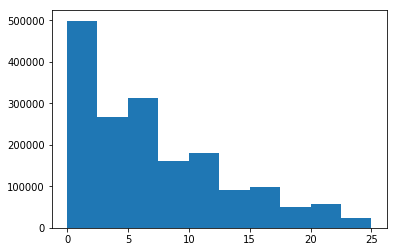


```python
# MTHS_SINCE_RECENT_REVOL_DELINQ
X= 'mths_since_recent_revol_delinq'
EDA_attr(X)
scale_attr(X)
```


**mths_since_recent_revol_delinq**: Months since most recent revolving delinquency.


    	Type: 			float64
    	Missing Values: 	1337566 (66.7%)
    	Mean: 			35.55
    	Range: 			(0.00, 202.00)


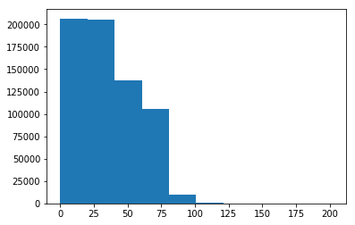


```python
# NUM_ACCTS_EVER_120_PD
X = 'num_accts_ever_120_pd'
EDA_attr(X)
scale_attr(X)
```


**num_accts_ever_120_pd**: Number of accounts ever 120 or more days past due


    	Type: 			float64
    	Missing Values: 	70276 (3.5%)
    	Mean: 			0.50
    	Range: 			(0.00, 51.00)


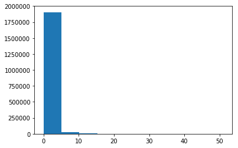


```python
# NUM_ACTV_BC_TL
X = 'num_actv_bc_tl'
EDA_attr(X)
scale_attr(X)
```


**num_actv_bc_tl**: Number of currently active bankcard accounts


    	Type: 			float64
    	Missing Values: 	70276 (3.5%)
    	Mean: 			3.68
    	Range: 			(0.00, 50.00)


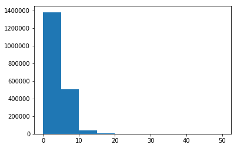


```python
# NUM_ACTV_REV_TL
X = 'num_actv_rev_tl'
EDA_attr(X)
scale_attr(X)
```


**num_actv_rev_tl**: Number of currently active revolving trades


    	Type: 			float64
    	Missing Values: 	70276 (3.5%)
    	Mean: 			5.66
    	Range: 			(0.00, 72.00)


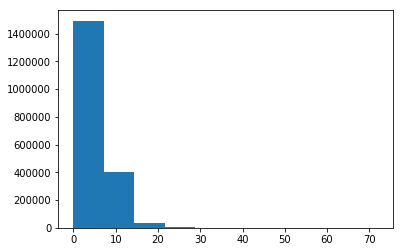


```python
# NUM_BC_SATS
X = 'num_bc_sats'
EDA_attr(X)
scale_attr(X)
```


**num_bc_sats**: Number of satisfactory bankcard accounts


    	Type: 			float64
    	Missing Values: 	58590 (2.9%)
    	Mean: 			4.76
    	Range: 			(0.00, 71.00)


```python
# NUM_BC_TL
X =  'num_bc_tl'
EDA_attr(X)
scale_attr(X)
```


**num_bc_tl**: Number of bankcard accounts


    	Type: 			float64
    	Missing Values: 	70276 (3.5%)
    	Mean: 			7.81
    	Range: 			(0.00, 86.00)


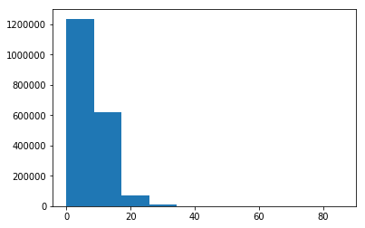


```python
# NUM_IL_TL
X = 'num_il_tl'
EDA_attr(X)
scale_attr(X)
```


**num_il_tl**: Number of installment accounts


    	Type: 			float64
    	Missing Values: 	70276 (3.5%)
    	Mean: 			8.44
    	Range: 			(0.00, 159.00)


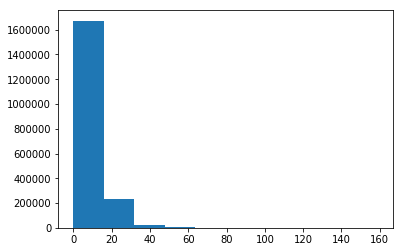


```python
# NUM_OP_REV_TL
X = 'num_op_rev_tl'
EDA_attr(X)
scale_attr(X)
```


**num_op_rev_tl**: Number of open revolving accounts


    	Type: 			float64
    	Missing Values: 	70276 (3.5%)
    	Mean: 			8.25
    	Range: 			(0.00, 91.00)


```python
# NUM_REV_ACCTS
X = 'num_rev_accts'
EDA_attr(X)
scale_attr(X)
```


**num_rev_accts**: Number of revolving accounts


    	Type: 			float64
    	Missing Values: 	70277 (3.5%)
    	Mean: 			14.15
    	Range: 			(0.00, 151.00)


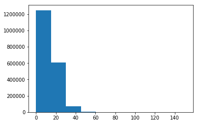


```python
# NUM_REV_TL_BAL_GT_0
X = 'num_rev_tl_bal_gt_0'
EDA_attr(X)
scale_attr(X)
```


**num_rev_tl_bal_gt_0**: Number of revolving trades with balance >0


    	Type: 			float64
    	Missing Values: 	70276 (3.5%)
    	Mean: 			5.60
    	Range: 			(0.00, 65.00)


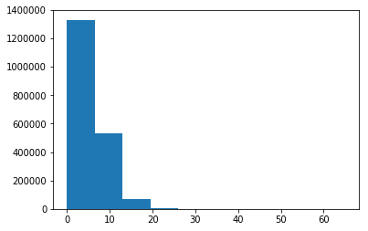


```python
# NUM_SATS
X = 'num_sats'
EDA_attr(X)
scale_attr(X)
```


**num_sats**: Number of satisfactory accounts


    	Type: 			float64
    	Missing Values: 	58590 (2.9%)
    	Mean: 			11.64
    	Range: 			(0.00, 101.00)


```python
# NUM_TL_120DPD_2M
X = 'num_tl_120dpd_2m'
EDA_attr(X)
scale_attr(X)
```


**num_tl_120dpd_2m**: Number of accounts currently 120 days past due (updated in past 2 months)


    	Type: 			float64
    	Missing Values: 	147544 (7.4%)
    	Mean: 			0.00
    	Range: 			(0.00, 7.00)


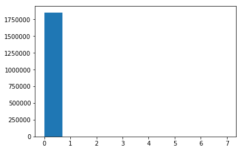


```python
# NUM_TL_30DPD
X = 'num_tl_30dpd'
EDA_attr(X)
scale_attr(X)
```


**num_tl_30dpd**: Number of accounts currently 30 days past due (updated in past 2 months)


    	Type: 			float64
    	Missing Values: 	70276 (3.5%)
    	Mean: 			0.00
    	Range: 			(0.00, 4.00)


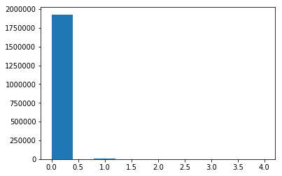


```python
# NUM_TL_90G_DPD_24M
X = 'num_tl_90g_dpd_24m'
EDA_attr(X)
scale_attr(X)
```


**num_tl_90g_dpd_24m**: Number of accounts 90 or more days past due in last 24 months


    	Type: 			float64
    	Missing Values: 	70276 (3.5%)
    	Mean: 			0.09
    	Range: 			(0.00, 42.00)


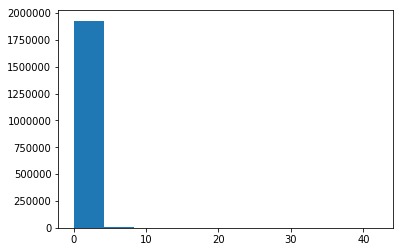


```python
# NUM_TL_OP_PAST_12M
X = 'num_tl_op_past_12m'
EDA_attr(X)
scale_attr(X)
```


**num_tl_op_past_12m**: Number of accounts opened in past 12 months


    	Type: 			float64
    	Missing Values: 	70276 (3.5%)
    	Mean: 			2.09
    	Range: 			(0.00, 32.00)


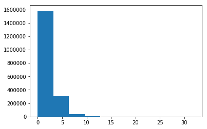


```python
# OPEN_ACC
X = 'open_acc'
EDA_attr(X)
scale_attr(X)
```


**open_acc**: The number of open credit lines in the borrower's credit file.


    	Type: 			float64
    	Missing Values: 	29 (0.0%)
    	Mean: 			11.62
    	Range: 			(0.00, 101.00)


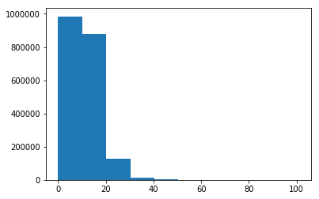


```python
# OPEN_ACC_6M
X = 'open_acc_6m'
EDA_attr(X)
scale_attr(X)
```


**open_acc_6m**: Number of open trades in last 6 months


    	Type: 			float64
    	Missing Values: 	866130 (43.2%)
    	Mean: 			0.94
    	Range: 			(0.00, 18.00)


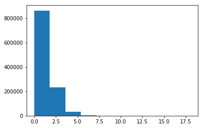


```python
# OPEN_ACT_IL
X = 'open_act_il'
EDA_attr(X)
scale_attr(X)
```


**open_act_il**: Number of currently active installment trades


    	Type: 			float64
    	Missing Values: 	866129 (43.2%)
    	Mean: 			2.79
    	Range: 			(0.00, 57.00)


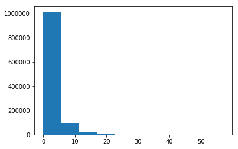


```python
# OPEN_ACT_12M
X = 'open_il_12m'
EDA_attr(X)
scale_attr(X)
```


**open_il_12m**: Number of installment accounts opened in past 12 months


    	Type: 			float64
    	Missing Values: 	866129 (43.2%)
    	Mean: 			0.68
    	Range: 			(0.00, 25.00)


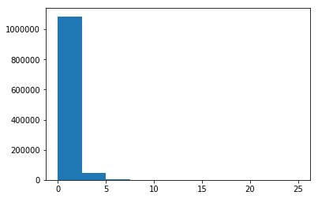


```python
# OPEN_ACT_24M
X = 'open_il_24m'
EDA_attr(X)
scale_attr(X)
```


**open_il_24m**: Number of installment accounts opened in past 24 months


    	Type: 			float64
    	Missing Values: 	866129 (43.2%)
    	Mean: 			1.57
    	Range: 			(0.00, 51.00)


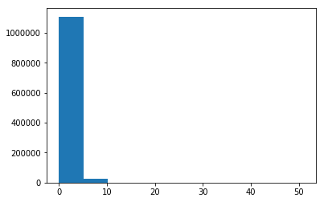


```python
# OPEN_RV_12M
X = 'open_rv_12m'
EDA_attr(X)
scale_attr(X)
```


**open_rv_12m**: Number of revolving trades opened in past 12 months


    	Type: 			float64
    	Missing Values: 	866129 (43.2%)
    	Mean: 			1.31
    	Range: 			(0.00, 28.00)


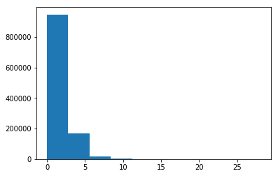


```python
# OPEN_RV_24M
X = 'open_rv_24m'
EDA_attr(X)
scale_attr(X)
```


**open_rv_24m**: Number of revolving trades opened in past 24 months


    	Type: 			float64
    	Missing Values: 	866129 (43.2%)
    	Mean: 			2.79
    	Range: 			(0.00, 60.00)


```python
# PCT_TL_NVR_DLQ
X = 'pct_tl_nvr_dlq'
EDA_attr(X)
scale_attr(X)
```


**pct_tl_nvr_dlq**: Percent of trades never delinquent


    	Type: 			float64
    	Missing Values: 	70430 (3.5%)
    	Mean: 			94.05
    	Range: 			(0.00, 100.00)


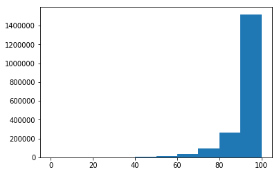


```python
# PERCENT_BC_GT_75
X = 'percent_bc_gt_75'
EDA_attr(X)
scale_attr(X)
```


**percent_bc_gt_75**: Percentage of all bankcard accounts > 75% of limit.


    	Type: 			float64
    	Missing Values: 	72038 (3.6%)
    	Mean: 			43.65
    	Range: 			(0.00, 100.00)


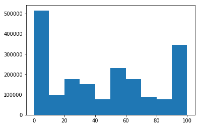


```python
# PUB_REC
X ='pub_rec'
EDA_attr(X)
scale_attr(X)
```


**pub_rec**: Number of derogatory public records


    	Type: 			float64
    	Missing Values: 	29 (0.0%)
    	Mean: 			0.21
    	Range: 			(0.00, 86.00)


```python
# PUB_REC_BANKRUPTCIES
X = 'pub_rec_bankruptcies'
EDA_attr(X)
scale_attr(X)
```


**pub_rec_bankruptcies**: Number of public record bankruptcies


    	Type: 			float64
    	Missing Values: 	1365 (0.1%)
    	Mean: 			0.13
    	Range: 			(0.00, 12.00)


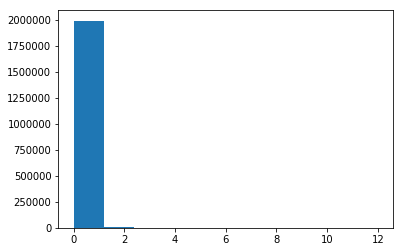


```python
# REVOL_BAL
X = 'revol_bal'
EDA_attr(X)
scale_attr(X)
```


**revol_bal**: Total credit revolving balance


    	Type: 			float64
    	Missing Values: 	0 (0.0%)
    	Mean: 			16650.30
    	Range: 			(0.00, 2904836.00)


```python
# REVOL_UTIL
X = 'revol_util'
EDA_attr(X)
ls_clean[X] = ls[X].str[:-1].astype(np.float)
scale_attr(X)
```


**revol_util**: Revolving line utilization rate, or the amount of credit the borrower is using relative to all available revolving credit.


    	Type: 			object
    	Missing Values: 	1517 (0.1%)
    	Number of Categories: 	1421


<div>
<style scoped>
    .dataframe tbody tr th:only-of-type {
        vertical-align: middle;
    }

    .dataframe tbody tr th {
        vertical-align: top;
    }

    .dataframe thead th {
        text-align: right;
    }
</style>
<table border="1" class="dataframe">
  <thead>
    <tr style="text-align: right;">
      <th></th>
      <th>count</th>
      <th>sum</th>
    </tr>
    <tr>
      <th>revol_util</th>
      <th></th>
      <th></th>
    </tr>
  </thead>
  <tbody>
    <tr>
      <th>0%</th>
      <td>10877</td>
      <td>152684825.000</td>
    </tr>
    <tr>
      <th>57%</th>
      <td>3945</td>
      <td>61456000.000</td>
    </tr>
    <tr>
      <th>59%</th>
      <td>3890</td>
      <td>61073725.000</td>
    </tr>
  </tbody>
</table>
</div>


```python
# TAX_LIENS
X = 'tax_liens'
EDA_attr(X)
scale_attr(X)
```


**tax_liens**: Number of tax liens


    	Type: 			float64
    	Missing Values: 	105 (0.0%)
    	Mean: 			0.05
    	Range: 			(0.00, 85.00)


```python
# TOT_COLL_AMT
X = 'tot_coll_amt'
EDA_attr(X)
scale_attr(X)
```


**tot_coll_amt**: Total collection amounts ever owed


    	Type: 			float64
    	Missing Values: 	70276 (3.5%)
    	Mean: 			238.34
    	Range: 			(0.00, 9152545.00)


```python
# TOT_CUR_BAL
X = 'tot_cur_bal'
EDA_attr(X)
scale_attr(X)
```


**tot_cur_bal**: Total current balance of all accounts


    	Type: 			float64
    	Missing Values: 	70276 (3.5%)
    	Mean: 			142034.93
    	Range: 			(0.00, 8524709.00)


```python
# TOT_HI_CRED_LIM
X = 'tot_hi_cred_lim'
EDA_attr(X)
scale_attr(X)
```


**tot_hi_cred_lim**: Total high credit/credit limit


    	Type: 			float64
    	Missing Values: 	70276 (3.5%)
    	Mean: 			177036.02
    	Range: 			(0.00, 9999999.00)


```python
# TOTAL_ACC
X = 'total_acc'
EDA_attr(X)
scale_attr(X)
```


**total_acc**: The total number of credit lines currently in the borrower's credit file


    	Type: 			float64
    	Missing Values: 	29 (0.0%)
    	Mean: 			24.35
    	Range: 			(1.00, 176.00)


```python
# TOTAL_BAL_EX_MORT
X = 'total_bal_ex_mort'
EDA_attr(X)
scale_attr(X)
```


**total_bal_ex_mort**: Total credit balance excluding mortgage


    	Type: 			float64
    	Missing Values: 	50030 (2.5%)
    	Mean: 			50769.50
    	Range: 			(0.00, 3408095.00)


```python
# TOTAL_BAL_IL
X = 'total_bal_il'
EDA_attr(X)
scale_attr(X)
```


**total_bal_il**: Total current balance of all installment accounts


    	Type: 			float64
    	Missing Values: 	866129 (43.2%)
    	Mean: 			35424.48
    	Range: 			(0.00, 1711009.00)


```python
# TOTAL_BC_LIMIT
X = 'total_bc_limit'
EDA_attr(X)
scale_attr(X)
```


**total_bc_limit**: Total bankcard high credit/credit limit


    	Type: 			float64
    	Missing Values: 	50030 (2.5%)
    	Mean: 			22667.45
    	Range: 			(0.00, 1569000.00)


```python
# TOTAL_CU_TL
X = 'total_cu_tl'
EDA_attr(X)
scale_attr(X)
```


**total_cu_tl**: Number of finance trades


    	Type: 			float64
    	Missing Values: 	866130 (43.2%)
    	Mean: 			1.47
    	Range: 			(0.00, 111.00)


```python
# TOTAL_IL_HIGH_CREDIT_LIMIT
X = 'total_il_high_credit_limit'
EDA_attr(X)
scale_attr(X)
```


**total_il_high_credit_limit**: Total installment high credit/credit limit


    	Type: 			float64
    	Missing Values: 	70276 (3.5%)
    	Mean: 			43384.39
    	Range: 			(0.00, 2101913.00)


```python
# TOTAL_REV_HI_LIM
X = 'total_rev_hi_lim'
EDA_attr(X)
scale_attr(X)
```


**total_rev_hi_lim**: Total revolving high credit/credit limit


    	Type: 			float64
    	Missing Values: 	70276 (3.5%)
    	Mean: 			33980.47
    	Range: 			(0.00, 9999999.00)


<hr style="height:2pt">

### 2D. Co-Borrower Information


```python
# APPLICATION_TYPE
X = 'application_type'
EDA_attr(X)
dummy_attr(X)
```


**application_type**: Indicates whether the loan is an individual application or a joint application with two co-borrowers


    	Type: 			object
    	Missing Values: 	0 (0.0%)
    	Number of Categories: 	2


<div>
<style scoped>
    .dataframe tbody tr th:only-of-type {
        vertical-align: middle;
    }

    .dataframe tbody tr th {
        vertical-align: top;
    }

    .dataframe thead th {
        text-align: right;
    }
</style>
<table border="1" class="dataframe">
  <thead>
    <tr style="text-align: right;">
      <th></th>
      <th>count</th>
      <th>sum</th>
    </tr>
    <tr>
      <th>application_type</th>
      <th></th>
      <th></th>
    </tr>
  </thead>
  <tbody>
    <tr>
      <th>Individual</th>
      <td>1917919</td>
      <td>28212239125.000</td>
    </tr>
    <tr>
      <th>Joint App</th>
      <td>86143</td>
      <td>1689824550.000</td>
    </tr>
  </tbody>
</table>
</div>


```python
# ANNUAL_INC_JOINT
X = 'annual_inc_joint'
EDA_attr(X)
outliers = outlier_attr(X, 10000000)
scale_attr(X, ls[~outliers][[X]])
```


**annual_inc_joint**: The combined self-reported annual income provided by the co-borrowers during registration


    	Type: 			float64
    	Missing Values: 	1917919 (95.7%)
    	Mean: 			120803.74
    	Range: 			(5693.51, 7874821.00)


```python
# DTI_JOINT
X = 'dti_joint'
EDA_attr(X)
scale_attr(X)
```


**dti_joint**: A ratio calculated using the co-borrowers' total monthly payments on the total debt obligations, excluding mortgages and the requested LC loan, divided by the co-borrowers' combined self-reported monthly income


    	Type: 			float64
    	Missing Values: 	1917923 (95.7%)
    	Mean: 			19.27
    	Range: 			(0.00, 69.49)


```python
# REVOL_BAL_JOINT
X = 'revol_bal_joint'
EDA_attr(X)
scale_attr(X)
```


**revol_bal_joint**:  Sum of revolving credit balance of the co-borrowers, net of duplicate balances


    	Type: 			float64
    	Missing Values: 	1930609 (96.3%)
    	Mean: 			32703.64
    	Range: 			(0.00, 371153.00)


```python
# SEC_APP_CHARGEOFF_WITHIN_12_MTHS
X ='sec_app_chargeoff_within_12_mths'
EDA_attr(X)
scale_attr(X)
```


**sec_app_chargeoff_within_12_mths**:  Number of charge-offs within last 12 months at time of application for the secondary applicant


    	Type: 			float64
    	Missing Values: 	1930608 (96.3%)
    	Mean: 			0.05
    	Range: 			(0.00, 21.00)


```python
# SEC_APP_COLLECTIONS_12_MTHS_EX_MED
X = 'sec_app_collections_12_mths_ex_med'
EDA_attr(X)
outliers = outlier_attr(X, 12)
scale_attr(X, ls[~outliers][[X]])
```


**sec_app_collections_12_mths_ex_med**:  Number of collections within last 12 months excluding medical collections at time of application for the secondary applicant


    	Type: 			float64
    	Missing Values: 	1930608 (96.3%)
    	Mean: 			0.08
    	Range: 			(0.00, 23.00)


```python
# SEC_APP_EARLIEST_CR_LINE
X = 'sec_app_earliest_cr_line'
EDA_attr(X)
ls_clean[X] =  np.array((ls['issue_d'] - ls[X]).dt.days).reshape(-1,1)
scale_attr(X)
```


**sec_app_earliest_cr_line**:  Earliest credit line at time of application for the secondary applicant


    	Type: 			datetime64[ns]
    	Missing Values: 	1930608 (96.3%)


```python
# SEC_APP_INQ_LAST_6MTHS
X = 'sec_app_inq_last_6mths'
EDA_attr(X)
scale_attr(X)
```


**sec_app_inq_last_6mths**:  Credit inquiries in the last 6 months at time of application for the secondary applicant


    	Type: 			float64
    	Missing Values: 	1930608 (96.3%)
    	Mean: 			0.66
    	Range: 			(0.00, 6.00)


```python
# SEC_APP_MORT_ACC
X = 'sec_app_mort_acc'
EDA_attr(X)
outliers = outlier_attr(X, 15)
scale_attr(X, ls[~outliers][[X]])
```


**sec_app_mort_acc**:  Number of mortgage accounts at time of application for the secondary applicant


    	Type: 			float64
    	Missing Values: 	1930608 (96.3%)
    	Mean: 			1.52
    	Range: 			(0.00, 27.00)


```python
# SEC_APP_MTHS_SINCE_LAST_MAJOR_DEROG
X = 'sec_app_mths_since_last_major_derog'
EDA_attr(X)
scale_attr(X)
```


**sec_app_mths_since_last_major_derog**:  Months since most recent 90-day or worse rating at time of application for the secondary applicant


    	Type: 			float64
    	Missing Values: 	1978886 (98.7%)
    	Mean: 			36.18
    	Range: 			(0.00, 185.00)


```python
# SEC_APP_NUM_REV_ACCTS
X = 'sec_app_num_rev_accts'
EDA_attr(X)
scale_attr(X)
```


**sec_app_num_rev_accts**:  Number of revolving accounts at time of application for the secondary applicant


    	Type: 			float64
    	Missing Values: 	1930608 (96.3%)
    	Mean: 			12.59
    	Range: 			(0.00, 96.00)


```python
# SEC_APP_OPEN_ACC
X = 'sec_app_open_acc'
EDA_attr(X)
scale_attr(X)
```


**sec_app_open_acc**:  Number of open trades at time of application for the secondary applicant


    	Type: 			float64
    	Missing Values: 	1930608 (96.3%)
    	Mean: 			11.50
    	Range: 			(0.00, 82.00)


```python
# SEC_APP_OPEN_ACT_IL
X = 'sec_app_open_act_il'
EDA_attr(X)
scale_attr(X)
```


**sec_app_open_act_il**:  Number of currently active installment trades at time of application for the secondary applicant


    	Type: 			float64
    	Missing Values: 	1930608 (96.3%)
    	Mean: 			3.03
    	Range: 			(0.00, 39.00)


```python
# SEC_APP_REVOL_UTIL
X = 'sec_app_revol_util'
EDA_attr(X)
scale_attr(X)
```


**sec_app_revol_util**:  Ratio of total current balance to high credit/credit limit for all revolving accounts


    	Type: 			float64
    	Missing Values: 	1931877 (96.4%)
    	Mean: 			59.13
    	Range: 			(0.00, 434.30)


```python
# VERIFICATION_STATUS_JOINT
X = 'verification_status_joint'
EDA_attr(X)
dummy_attr(X)
```


**verification_status_joint**: NULL


    	Type: 			object
    	Missing Values: 	1918909 (95.8%)
    	Number of Categories: 	3


<div>
<style scoped>
    .dataframe tbody tr th:only-of-type {
        vertical-align: middle;
    }

    .dataframe tbody tr th {
        vertical-align: top;
    }

    .dataframe thead th {
        text-align: right;
    }
</style>
<table border="1" class="dataframe">
  <thead>
    <tr style="text-align: right;">
      <th></th>
      <th>count</th>
      <th>sum</th>
    </tr>
    <tr>
      <th>verification_status_joint</th>
      <th></th>
      <th></th>
    </tr>
  </thead>
  <tbody>
    <tr>
      <th>Not Verified</th>
      <td>44216</td>
      <td>804177525.000</td>
    </tr>
    <tr>
      <th>Source Verified</th>
      <td>24063</td>
      <td>491283900.000</td>
    </tr>
    <tr>
      <th>Verified</th>
      <td>16874</td>
      <td>371509725.000</td>
    </tr>
  </tbody>
</table>
</div>


<hr style="height:5pt">

## 3. Dependent Variable Feature Design (36 variables)


```python
# DEPENDENT VARIABLES
dependent_cols = [
    
    # Payment Variables (11): 
    'issue_d', 'last_pymnt_amnt', 'last_pymnt_d', 'loan_status', 
    'next_pymnt_d', 'out_prncp', 'out_prncp_inv', 'total_pymnt', 
    'total_pymnt_inv', 'total_rec_int', 'total_rec_prncp', 
    
    # Hardship/Collections/Settlements
    'collection_recovery_fee', 'debt_settlement_flag', 'debt_settlement_flag_date', 'deferral_term', 
    'hardship_amount', 'hardship_dpd', 'hardship_end_date', 'hardship_flag', 
    'hardship_last_payment_amount','hardship_length', 'hardship_loan_status', 'hardship_payoff_balance_amount', 
    'hardship_reason', 'hardship_start_date', 'hardship_status', 'hardship_type',
    'last_credit_pull_d', 'orig_projected_additional_accrued_interest', 'payment_plan_start_date', 'pymnt_plan', 
    'recoveries', 'settlement_amount', 'settlement_date', 'settlement_percentage', 
    'settlement_status', 'settlement_term', 'total_rec_late_fee', ]

ls_clean.drop(dependent_cols, axis=1, inplace=True)
```


There are three features that we will design to represent the outcome of loan:
- A. **Outcome Classification** (Repaid/Current vs. Not Repaid/Current)
- B. **Principal Repaid Percentage**
- C. **Annual Percentage Rate of Return** (APR)

Our focus will be on loans that have completed their terms. This subset of loans provides the most complete outcome information. In-force loans cannot provide conclusive inferences on loan outcomes because the full term has not completed. Therefore information

### A. `OUT_Class`


```python
print(ls.groupby('loan_status')['loan_amnt'].count())
len(ls['loan_status'])
```


    loan_status
    Charged Off                                            226958
    Current                                                834071
    Default                                                    36
    Does not meet the credit policy. Status:Charged Off       761
    Does not meet the credit policy. Status:Fully Paid       1988
    Fully Paid                                             898954
    In Grace Period                                         13740
    Late (16-30 days)                                        5128
    Late (31-120 days)                                      22426
    Name: loan_amnt, dtype: int64


    2004062


```python
ls_clean['OUT_Class'] = 0
ls_clean.loc[ls['loan_status'].str.contains('Fully Paid'), 'OUT_Class'] = 1
ls_clean.loc[ls['loan_status'].str.contains('Current'), 'OUT_Class'] = 1
```


```python
print(ls_clean.groupby('OUT_Class')['loan_amnt'].count())
len(ls['loan_status'])
```


    OUT_Class
    0     269049
    1    1735011
    Name: loan_amnt, dtype: int64


    2004062


### B. `OUT_Prncp_Repaid_Percentage`


```python
ls_clean['OUT_Prncp_Repaid_Percentage'] = ls['total_rec_prncp'] / ls['loan_amnt']
```


```python
ls_clean['OUT_Prncp_Repaid_Percentage'].describe()
```


    count   2004062.000
    mean          0.645
    std           0.370
    min           0.000
    25%           0.265
    50%           0.764
    75%           1.000
    max           1.000
    Name: OUT_Prncp_Repaid_Percentage, dtype: float64


### C. `OUT_APR`


```python
# print(ls[['loan_amnt','term','int_rate','total_pymnt', 'installment', 'loan_status']].head(10))

# def calculat_EAR():
#     months = 36
#     loan_amnt= 5000
#     total_pymnt = 5863.155
#     cashflows = np.insert(np.full(months, total_pymnt/months), 0 , -loan_amnt)
#     monthly_IRR = np.irr(df)
    
# print((ls['last_pymnt_d'].dt.to_period('M') - ls['issue_d'].dt.to_period('M')).head(10))
# print(ls['loan_status'].head(10))
```


<hr style="height:5pt">

## 4. Final Processing


```python
# DROP OUTLIERS
ls_clean2 = ls_clean[ls_clean['outlier']==0]
ls_clean2 = ls_clean2.drop('outlier', axis=1)
```


```python
# DROP IN-FORCE LOANS

# Completed 36-month loans
completed_36 = (ls['issue_d'] < '2015-04-01') & (ls['term']  == ' 36 months')

# Completed 60-month loans
completed_60 = (ls['issue_d'] < '2013-04-01') & (ls['term']  == ' 60 months')

ls_completed = ls_clean2[completed_36 | completed_60]
```


```python
# EXPORT DATASET
ls_clean2.to_hdf(directory + 'LS_CLEAN.h5', 'LS_CLEAN')
ls_completed.to_hdf(directory + 'LS_CLEAN_COMPLETED.h5', 'LS_CLEAN_COMPLETED')
```


```python
# EXPORT DATASETS BY TERM
```


```python
# EXPORT DATASETS BY GRADE
```

