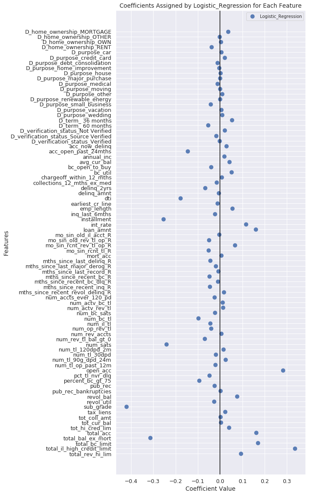

## Contents
{:.no_toc}
*  
{: toc}


This section presents the modeling we have undertaken to determine which loan features are most predictive of loan outcomes. A discussion of the results and implications follows in the [Investment Strategy](https://cs109group67.github.io/lendingclub/Strategy.html) section.

## 1. Preprocessing

### 1A. Train-Test Split

Before we begin modeling, we set aside a test set that we will use later to evaluate the predictive quality of our investment strategy. We do this in a stratified fashion ensuring that the outcome classes (fully paid loans and not fully paid loans) are equally represented in the train and test sets. For the splitting algorithm, we use `sklearn`'s `train_test_split` function. This function creates random train and test subsets of the dataset. The flag `stratify` ensures that both classes are equally represented in each set. 


```python
from sklearn.model_selection import train_test_split
ls_train, ls_test = train_test_split(ls, test_size=0.2, stratify=ls['OUT_Class'], random_state=1)
```


### 1B. Standard Scaling

The models used in the next sections assume that the features are on similar scales. To achieve this, we transform the numeric variables to a standard scale with mean 0 and standard deviation 1 using sklearn's `StandardScaler` function.


```python
#SEPARATE OUTCOME, DUMMY AND NUMERIC VARIABLES
var_list = ls.columns
outcome_var_list = sorted(out_var for out_var in var_list if "OUT_" in out_var)
dummy_var_list = sorted(dummy for dummy in var_list if "D_" in dummy)
numeric_var_list = sorted(set(var_list) - set(outcome_var_list) - set(dummy_var_list))

#train target
outcome_train = ls_train[sorted(outcome_var_list)]
OUT_Class_train = outcome_train.iloc[:,0]
OUT_Principle_Repaid_Percentage_train = outcome_train.iloc[:,1]
OUT_Monthly_Rate_Of_Return_train = outcome_train.iloc[:,2]

#test target
outcome_test = ls_test[sorted(outcome_var_list)]
OUT_Class_test = pd.DataFrame(outcome_test.iloc[:,0])
OUT_Principle_Repaid_Percentage_test = outcome_test.iloc[:,1]
OUT_Monthly_Rate_Of_Return_test = outcome_test.iloc[:,2]
```


```python
#STANDARD SCALING
scaler = StandardScaler()

#train data -> fit_transform
train_vars_scaled = pd.DataFrame(scaler.fit_transform(ls_train[numeric_var_list]),
                                 index=ls_train.index, columns=ls_train[numeric_var_list].columns)
feature_train = pd.concat([train_vars_scaled, ls_train[dummy_var_list]], axis=1).sort_index(axis=1)

#test data -> transform
test_vars_scaled = pd.DataFrame(scaler.transform(ls_test[numeric_var_list]),
                                index=ls_test.index, columns=ls_test[numeric_var_list].columns)
feature_test = pd.concat([test_vars_scaled, ls_test[dummy_var_list]], axis=1).sort_index(axis=1)
```


### 1C. Model Evaluation Functions


```python
def model_scoring(model, feature, target, modeltype='C', cv=5):
    """Displays model evaluation for regression and classification modeling"""
    scoring = ['accuracy', 'precision', 'recall']
    if modeltype=='R': # regression
        scoring = ['neg_mean_squared_error', 'r2']
    for score in scoring:
        cv_score = cross_val_score(model, feature, target, scoring=score, cv=cv).mean()
        print('Cross-validation {}: {:.4}'.format(score, cv_score))
```


```python
class_names = ['Fully Repaid', 'Not Fully Repaid']
def display_confusion_matrix(target, target_predicted):
    """Displays confusion matrix for classification models"""
    fig, ax = plt.subplots(figsize=(8,4))
    matrix = pd.DataFrame(confusion_matrix(target, target_predicted),
                      index=class_names,
                      columns=class_names)
    sns.heatmap(matrix, annot=True, fmt='g', cbar=None, cmap='Blues')
    plt.title('Confusion Matrix'), plt.ylabel('True Class'), plt.xlabel('Predicted Class')
    ax.set_xticklabels(['Charged Off', 'Fully Repaid'], va='center')
    ax.set_yticklabels(['Charged Off', 'Fully Repaid'], va='center')
    plt.tight_layout()
    plt.show()
```


```python
def display_ROC_curve(target, target_probabilities):
    """Displays the ROC curve for classification models"""
    fig, ax = plt.subplots(figsize=(10,4))
    true_pr, false_pr, threshold = roc_curve(target, target_probabilities)

    ax.plot(false_pr, true_pr, label='ROC')
    ax.plot([0,1], ls='--',label='random')
    ax.plot([0,0],[1,0], c='.7', ), plt.plot([1,1], c='.7', label='perfect')
    ax.set_title('Reciever Operating Characterisic')
    ax.set_ylabel('True Positive Rate')
    ax.set_xlabel('False Positive Rate')
    plt.legend()
    plt.show()
```


## 2. `OUT_Class` Modeling

### 2A. Baseline Classifier
It is insightful to create some very simple models that we can use as a baseline to compare against our actual model. A basic measure of a classifier's performance is how much it improves on random guessing. Using sklearn's `dummyclassifer` with flag `strategy='uniform'` generates predictions uniformly at random between the training set's two classes.


```python
#DUMMY CLASSIFIER OF 'OUT_Class' 
dummy_classifier = DummyClassifier(strategy='stratified', random_state=1)
dummy_classifier.fit(feature_train, OUT_Class_train)
model_scoring(dummy_classifier, feature_train, OUT_Class_train)
```


    Cross-validation accuracy: 0.7653
    Cross-validation precision: 0.8643
    Cross-validation recall: 0.8642


### 2B. Logistic Regression Classifier

This model is a logistic regression on the outcome variable `OUT_class` which is the binary classification for loans are either fully repaid (1) or charged off (0). The flag `class_weight='balanced'` ensures that both classes are equally represented in each set. 


```python
#LOGISTIC REGRESSION
classifier = LogisticRegression(solver='lbfgs', max_iter=10000, class_weight='balanced', random_state=0)
classifier.fit(feature_train, OUT_Class_train)
model_scoring(classifier, feature_train, OUT_Class_train, modeltype='C')
```


    Cross-validation accuracy: 0.6314
    Cross-validation precision: 0.9168
    Cross-validation recall: 0.6309


```python
print(classification_report(OUT_Class_test, classifier.predict(feature_test), target_names=class_names))
```


                      precision    recall  f1-score   support
    
        Fully Repaid       0.21      0.63      0.32      9337
    Not Fully Repaid       0.92      0.63      0.75     59566
    
           micro avg       0.63      0.63      0.63     68903
           macro avg       0.56      0.63      0.53     68903
        weighted avg       0.82      0.63      0.69     68903
    


```python
#CONFUSION MATRIX
display_confusion_matrix(OUT_Class_test, classifier.predict(feature_test))
```


```python
#ROC CURVE
display_ROC_curve(OUT_Class_test, classifier.predict_proba(feature_test)[:,0])
```





## 3 `OUT_Principle_Repaid_Percentage` Modeling

### 3A. Baseline Regression
A basic measure of a regressor's performance is how much better it is than a very simple model that makes constant predictions. Using sklearn's `DummyRegressor` with the flag `strategy='mean'` we get baseline predictions of the mean value in the training set.


```python
#DUMMY REGRESSOR OF 'OUT_Principle_Repaid_Percentage' 
dummy_regression = DummyRegressor(strategy='mean')
dummy_regression.fit(feature_train, OUT_Principle_Repaid_Percentage_train)
model_scoring(dummy_regression, feature_train, OUT_Principle_Repaid_Percentage_train, modeltype='R')
```


    Cross-validation neg_mean_squared_error: -0.00223
    Cross-validation r2: -1.209e-05


### 3B. Linear Regression
Linear regression assumes that the relationship between the features and the outcome vector is approximately linear. We use the flag `fit_intercept=False` because by applying one-hot encoding for the dummy variables without discarding one dummy variable we have already inplicitly added an intercept term.


```python
linear_regression = LinearRegression(fit_intercept=False)
linear_regression.fit(feature_train, OUT_Principle_Repaid_Percentage_train)
model_scoring(linear_regression, feature_train, OUT_Principle_Repaid_Percentage_train, modeltype='R')
```


    Cross-validation neg_mean_squared_error: -0.002212
    Cross-validation r2: 0.007783


### 3C. Polynomial Regression
Polynomial regression is an extension of linear regression to model non-linear relationships. 

#### Degree 2 (no interaction terms)


```python
train_2 = pd.DataFrame(np.hstack((feature_train.iloc[:,22:]**(i+1) for i in range(2))),
                      index=feature_train.index, 
                      columns=numeric_var_list+[s+'_2' for s in numeric_var_list])
feature_train_2 = pd.concat([ls_train[dummy_var_list], train_2], axis=1).sort_index(axis=1)
```


```python
test_2 = pd.DataFrame(np.hstack((feature_test.iloc[:,22:]**(i+1) for i in range(2))),
                      index=feature_test.index, 
                      columns=numeric_var_list+[s+'_2' for s in numeric_var_list])
feature_test_2 = pd.concat([ls_test[dummy_var_list], test_2], axis=1).sort_index(axis=1)
```


```python
poly2_regression = LinearRegression(fit_intercept=False)
poly2_regression.fit(feature_train_2, OUT_Principle_Repaid_Percentage_train)
model_scoring(poly2_regression, feature_train_2, OUT_Principle_Repaid_Percentage_train, modeltype='R')
```


    Cross-validation neg_mean_squared_error: -0.002568
    Cross-validation r2: -0.1488


#### Degree 3 (no interaction terms)


```python
feature_train_3 = pd.DataFrame(np.hstack((feature_train.iloc[:,22:]**(i+1) for i in range(3))),
                               index=feature_train.index, 
                               columns=numeric_var_list+[s+'_'+str(i) for i in range(2,4) for s in numeric_var_list])
feature_train_3 = pd.concat([ls_train[dummy_var_list], feature_train_3], axis=1).sort_index(axis=1)
```


```python
feature_test_3 = pd.DataFrame(np.hstack((feature_test.iloc[:,22:]**(i+1) for i in range(3))),
                               index=feature_test.index, 
                               columns=numeric_var_list+[s+'_'+str(i) for i in range(2,4) for s in numeric_var_list])
feature_test_3 = pd.concat([ls_train[dummy_var_list], feature_test_3], axis=1).sort_index(axis=1)
```


```python
poly3_regression = LinearRegression(fit_intercept=False)
poly3_regression.fit(feature_train_3, OUT_Principle_Repaid_Percentage_train)
model_scoring(poly3_regression, feature_train_3, OUT_Principle_Repaid_Percentage_train, modeltype='R')
```


    Cross-validation neg_mean_squared_error: -8.682e+05
    Cross-validation r2: -3.952e+08


## 4. `OUT_Monthly_Rate_Of_Return` Modeling

### 4A. Baseline Regression


```python
#DUMMY REGRESSOR OF  `OUT_Monthly_Rate_Of_Return`
dummy_regression = DummyRegressor(strategy='mean')
dummy_regression.fit(feature_train, OUT_Monthly_Rate_Of_Return_train)
model_scoring(dummy_regression, feature_train, OUT_Monthly_Rate_Of_Return_train, modeltype='R')
```


    Cross-validation neg_mean_squared_error: -0.04668
    Cross-validation r2: -1.986e-05


### 4B. Linear Regression


```python
linear_regression = LinearRegression(fit_intercept=False)
linear_regression.fit(feature_train, OUT_Monthly_Rate_Of_Return_train)
model_scoring(linear_regression, feature_train, OUT_Monthly_Rate_Of_Return_train, modeltype='R')
```


    Cross-validation neg_mean_squared_error: -0.04429
    Cross-validation r2: 0.05122


### 4C. Polynomial Regression

#### Degree 2 (no interaction terms)


```python
train_2 = pd.DataFrame(np.hstack((feature_train.iloc[:,22:]**(i+1) for i in range(2))),
                      index=feature_train.index, 
                      columns=numeric_var_list+[s+'_2' for s in numeric_var_list])
feature_train_2 = pd.concat([ls_train[dummy_var_list], train_2], axis=1).sort_index(axis=1)
```


```python
test_2 = pd.DataFrame(np.hstack((feature_test.iloc[:,22:]**(i+1) for i in range(2))),
                      index=feature_test.index, 
                      columns=numeric_var_list+[s+'_2' for s in numeric_var_list])
feature_test_2 = pd.concat([ls_test[dummy_var_list], test_2], axis=1).sort_index(axis=1)
```


```python
poly2_regression = LinearRegression(fit_intercept=False)
poly2_regression.fit(feature_train_2, OUT_Monthly_Rate_Of_Return_train)
model_scoring(poly2_regression, feature_train_2, OUT_Monthly_Rate_Of_Return_train, modeltype='R')
```


    Cross-validation neg_mean_squared_error: -0.04538
    Cross-validation r2: 0.02776


#### Degree 3 (no interaction terms)


```python
feature_train_3 = pd.DataFrame(np.hstack((feature_train.iloc[:,22:]**(i+1) for i in range(3))),
                               index=feature_train.index, 
                               columns=numeric_var_list+[s+'_'+str(i) for i in range(2,4) for s in numeric_var_list])
feature_train_3 = pd.concat([ls_train[dummy_var_list], feature_train_3], axis=1).sort_index(axis=1)
```


```python
feature_test_3 = pd.DataFrame(np.hstack((feature_test.iloc[:,22:]**(i+1) for i in range(3))),
                               index=feature_test.index, 
                               columns=numeric_var_list+[s+'_'+str(i) for i in range(2,4) for s in numeric_var_list])
feature_test_3 = pd.concat([ls_train[dummy_var_list], feature_test_3], axis=1).sort_index(axis=1)
```


```python
poly3_regression = LinearRegression(fit_intercept=False)
poly3_regression.fit(feature_train_3, OUT_Principle_Repaid_Percentage_train)
model_scoring(poly3_regression, feature_train_3, OUT_Monthly_Rate_Of_Return_train, modeltype='R')
```


    Cross-validation neg_mean_squared_error: -3.298e+07
    Cross-validation r2: -7.097e+08

