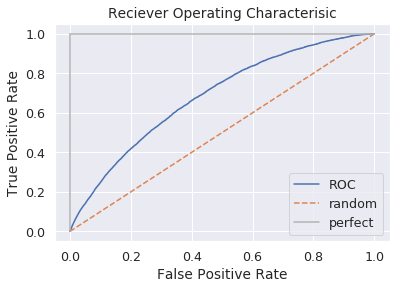
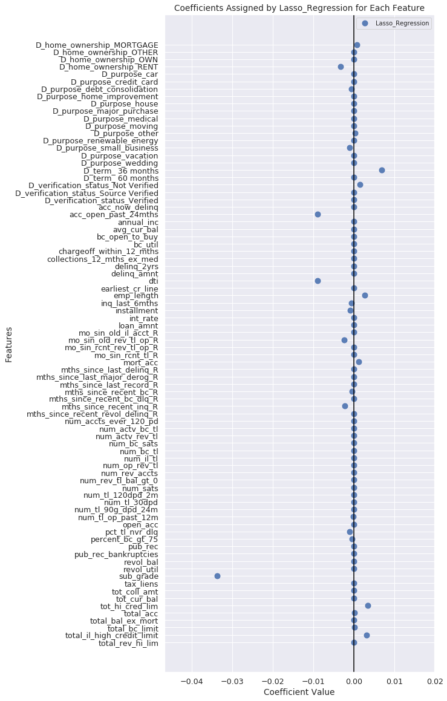

## Contents
{:.no_toc}
*  
{: toc}


This section presents the modeling we have undertaken to determine which loan features are most predictive of loan outcomes. A summary of the results and discussion of the implications for investing follows in the [Investment Strategy](https://cs109group67.github.io/lendingclub/Strategy.html) section.

## 1. Preprocessing

### 1A. Train-Test Split

Before we begin modeling, we set aside a test set that we will use later to evaluate the predictive quality of our investment strategy. We do this in a stratified fashion ensuring that the outcome classes (fully paid loans and not fully paid loans) are equally represented in the train and test sets. For the splitting algorithm, we use `sklearn`'s `train_test_split` function. This function creates random train and test subsets of the dataset. The flag `stratify` ensures that both classes are equally represented in each set. 


```python
from sklearn.model_selection import train_test_split
ls_train, ls_test = train_test_split(ls, test_size=0.2, stratify=ls['OUT_Class'], random_state=1)
```


### 1B. Standard Scaling

The models used in the next sections assume that the features are on similar scales. To achieve this, we transform the numeric variables to a standard scale with mean 0 and standard deviation 1 using sklearn's `StandardScaler` function.


```python
#STANDARD SCALING
scaler = StandardScaler()

#separate features and targets
outcome_var_list = sorted(out_var for out_var in ls.columns if "OUT_" in out_var)

#train features
X_train = ls_train[sorted(set(ls.columns)-set(outcome_var_list))]
X_train_scaled = pd.DataFrame(scaler.fit_transform(X_train),index=X_train.index, columns=X_train.columns)

#test features
X_test = ls_test[sorted(set(ls.columns)-set(outcome_var_list))]
X_test_scaled = pd.DataFrame(scaler.transform(X_test),index=X_test.index, columns=X_test.columns)

#train targets
y_train = ls_train[sorted(outcome_var_list)]
OUT_Class_train = y_train.iloc[:,0]
OUT_Principle_Repaid_Percentage_train = y_train.iloc[:,1]
OUT_Monthly_Rate_Of_Return_train = y_train.iloc[:,2]

#test targets
y_test = ls_test[sorted(outcome_var_list)]
OUT_Class_test = y_test.iloc[:,0]
OUT_Principle_Repaid_Percentage_test = y_test.iloc[:,1]
OUT_Monthly_Rate_Of_Return_test = y_test.iloc[:,2]
```


## 2. `OUT_Class`

### 2A. Baseline Classification
It is insightful to create some very simple models that we can use as a baseline to compare against our actual model. A basic measure of a classifier's performance is how much it improves on random guessing. Using sklearn's `dummyclassifer` with flag `strategy='uniform'` generates predictions uniformly at random between the different classes.


    DummyClassifier(constant=None, random_state=1, strategy='uniform')
    
    Train scores:
    	Cross-validation accuracy: 0.5016
    	Cross-validation precision: 0.864
    	Cross-validation recall: 0.5025
    Test scores:
    	Cross-validation accuracy: 0.5011
    	Cross-validation precision: 0.8644
    	Cross-validation recall: 0.5016


### 2B. Logistic Regression Classification

This model is a logistic regression on the outcome variable `OUT_class` which is the binary classification for loans are either fully repaid (1) or charged off (0). The flag `class_weight='balanced'` ensures that both classes are equally represented in each set. We use cross validation to select the best hyperparameter for the inverse regularization strength.


    LogisticRegressionCV(Cs=8, class_weight='balanced', cv='warn', dual=False,
               fit_intercept=False, intercept_scaling=1.0, max_iter=10000,
               multi_class='warn', n_jobs=None, penalty='l2', random_state=0,
               refit=True, scoring=None, solver='lbfgs', tol=0.0001, verbose=0)
    
    Train scores:
    	Cross-validation accuracy: 0.5648
    	Cross-validation precision: 0.9258
    	Cross-validation recall: 0.5398
    Test scores:
    	Cross-validation accuracy: 0.5654
    	Cross-validation precision: 0.9255
    	Cross-validation recall: 0.5407
    
                      precision    recall  f1-score   support
    
        Fully Repaid       0.20      0.72      0.31      9337
    Not Fully Repaid       0.92      0.54      0.68     59566
    
           micro avg       0.57      0.57      0.57     68903
           macro avg       0.56      0.63      0.50     68903
        weighted avg       0.83      0.57      0.63     68903
    





## 3 `OUT_Principle_Repaid_Percentage`

### 3A. Baseline Regression
A basic measure of a regressor's performance is how much better it is than a very simple model that makes constant predictions. Using sklearn's `DummyRegressor` with the flag `strategy='mean'` we get baseline predictions of the mean value in the training set.


    DummyRegressor(constant=None, quantile=None, strategy='mean')
    
    Train scores:
    	Cross-validation neg_mean_squared_error: -0.00223
    	Cross-validation r2: -1.209e-05
    Test scores:
    	Cross-validation neg_mean_squared_error: -0.002236
    	Cross-validation r2: -1.893e-05


### 3B. Linear Regression
Linear regression assumes that the relationship between the features and the outcome vector is approximately linear. We use the flag `fit_intercept=False` because by applying one-hot encoding for the dummy variables without discarding one dummy variable we have already inplicitly added an intercept term.


    LinearRegression(copy_X=True, fit_intercept=False, n_jobs=None,
             normalize=False)
    
    Train scores:
    	Cross-validation neg_mean_squared_error: -0.002214
    	Cross-validation r2: 0.00711
    Test scores:
    	Cross-validation neg_mean_squared_error: -0.002224
    	Cross-validation r2: 0.005207


### 3C. Ridge Regression
It will be useful to reduce the variance of the coefficients. By applying a shrinkage penalty (aka regularization) we can attempt to minimize RSS and some penalty for the magnitude of the coefficient values. With Ridge the shrinkage penalty is a tuning hyperparameter multiplied by the squared sum of all the coefficients. The hyperparameter alpha lets us control how much we penalize the coefficients


    RidgeCV(alphas=array([ 0.1,  1. , 10. ]), cv=None, fit_intercept=False,
        gcv_mode=None, normalize=False, scoring=None, store_cv_values=False)
    
    Train scores:
    	Cross-validation neg_mean_squared_error: -0.002213
    	Cross-validation r2: 0.007235
    Test scores:
    	Cross-validation neg_mean_squared_error: -0.002223
    	Cross-validation r2: 0.005698


### 3D. Lasso Regression
Lasso regression often produces more interpretable models than Ridge regression. In Lasso the shrinkage penalty is a tuning hyperparameter multiplied by the sum of the absolute value of all coefficients. This method is more effective at shrinking the coefficients to zero, effectively reducing the number of features in the model.


    LassoCV(alphas=None, copy_X=True, cv='warn', eps=0.001, fit_intercept=False,
        max_iter=1000, n_alphas=100, n_jobs=None, normalize=False,
        positive=False, precompute='auto', random_state=None,
        selection='cyclic', tol=0.0001, verbose=False)
    
    Train scores:
    	Cross-validation neg_mean_squared_error: -0.002212
    	Cross-validation r2: 0.00806
    Test scores:
    	Cross-validation neg_mean_squared_error: -0.002223
    	Cross-validation r2: 0.005764


### 3E. Polynomial Lasso Regression (degree=2)
Polynomial regression is an extension of linear regression to model non-linear relationships. We use polynomials of degree 2 and no interaction terms. 


```python
#GET POLYNOMIALS
dummy_var_list = sorted(dummy for dummy in ls.columns if "D_" in dummy)
numeric_var_list = sorted(set(ls.columns) - set(outcome_var_list) - set(dummy_var_list))
poly_2 = pd.DataFrame(np.hstack((X_train.iloc[:,22:]**(i+1) for i in range(2))),
                      index=X_train.index, 
                      columns=numeric_var_list+[s+'_2' for s in numeric_var_list])
X_train_2 = pd.concat([ls_train[dummy_var_list], poly_2], axis=1).sort_index(axis=1)
poly_2 = pd.DataFrame(np.hstack((X_test.iloc[:,22:]**(i+1) for i in range(2))),
                      index=X_test.index, 
                      columns=numeric_var_list+[s+'_2' for s in numeric_var_list])
X_test_2 = pd.concat([ls_test[dummy_var_list], poly_2], axis=1).sort_index(axis=1)

#STANDARD SCALING
scaler = StandardScaler()
X_train_scaled_2 = pd.DataFrame(scaler.fit_transform(X_train_2),index=X_train_2.index, columns=X_train_2.columns)
X_test_scaled_2 = pd.DataFrame(scaler.transform(X_test_2),index=X_test_2.index, columns=X_test_2.columns)
```


    LassoCV(alphas=None, copy_X=True, cv='warn', eps=0.001, fit_intercept=False,
        max_iter=1000, n_alphas=100, n_jobs=None, normalize=False,
        positive=False, precompute='auto', random_state=None,
        selection='cyclic', tol=0.0001, verbose=False)
    
    Train scores:
    	Cross-validation neg_mean_squared_error: -0.00221
    	Cross-validation r2: 0.008666
    Test scores:
    	Cross-validation neg_mean_squared_error: -0.002224
    	Cross-validation r2: 0.005607


## 4. `OUT_Monthly_Rate_Of_Return`

### 4A. Baseline Regression


    DummyRegressor(constant=None, quantile=None, strategy='mean')
    
    Train scores:
    	Cross-validation neg_mean_squared_error: -0.04668
    	Cross-validation r2: -1.986e-05
    Test scores:
    	Cross-validation neg_mean_squared_error: -0.04709
    	Cross-validation r2: -8.434e-05


### 4B. Linear Regression


    LinearRegression(copy_X=True, fit_intercept=False, n_jobs=None,
             normalize=False)
    
    Train scores:
    	Cross-validation neg_mean_squared_error: -0.9982
    	Cross-validation r2: -20.4
    Test scores:
    	Cross-validation neg_mean_squared_error: -0.9497
    	Cross-validation r2: -19.21


### 4C. Ridge Regression


    RidgeCV(alphas=array([ 0.1,  1. , 10. ]), cv=None, fit_intercept=False,
        gcv_mode=None, normalize=False, scoring=None, store_cv_values=False)
    
    Train scores:
    	Cross-validation neg_mean_squared_error: -0.9208
    	Cross-validation r2: -18.73
    Test scores:
    	Cross-validation neg_mean_squared_error: -0.8948
    	Cross-validation r2: -18.01


### 4D. Lasso Regression


    LassoCV(alphas=None, copy_X=True, cv='warn', eps=0.001, fit_intercept=False,
        max_iter=1000, n_alphas=100, n_jobs=None, normalize=False,
        positive=False, precompute='auto', random_state=None,
        selection='cyclic', tol=0.0001, verbose=False)
    
    Train scores:
    	Cross-validation neg_mean_squared_error: -0.8948
    	Cross-validation r2: -18.17
    Test scores:
    	Cross-validation neg_mean_squared_error: -0.8939
    	Cross-validation r2: -17.99





### 4E. Polynomial Lasso Regression (degree=2)


    LassoCV(alphas=None, copy_X=True, cv='warn', eps=0.001, fit_intercept=False,
        max_iter=1000, n_alphas=100, n_jobs=None, normalize=False,
        positive=False, precompute='auto', random_state=None,
        selection='cyclic', tol=0.0001, verbose=False)
    
    Train scores:
    	Cross-validation neg_mean_squared_error: -305.1
    	Cross-validation r2: -6.566e+03
    Test scores:
    	Cross-validation neg_mean_squared_error: -0.676
    	Cross-validation r2: -13.23


## 5. Predictor Forward Stepwise Selection Function


```python
def forward_selection(model, model_type, x_train, y_train, num_pred=5):
    assert model_type in ['regressor', 'classifier']
    def base_model():
        return model
    
    best_scores = []
    best_models = []
    
    all_predictors = set(independent_columns)
    selected_good_predictors = set()
    for i in range(num_pred):
        print('finding pred {}'.format(i))
        
        possible_scores = []
        possible_predictors = list(selected_good_predictors ^ all_predictors)
        for predictor in possible_predictors:
            current_test_predictors = list(selected_good_predictors) + [predictor]
            
            model = base_model()
            model.fit(x_train[current_test_predictors], y_train)
            model_pred = model.predict(x_train[current_test_predictors])
            
            if model_type == 'classifier':
                score = accuracy_score(y_train, model_pred)
            else:
                score = explained_variance_score(y_train, model_pred)
            possible_scores.append(score)
        
        best_predictor = possible_predictors[np.argmax(possible_scores)]
        selected_good_predictors.add(best_predictor)
        
        best_models.append(list(selected_good_predictors))
        best_scores.append(np.max(possible_scores))
    return list(zip(best_scores, best_models))


```

