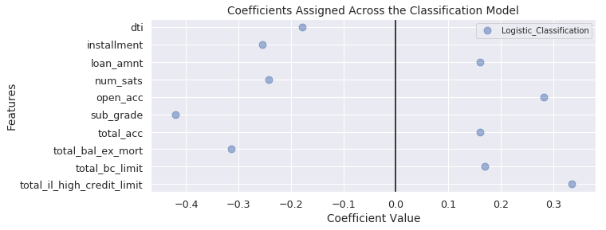
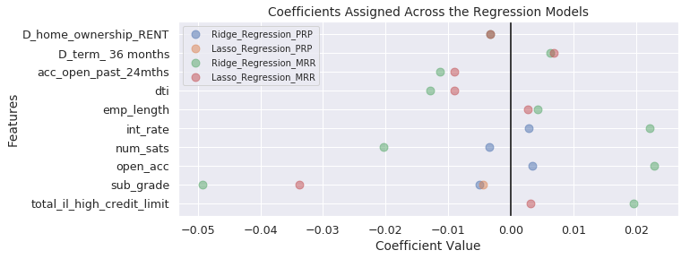

## Contents
{:.no_toc}
*  
{: toc}


    DummyClassifier(constant=None, random_state=1, strategy='uniform')
    LogisticRegressionCV(Cs=8, class_weight='balanced', cv='warn', dual=False,
               fit_intercept=False, intercept_scaling=1.0, max_iter=10000,
               multi_class='warn', n_jobs=None, penalty='l2', random_state=0,
               refit=True, scoring=None, solver='lbfgs', tol=0.0001, verbose=0)
    DummyRegressor(constant=None, quantile=None, strategy='mean')
    LinearRegression(copy_X=True, fit_intercept=False, n_jobs=None,
             normalize=False)
    RidgeCV(alphas=array([ 0.1,  1. , 10. ]), cv=None, fit_intercept=False,
        gcv_mode=None, normalize=False, scoring=None, store_cv_values=False)
    LassoCV(alphas=None, copy_X=True, cv='warn', eps=0.001, fit_intercept=False,
        max_iter=1000, n_alphas=100, n_jobs=None, normalize=False,
        positive=False, precompute='auto', random_state=None,
        selection='cyclic', tol=0.0001, verbose=False)
    LassoCV(alphas=None, copy_X=True, cv='warn', eps=0.001, fit_intercept=False,
        max_iter=1000, n_alphas=100, n_jobs=None, normalize=False,
        positive=False, precompute='auto', random_state=None,
        selection='cyclic', tol=0.0001, verbose=False)
    DummyRegressor(constant=None, quantile=None, strategy='mean')
    LinearRegression(copy_X=True, fit_intercept=False, n_jobs=None,
             normalize=False)
    RidgeCV(alphas=array([ 0.1,  1. , 10. ]), cv=None, fit_intercept=False,
        gcv_mode=None, normalize=False, scoring=None, store_cv_values=False)
    LassoCV(alphas=None, copy_X=True, cv='warn', eps=0.001, fit_intercept=False,
        max_iter=1000, n_alphas=100, n_jobs=None, normalize=False,
        positive=False, precompute='auto', random_state=None,
        selection='cyclic', tol=0.0001, verbose=False)
    LassoCV(alphas=None, copy_X=True, cv='warn', eps=0.001, fit_intercept=False,
        max_iter=1000, n_alphas=100, n_jobs=None, normalize=False,
        positive=False, precompute='auto', random_state=None,
        selection='cyclic', tol=0.0001, verbose=False)


## 1. Modeling Summary


In the [Modeling](https://cs109group67.github.io/lendingclub/Modeling.html) section we preformed a variety of classifiction and regression models on the three outcome features. A summary of the model scoring metrics is as follows:


### OUT_Class Models:


<div>
<style scoped>
    .dataframe tbody tr th:only-of-type {
        vertical-align: middle;
    }

    .dataframe tbody tr th {
        vertical-align: top;
    }

    .dataframe thead tr th {
        text-align: left;
    }
</style>
<table border="1" class="dataframe">
  <thead>
    <tr>
      <th>Model</th>
      <th colspan="3" halign="left">Training Scores</th>
      <th colspan="3" halign="left">Testing Scores</th>
    </tr>
    <tr>
      <th></th>
      <th>Accuracy</th>
      <th>Precision</th>
      <th>Recall</th>
      <th>Accuracy</th>
      <th>Precision</th>
      <th>Recall</th>
    </tr>
  </thead>
  <tbody>
    <tr>
      <th>Baseline Classifier</th>
      <td>0.50160</td>
      <td>0.86400</td>
      <td>0.50250</td>
      <td>0.50110</td>
      <td>0.86440</td>
      <td>0.50160</td>
    </tr>
    <tr>
      <th>Logistic Classifier</th>
      <td>0.56480</td>
      <td>0.92580</td>
      <td>0.53980</td>
      <td>0.56540</td>
      <td>0.92550</td>
      <td>0.54070</td>
    </tr>
  </tbody>
</table>
</div>


### OUT_Principle_Repaid Models:


<div>
<style scoped>
    .dataframe tbody tr th:only-of-type {
        vertical-align: middle;
    }

    .dataframe tbody tr th {
        vertical-align: top;
    }

    .dataframe thead tr th {
        text-align: left;
    }
</style>
<table border="1" class="dataframe">
  <thead>
    <tr>
      <th>Model</th>
      <th colspan="2" halign="left">Training Scores</th>
      <th colspan="2" halign="left">Testing Scores</th>
    </tr>
    <tr>
      <th></th>
      <th>Neg MSE</th>
      <th>R2</th>
      <th>Neg MSE</th>
      <th>R2</th>
    </tr>
  </thead>
  <tbody>
    <tr>
      <th>Baseline Regressor</th>
      <td>-0.00223</td>
      <td>-0.00001</td>
      <td>-0.00224</td>
      <td>-0.00002</td>
    </tr>
    <tr>
      <th>Linear Regressor</th>
      <td>-0.00221</td>
      <td>0.00711</td>
      <td>-0.00222</td>
      <td>0.00521</td>
    </tr>
    <tr>
      <th>Ridge Regressor</th>
      <td>-0.00221</td>
      <td>0.00724</td>
      <td>-0.00222</td>
      <td>0.00570</td>
    </tr>
    <tr>
      <th>Lasso Regressor</th>
      <td>-0.00221</td>
      <td>0.00806</td>
      <td>-0.00222</td>
      <td>0.00576</td>
    </tr>
    <tr>
      <th>Polynomial Regressor</th>
      <td>-0.00221</td>
      <td>0.00867</td>
      <td>-0.00222</td>
      <td>0.00561</td>
    </tr>
  </tbody>
</table>
</div>


### OUT_Monthly_Rate_Of_Return Models:


<div>
<style scoped>
    .dataframe tbody tr th:only-of-type {
        vertical-align: middle;
    }

    .dataframe tbody tr th {
        vertical-align: top;
    }

    .dataframe thead tr th {
        text-align: left;
    }
</style>
<table border="1" class="dataframe">
  <thead>
    <tr>
      <th>Model</th>
      <th colspan="2" halign="left">Training Scores</th>
      <th colspan="2" halign="left">Testing Scores</th>
    </tr>
    <tr>
      <th></th>
      <th>Neg MSE</th>
      <th>R2</th>
      <th>Neg MSE</th>
      <th>R2</th>
    </tr>
  </thead>
  <tbody>
    <tr>
      <th>Baseline Regressor</th>
      <td>-0.04668</td>
      <td>-0.00002</td>
      <td>-0.04709</td>
      <td>-0.00008</td>
    </tr>
    <tr>
      <th>Linear Regressor</th>
      <td>-0.99820</td>
      <td>-20.40000</td>
      <td>-0.94970</td>
      <td>-19.21000</td>
    </tr>
    <tr>
      <th>Ridge Regressor</th>
      <td>-0.92080</td>
      <td>-18.73000</td>
      <td>-0.89480</td>
      <td>-18.01000</td>
    </tr>
    <tr>
      <th>Lasso Regressor</th>
      <td>-0.89480</td>
      <td>-18.17000</td>
      <td>-0.89390</td>
      <td>-17.99000</td>
    </tr>
    <tr>
      <th>Polynomial Regressor</th>
      <td>-305.10000</td>
      <td>-6566.00000</td>
      <td>-0.67600</td>
      <td>-13.23000</td>
    </tr>
  </tbody>
</table>
</div>


The classififcation and regression models did not perform well at predicting the target features, but they did provide important information about which variables potentially hold the most inferential information for a prospective investor. The visualizations below display cofficients assigned across the models. The focus is on features that have significant magnitude across distinct models.


```python
models = dict(Logistic_Classification=log_cls,)
coefs = plot_coefficients(X_train_scaled, models=models, thresh=(0.15,2), title='Classification Model')
```





```python
models = dict(Ridge_Regression_PRP=ridge_reg_PRP,
              Lasso_Regression_PRP=lasso_reg_PRP,
              Ridge_Regression_MRR=ridge_reg_MRR,
              Lasso_Regression_MRR=lasso_reg_MRR)
coefs = plot_coefficients(X_train_scaled, models=models, thresh=(0.0025,3), title='Regression Models')
```





## 2. Key Variables Driving Investment Decisions

The modeling has revealed the most likely key variables that should power the investment decisions: those which have significant coefficients across the distinct classification and regression models. These form the subset for our investment strategy formulation. This will aid interpretation and understanding at the loss of likely only mimimal investment efficacy. 


### Top 10 Key Variables:


    0         D_home_ownership_RENT
    1             D_term_ 36 months
    2          acc_open_past_24mths
    3                           dti
    4                    emp_length
    5                      int_rate
    6                      num_sats
    7                      open_acc
    8                     sub_grade
    9    total_il_high_credit_limit
    Name: key_variables, dtype: object


## 3. Investment Strategy

With the key variables established, we now perform decision tree analysis on this key subset.

## 4. Predictive Quality of Model

**Expected Risk and Return**
