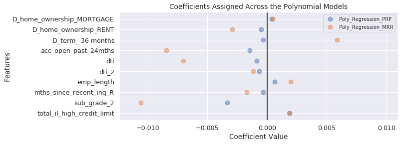
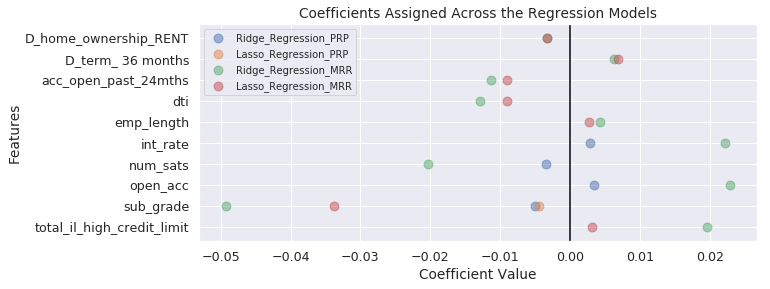
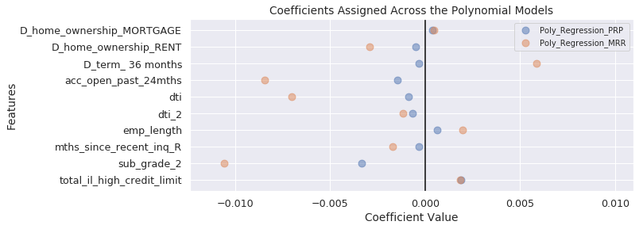
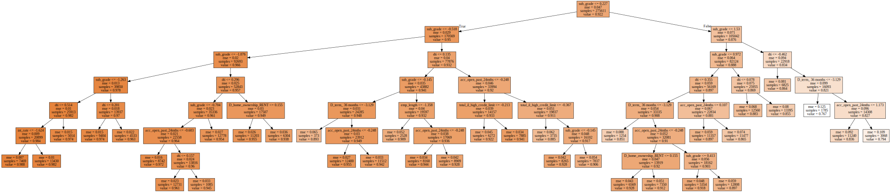
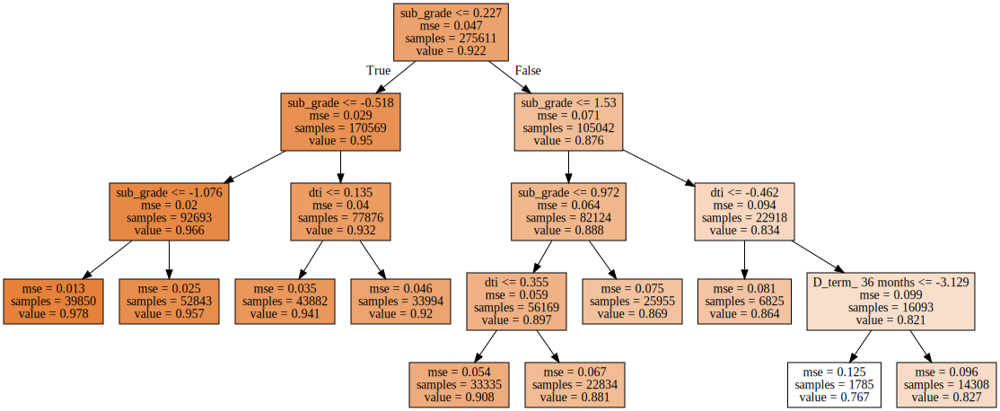
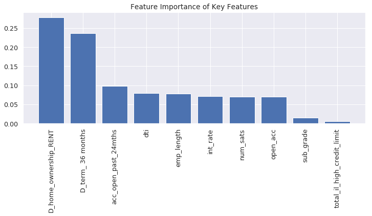

## Contents
{:.no_toc}
*  
{: toc}


## 1. Modeling Summary


In the [Modeling](https://cs109group67.github.io/lendingclub/Modeling.html) section we preformed a variety of classifiction and regression models on the three outcome features. A summary of the model scoring metrics is as follows:


**`OUT_Class`:**


<div>
<style scoped>
    .dataframe tbody tr th:only-of-type {
        vertical-align: middle;
    }

    .dataframe tbody tr th {
        vertical-align: top;
    }

    .dataframe thead tr th {
        text-align: left;
    }
</style>
<table border="1" class="dataframe">
  <thead>
    <tr>
      <th>Model</th>
      <th colspan="3" halign="left">Training Scores</th>
      <th colspan="3" halign="left">Testing Scores</th>
    </tr>
    <tr>
      <th></th>
      <th>Accuracy</th>
      <th>Precision</th>
      <th>Recall</th>
      <th>Accuracy</th>
      <th>Precision</th>
      <th>Recall</th>
    </tr>
  </thead>
  <tbody>
    <tr>
      <th>Baseline Classifier</th>
      <td>0.502</td>
      <td>0.864</td>
      <td>0.502</td>
      <td>0.501</td>
      <td>0.864</td>
      <td>0.502</td>
    </tr>
    <tr>
      <th>Logistic Classifier</th>
      <td>0.565</td>
      <td>0.926</td>
      <td>0.540</td>
      <td>0.565</td>
      <td>0.925</td>
      <td>0.541</td>
    </tr>
  </tbody>
</table>
</div>


```python
display(Markdown('**`OUT_Principle_Repaid`:**'))
OUT_PRP_results
```


**`OUT_Principle_Repaid`:**


<div>
<style scoped>
    .dataframe tbody tr th:only-of-type {
        vertical-align: middle;
    }

    .dataframe tbody tr th {
        vertical-align: top;
    }

    .dataframe thead tr th {
        text-align: left;
    }
</style>
<table border="1" class="dataframe">
  <thead>
    <tr>
      <th>Model</th>
      <th colspan="2" halign="left">Training Scores</th>
      <th colspan="2" halign="left">Testing Scores</th>
    </tr>
    <tr>
      <th></th>
      <th>Neg MSE</th>
      <th>R2</th>
      <th>Neg MSE</th>
      <th>R2</th>
    </tr>
  </thead>
  <tbody>
    <tr>
      <th>Baseline Regressor</th>
      <td>-0.002</td>
      <td>-0.000</td>
      <td>-0.002</td>
      <td>-0.000</td>
    </tr>
    <tr>
      <th>Linear Regressor</th>
      <td>-0.002</td>
      <td>0.007</td>
      <td>-0.002</td>
      <td>0.005</td>
    </tr>
    <tr>
      <th>Ridge Regressor</th>
      <td>-0.002</td>
      <td>0.007</td>
      <td>-0.002</td>
      <td>0.006</td>
    </tr>
    <tr>
      <th>Lasso Regressor</th>
      <td>-0.002</td>
      <td>0.008</td>
      <td>-0.002</td>
      <td>0.006</td>
    </tr>
    <tr>
      <th>Polynomial Regressor</th>
      <td>-0.002</td>
      <td>0.009</td>
      <td>-0.002</td>
      <td>0.006</td>
    </tr>
  </tbody>
</table>
</div>


```python
display(Markdown('**`OUT_Monthly_Rate_Of_Return`:**'))
OUT_MRR_results
```


**`OUT_Monthly_Rate_Of_Return`:**


<div>
<style scoped>
    .dataframe tbody tr th:only-of-type {
        vertical-align: middle;
    }

    .dataframe tbody tr th {
        vertical-align: top;
    }

    .dataframe thead tr th {
        text-align: left;
    }
</style>
<table border="1" class="dataframe">
  <thead>
    <tr>
      <th>Model</th>
      <th colspan="2" halign="left">Training Scores</th>
      <th colspan="2" halign="left">Testing Scores</th>
    </tr>
    <tr>
      <th></th>
      <th>Neg MSE</th>
      <th>R2</th>
      <th>Neg MSE</th>
      <th>R2</th>
    </tr>
  </thead>
  <tbody>
    <tr>
      <th>Baseline Regressor</th>
      <td>-0.047</td>
      <td>-0.000</td>
      <td>-0.047</td>
      <td>-0.000</td>
    </tr>
    <tr>
      <th>Linear Regressor</th>
      <td>-0.998</td>
      <td>-20.427</td>
      <td>-0.950</td>
      <td>-19.218</td>
    </tr>
    <tr>
      <th>Ridge Regressor</th>
      <td>-0.921</td>
      <td>-18.730</td>
      <td>-0.895</td>
      <td>-18.010</td>
    </tr>
    <tr>
      <th>Lasso Regressor</th>
      <td>-0.895</td>
      <td>-18.170</td>
      <td>-0.894</td>
      <td>-17.993</td>
    </tr>
    <tr>
      <th>Polynomial Regressor</th>
      <td>-305.134</td>
      <td>-6566.432</td>
      <td>-0.676</td>
      <td>-13.230</td>
    </tr>
  </tbody>
</table>
</div>


The classification and regression models did not perform well at predicting the target features, but they did provide important information about which variables potentially hold the most inferential information for a prospective investor. The visualizations below display cofficients assigned across the models. The focus is on features that have the most significant magnitude across distinct models.











## 2. Key Variables Driving Investment Decisions

The modeling has revealed key variables that should power the investment decisions: those which have significant coefficients across the distinct classification and regression models. These form the subset for our investment strategy formulation. This will aid interpretation and understanding for the investor at the loss of minimal investment efficacy. 

**Top 10 Key Variables**:


    0         D_home_ownership_RENT
    1             D_term_ 36 months
    2          acc_open_past_24mths
    3                           dti
    4                    emp_length
    5                      int_rate
    6                      num_sats
    7                      open_acc
    8                     sub_grade
    9    total_il_high_credit_limit
    Name: key_variables, dtype: object


With the key variables established, we examine decision tree and random forest analysis on this key subset to establish the investment strategy. We focus on the most comprehensive outcome feature of `OUT_Monthly_Rate_Of_Return` since this feature takes into account the total amount repeiad with interest for the effective term of the loan. We visualize both a larger tree (for completeness and demonstrative purposes) and a simplified tree. 


**FULL Key Feaure Decision Tree on OUT_Class**:


    DecisionTreeRegressor(criterion='mse', max_depth=10, max_features=None,
               max_leaf_nodes=None, min_impurity_decrease=0.0,
               min_impurity_split=None, min_samples_leaf=1,
               min_samples_split=0.05, min_weight_fraction_leaf=0.0,
               presort=False, random_state=0, splitter='best')





**Key Feature Decision Tree on OUT_Monthly_Rate_Of_Return**:


    DecisionTreeRegressor(criterion='mse', max_depth=10, max_features=None,
               max_leaf_nodes=10, min_impurity_decrease=0.0,
               min_impurity_split=None, min_samples_leaf=1,
               min_samples_split=0.05, min_weight_fraction_leaf=0.0,
               presort=False, random_state=0, splitter='best')





**SIMPLIFIED Key Feature Random Forest on OUT_Monthly_Rate_Of_Return**:


    RandomForestRegressor(bootstrap=True, criterion='mse', max_depth=None,
               max_features='auto', max_leaf_nodes=None,
               min_impurity_decrease=0.0, min_impurity_split=None,
               min_samples_leaf=1, min_samples_split=2,
               min_weight_fraction_leaf=0.0, n_estimators=100, n_jobs=None,
               oob_score=False, random_state=None, verbose=0, warm_start=False)





## 3. Investment Strategy

Based on the completed analysis, we postulate the following simple investment strategy to only invest in loans that meet the following criteria:
1. **No renters**: `home_ownership` = Own, Morgage or Other
2. **Short term**: `term` = 36_months
3. **Few recent accounts opened**: `acc_open_past_24_months` < 4
4. **Low debt-to-income obligations**: `dti` < 0.5
5. **Solidly employed**: `emp_length` > 5
6. **Low grade**: `subgrades` < 20

To reduce their risk and get the full benefit of diversification, we recommended that the investor should make the mimimun qualifying investment across as many qualifying loans as possible.

## 4. Predictive Quality of Model

**Expected Risk and Return**
