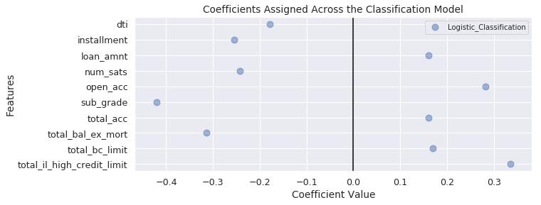
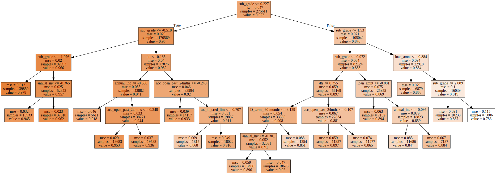

## Contents
{:.no_toc}
*  
{: toc}


## 1. Modeling Summary


In the [Modeling](https://cs109group67.github.io/lendingclub/Modeling.html) section we preformed a variety of classifiction and regression models on the three outcome features. A summary of the model scoring metrics is as follows:


**`OUT_Class`:**


<div>
<style scoped>
    .dataframe tbody tr th:only-of-type {
        vertical-align: middle;
    }

    .dataframe tbody tr th {
        vertical-align: top;
    }

    .dataframe thead tr th {
        text-align: left;
    }
</style>
<table border="1" class="dataframe">
  <thead>
    <tr>
      <th>Model</th>
      <th colspan="3" halign="left">Training Scores</th>
      <th colspan="3" halign="left">Testing Scores</th>
    </tr>
    <tr>
      <th></th>
      <th>Accuracy</th>
      <th>Precision</th>
      <th>Recall</th>
      <th>Accuracy</th>
      <th>Precision</th>
      <th>Recall</th>
    </tr>
  </thead>
  <tbody>
    <tr>
      <th>Baseline Classifier</th>
      <td>0.502</td>
      <td>0.864</td>
      <td>0.502</td>
      <td>0.501</td>
      <td>0.864</td>
      <td>0.502</td>
    </tr>
    <tr>
      <th>Logistic Classifier</th>
      <td>0.565</td>
      <td>0.926</td>
      <td>0.540</td>
      <td>0.565</td>
      <td>0.925</td>
      <td>0.541</td>
    </tr>
  </tbody>
</table>
</div>


```python
display(Markdown('**`OUT_Principle_Repaid`:**'))
OUT_PRP_results
```


**`OUT_Principle_Repaid`:**


<div>
<style scoped>
    .dataframe tbody tr th:only-of-type {
        vertical-align: middle;
    }

    .dataframe tbody tr th {
        vertical-align: top;
    }

    .dataframe thead tr th {
        text-align: left;
    }
</style>
<table border="1" class="dataframe">
  <thead>
    <tr>
      <th>Model</th>
      <th colspan="2" halign="left">Training Scores</th>
      <th colspan="2" halign="left">Testing Scores</th>
    </tr>
    <tr>
      <th></th>
      <th>Neg MSE</th>
      <th>R2</th>
      <th>Neg MSE</th>
      <th>R2</th>
    </tr>
  </thead>
  <tbody>
    <tr>
      <th>Baseline Regressor</th>
      <td>-0.002</td>
      <td>-0.000</td>
      <td>-0.002</td>
      <td>-0.000</td>
    </tr>
    <tr>
      <th>Linear Regressor</th>
      <td>-0.002</td>
      <td>0.007</td>
      <td>-0.002</td>
      <td>0.005</td>
    </tr>
    <tr>
      <th>Ridge Regressor</th>
      <td>-0.002</td>
      <td>0.007</td>
      <td>-0.002</td>
      <td>0.006</td>
    </tr>
    <tr>
      <th>Lasso Regressor</th>
      <td>-0.002</td>
      <td>0.008</td>
      <td>-0.002</td>
      <td>0.006</td>
    </tr>
    <tr>
      <th>Polynomial Regressor</th>
      <td>-0.002</td>
      <td>0.009</td>
      <td>-0.002</td>
      <td>0.006</td>
    </tr>
  </tbody>
</table>
</div>


```python
display(Markdown('**`OUT_Monthly_Rate_Of_Return`:**'))
OUT_MRR_results
```


**`OUT_Monthly_Rate_Of_Return`:**


<div>
<style scoped>
    .dataframe tbody tr th:only-of-type {
        vertical-align: middle;
    }

    .dataframe tbody tr th {
        vertical-align: top;
    }

    .dataframe thead tr th {
        text-align: left;
    }
</style>
<table border="1" class="dataframe">
  <thead>
    <tr>
      <th>Model</th>
      <th colspan="2" halign="left">Training Scores</th>
      <th colspan="2" halign="left">Testing Scores</th>
    </tr>
    <tr>
      <th></th>
      <th>Neg MSE</th>
      <th>R2</th>
      <th>Neg MSE</th>
      <th>R2</th>
    </tr>
  </thead>
  <tbody>
    <tr>
      <th>Baseline Regressor</th>
      <td>-0.047</td>
      <td>-0.000</td>
      <td>-0.047</td>
      <td>-0.000</td>
    </tr>
    <tr>
      <th>Linear Regressor</th>
      <td>-0.998</td>
      <td>-20.427</td>
      <td>-0.950</td>
      <td>-19.218</td>
    </tr>
    <tr>
      <th>Ridge Regressor</th>
      <td>-0.921</td>
      <td>-18.730</td>
      <td>-0.895</td>
      <td>-18.010</td>
    </tr>
    <tr>
      <th>Lasso Regressor</th>
      <td>-0.895</td>
      <td>-18.170</td>
      <td>-0.894</td>
      <td>-17.993</td>
    </tr>
    <tr>
      <th>Polynomial Regressor</th>
      <td>-305.134</td>
      <td>-6566.432</td>
      <td>-0.676</td>
      <td>-13.230</td>
    </tr>
  </tbody>
</table>
</div>


The classification and regression models did not perform well at predicting the target features, but they did provide important information about which variables potentially hold the most inferential information for a prospective investor. The visualizations below display cofficients assigned across the models. The focus is on features that have the most significant magnitude across distinct models.





## 2. Key Variables Driving Investment Decisions

The modeling has revealed key variables that should power the investment decisions: those which have significant coefficients across the distinct classification and regression models. These form the subset for our investment strategy formulation. This will aid interpretation and understanding for the investor at the loss of minimal investment efficacy. 

**Top 10 Key Variables**:


    0         D_home_ownership_RENT
    1             D_term_ 36 months
    2          acc_open_past_24mths
    3                           dti
    4                    emp_length
    5                      int_rate
    6                      num_sats
    7                      open_acc
    8                     sub_grade
    9    total_il_high_credit_limit
    Name: key_variables, dtype: object


## 3. Investment Strategy

With the key variables established, we examine decision tree and random forest analysis on this key subset to establish the investment strategy.


```python
decisiontree = DecisionTreeRegressor(random_state=0, 
                                     max_depth=10, 
                                     min_samples_split=.05,
                                    max_leaf_nodes=20)
decisiontree.fit(X_train_scaled, OUT_Monthly_Rate_Of_Return_train)
```


    DecisionTreeRegressor(criterion='mse', max_depth=10, max_features=None,
               max_leaf_nodes=20, min_impurity_decrease=0.0,
               min_impurity_split=None, min_samples_leaf=1,
               min_samples_split=0.05, min_weight_fraction_leaf=0.0,
               presort=False, random_state=0, splitter='best')


```python
from sklearn.tree import export_graphviz
from graphviz import Source
from IPython.display import display, SVG
graph = Source(export_graphviz(decisiontree, 
                               class_names=['Charged Off', 'Fully Paid'],
                               feature_names=X_train_scaled.columns,
                               out_file=None, 
                               filled = True))
display(SVG(graph.pipe(format='svg')))
```





## 4. Predictive Quality of Model

**Expected Risk and Return**
